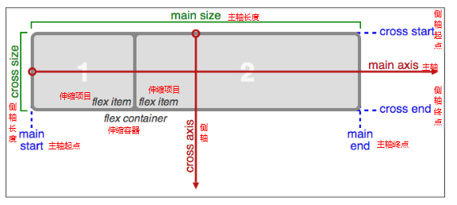

# 选择器

CSS3选择器与jQuery中所提供的绝大部分选择器兼容。

## 属性选择器

其特点是通过属性来选择元素，具体有以下7种形式：

1. E[attr] 表示存在attr属性即可；
2. E[attr=val] 表示属性值完全等于val；
3. E[attr*=val] 表示的属性值里包含val字符并且在“__任意__”位置；
4. E[attr^=val] 表示的属性值里包含val字符并且在“__开始__”位置；
5. E[attr$=val] 表示的属性值里包含val字符并且在“__结束__”位置；

## 伪类选择器

除了以前学过的:link、:active、:visited、:hover，CSS3又新增了其它的伪类选择器。

- 以某元素相对于其父元素或兄弟元素的位置来获取无素的结构伪类。重点理解通过E来确定元素的父元素。
  - E:first-child第一个子元素
  - E:last-child最后一个子元素
  - E:nth-child(n) 第n个子元素，计算方法是E元素的全部兄弟元素；
  - E:nth-last-child(n) 同E:nth-child(n) 相似，只是倒着计算；
    - n遵循线性变化，其取值0、1、2、3、4、... 但是当n<=0时，选取无效。
    - n可是多种形式：nth-child(2n)、nth-child(2n+1)、nth-child(-1n+5)等；
  - E:nth-of-type(n) 匹配同类型中的第n个同级兄弟元素E；
  - E:nth-last-of-type(n) 匹配同类型中的倒数第n个同级兄弟元素E；
- E:empty 选中没有任何子节点的E元素；（使用不是非常广泛）
- E:target 目标伪类，结合锚点进行使用，处于当前锚点的元素会被选中；

## 伪元素选择器
- E::first-letter文本的第一个单词或字（如中文、日文、韩文等）；
- E::first-line 文本第一行；
- E::selection 可改变选中文本的样式；
- **E::before、E::after** 是一个行内元素，需要转换成块元素
- E:not(s) 匹配所有不匹配简单选择符s的元素E

>E:after、E:before 在旧版本里是伪类，在新版本里是伪元素，新版本下E:after、E:before会被自动识别为E::after、E::before，按伪元素来对待，这样做的目的是用来做兼容处理。
":" 与 "::" 区别在于区分伪类和伪元素

## 通过attr取值

```
span::before, span::after{
    content: attr(data-text);
}

<span data-text="字体">字体</span>
```


# 颜色

新增了RGBA、HSLA模式，其中的A表示透明度，相较opacity，它们不具有继承性，即不会影响子元素的透明度。

## RGBA

- Red、Green、Blue、Alpha
- R、G、B 取值范围0~255

## HSLA

- Hue、Saturation、Lightness、Alpha
- H 色调 取值范围0~360，0/360表示红色、120表示绿色、240表示蓝色
- S 饱和度 取值范围0%~100%
- L 亮度 取值范围0%~100%
- A 透明度 取值范围0~1

关于透明度：
- opacity只能针对整个盒子设置透明度，子盒子及内容会继承父盒子的透明度
- transparent 不可调节透明度，始终完全透明
- RGBA、HSLA可应用于所有使用颜色的地方


# 文本

## text-shadow

设置文本阴影，可分别设置偏移量、模糊度、颜色（可设透明度）。可同时设置多个阴影

1. 水平偏移量 正值向右 负值向左；
2. 垂直偏移量 正值向下 负值向上；
3. 模糊度是不能为负值；

```
text-shadow: 15px 15px 20px red;
```

```
text-shadow: -3px -3px 5px #000, 6px 6px 5px red;
```

# 边框

## 边框圆角（border-radius）

圆角处理时，脑中要形成圆、圆心、横轴、纵轴的概念，正圆是椭圆的一种特殊情况。如下图


>可分别设置长、短半径，以“/”进行分隔，遵循“1，2，3，4”规则，“/”前面的1-4个用来设置横轴半径（分别对应横轴1、2、3、4位置），“/”后面1-4个参数用来设置纵轴半径（分别对应纵轴1、2、3、4位置）

## 边框阴影（box-shadow）

1. 水平偏移量 正值向右 负值向左；
2. 垂直偏移量 正值向下 负值向上；
3. 模糊度是不能为负值；
4. inset可以设置内阴影；

- 设置边框阴影不会改变盒子的大小，即不会影响其兄弟元素的布局。
- 可以设置多重边框阴影，实现更好的效果，增强立体感。

```
box-shadow: -2px -2px 2px #ccc inset;
```

```
box-shadow: 20px 20px 10px #ccc, 50px 60px 80px red;
```

## 边框图片（border-image）

设置的图片将会被“切割”成九宫格形式，然后进行设置。如下图


“切割”完成后生成虚拟的9块图形，然后按对应位置设置背景，**其中四个角位置、形状保持不变，中心位置水平垂直两个方向平铺**。如下图


有以下几个属性：
- border-image-source: 图片路径
- border-image-slice: 裁剪
- border-image-width: 边框宽度
- border-image-repeat: 边框图片的平铺样式
    - repeat: 单纯平铺多余部分，会被“裁切”而不能完整显示
    - round: 会自动调整尺寸，完整显示边框图片
    - stretch: 拉伸

```
border-image-source: url(/images/border.png);
order-image-width: 15px;
border-image-slice: 27 27 27 27;
border-image-repeat: round;
```

```
border-image: url("images/border.png") 27/20px round
```

# 盒模型

CSS3中可以通过**box-sizing**来指定盒模型
- box-sizing: border-box  计算方式为width = border + padding + content
- box-sizing: content-box  计算方式为width = content
- 默认值是content-box

# 背景

>以逗号分隔可以设置多背景，可用于自适应局

## background-size设置背景图片的尺寸

- cover会自动调整缩放比例，保证图片始终填充满背景区域，如有溢出部分则会被隐藏。
- contain会自动调整缩放比例，保证图片始终完整显示在背景区域。
- 也可以使用长度单位或百分比

## background-origin设置背景定位的原点

- border-box以边框做为参考原点；
- padding-box以内边距做为参考原点；
- content-box以内容区做为参考点；

## background-clip设置背景区域裁切

- border-box裁切边框以内为背景区域；
- padding-box裁切内边距以内为背景区域；
- content-box裁切内容区做为背景区域；

# 渐变

## 线性渐变（linear-gradient）

线性渐变指沿着某条直线朝一个方向产生渐变效果。

- 必要的元素：
    - 方向
    - 起始颜色
    - 终止色

如：
```
background-image: linear-gradient(to right, yellow, green);
```


```
background-image: linear-gradient(45deg, yellow, green);
```


```
background-image:linear-gradient(to right, yellow 25%, green 50%, blue 75%);
```


```
background-image: linear-gradient(to right, yellow 25%, green 25%, green 50%, blue 50%, blue 75%, red 75%, red 100%);
```

- 关于方向如下图


## 径向渐变（radial-gradient）

径向渐变指从一个中心点开始沿着四周产生渐变效果

- 必要的元素：
    - 辐射范围，即圆半径
    - 中心点，即圆的中心
    - 渐变起始色
    - 渐变终止色
- 关于中心点：中心位置参照的是**盒子的左上角**
- 关于辐射范围：其半径可以不等，即可以是椭圆

如：

```
background-image: radial-gradient(120px 180px at center, yellow, green);
```

```
background-image: radial-gradient(120px at right top, yellow, green);
```

```
background-image: radial-gradient(120px at 300px 150px , yellow, green);
```

```
background-image: radial-gradient(200px at 160px 160px, rgba(0, 0, 0, 0), rgba(0, 0, 0, 0.6));
```

# 过渡
过渡是CSS3中具有颠覆性的特征之一，可以实现元素不同状态间的平滑过渡（补间动画），经常用来制作动画效果。

动画分两种：
- 帧动画：通过一帧一帧的画面按照固定顺序和速度播放。如电影胶片
- 补间动画：自动完成从起始状态到终止状态的的过渡。

过度有4个属性值：
- transition-property设置过渡属性
- transition-duration设置过渡时间
- transition-timing-function设置过渡速度
    -  过渡速度遵循贝赛尔曲线
    
- transition-delay设置过渡延时

如：
```
transition: width 2s;
```

```
transition: all 1s linear;
```

```
transition: all 0.3s ease 0s;
```

# 2D转换

通过transform来指定以下各类型的变化

- 移动：translate(x, y) 可以改变元素的位置，x、y可为负值；
    - 移动位置相对于自身原来位置
    - y轴正方向朝下
    - 除了可以是像素值，也可以是百分比，相对于自身的宽度或高度
```
transform: translate(400px, 300px);
```

```
transform:translate(-50%,-50%);
```

- 缩放：scale(x, y) 可以对元素进行水平和垂直方向的缩放，x、y的取值可为小数；

```
transform: scale(0.75, 1.5);
```

- 旋转：rotate(deg) 可以对元素进行旋转，正值为顺时针，负值为逆时针；
    - 通过transform-origin指定旋转原点（默认是中心）
    - 当元素旋转以后，坐标轴也跟着发生的转变

```
transform: rotate(-45deg);
transform-origin: left top;
```

- 倾斜：skew(deg, deg) 可以使元素按一定的角度进行倾斜，可为负值，第二个参数不写默认为0

```
transform: skew(45deg, 0deg);
```

多个属性同时设置用空格隔开，其顺序会影响转换的效果

```
transform: translate(50px, 50px) rotate(360deg) scale(0.75);
```

## 任意元素居中

```
position: fixed;
left: 50%;
top: 50%;
transform: translate(-50%, -50%);
```

# 3D转换

## 左手坐标系
伸出左手，让拇指和食指成“L”形，大拇指向右，食指向上，中指指向前方。这样我们就建立了一个左手坐标系，拇指、食指和中指分别代表X、Y、Z轴的正方向。


2、CSS中的3D坐标系
CSS3中的3D坐标系与上述的3D坐标系是有一定区别的，相当于其绕着X轴旋转了180度。


## 旋转

rotateX、rotateY、rotateZ分别指定X、Y、Z轴的旋转，旋转方向是面对坐标轴正方向，正数为顺时针，负数为逆时针。

```
transform:rotateX(360deg) rotateY(360deg) rotateZ(360deg);
```

## 移动

translateX、translateY、translateZ分别指定X、Y、Z轴的移动

```
transform:translateX(300px) translateY(300px) translateZ(300px);
```

## 透视（perspective）

电脑显示屏是一个2D平面，图像之所以具有立体感（3D效果），其实只是一种视觉呈现，通过透视可以实现此目的。

**仅仅只是视觉呈现出3d 效果，并不是正真的3d**

**注：并非任何情况下需要透视效果，根据开发需要进行设置。**

```
perspective: 400px;
```

perspective有两种写法

- 作为一个属性，设置给父元素，作用于所有3D转换的子元素
- 作为transform属性的一个值，做用于元素自身

### 理解透视距离

下图中d为透视距离，Z为Z坐标轴距离


**透视会产生“近大远小”的效果**

## 3D呈现（transform-style）

3D元素构建是指某个图形是由多个元素构成的，可以给这些元素的父元素设置transform-style: preserve-3d来使其变成一个真正的3D图形。

- flat：所有子元素在 2D 平面呈现
- preserve-3d：保留3D空间

## backface-visibility

设置元素背面是否可见

```
backface-visibility: hidden;
```

# 动画

## 必要元素：
- 通过@keyframes指定动画序列；
- 通过百分比将动画序列分割成多个节点；
- 在各节点中分别定义各属性
- 通过animation将动画应用于相应元素；

## 关键属性
- animation-name设置动画序列名称
- animation-duration动画持续时间
- animation-delay动画延时时间
- animation-timing-function动画执行速度，linear、ease等
- animation-play-state动画播放状态，play、paused等
- animation-direction动画逆播，alternate等
- animation-fill-mode动画执行完毕后状态，forwards、backwards等
- animation-iteration-count动画执行次数，infinite等
- steps(60) 表示动画分成60步完成

```
.box{
    /* 调用*/
    animation: gun 4s;
}

/* 定义多组动画*/
@keyframes gun {
    0%{
        transform:translateX(0px) translateY(0px);
        background-color: green;
        border-radius: 0px;
    }

   25%{
       transform:translateX(500px) translateY(0px);
   }

   50%{
       transform:translateX(500px) translateY(300px);
       border-radius: 50%;
   }

   75%{
       transform:translateX(0px) translateY(300px);
   }

    100%{
       transform:translateX(0px) translateY(0px);
       background-color: red;
       border-radius: 0;
    }
}
```

```
.box{
    /* 调用*/
    /* infinite:无限次*/
    /* animation: 动画名称 持续时间  执行次数  是否反向  运动曲线 延迟执行*/
    animation: move 1s  alternate linear 3;
}

/* 定义动画*/
@keyframes move {
    from{
        transform: translateX(0px) rotate(0deg) ;
    }
    to{
        transform: translateX(500px) rotate(555deg) ;
    }
}
```

```
.box{
    /*animation: move 2s 3  alternate linear;*/

    /* 动画名称*/
    animation-name: move;

    /* 一次动画持续时间  前两属性是必须，且顺序固定*/
    animation-duration: 3s;

    /* 动画执行次数  无数次：infinite*/
    animation-iteration-count: 1;

    /* 动画的方向： normal 正常 ， alternate： 反向*/
    animation-direction: alternate;

    /* 动画延迟执行*/
    /*animation-delay: 1s;*/

    /* 设置动画结束盒子盒子的状态
        forwards：保持动画结束后的状态
        backwards：保持动画开始前的状态*/
    animation-fill-mode:forwards;

    /* 运动曲线  linear   ease-in-out  steps()*/
    /*animation-timing-function:ease-in;*/

    animation-timing-function: steps(8);
}

@keyframes move{
    0%{}

    100%{
        transform:translateX(500px) rotate(345deg);
    }
}
```

[腾讯动画库](http://isux.tencent.com/css3/tools.html)

# 伸缩布局



- 主轴：Flex容器的主轴主要用来配置Flex项目，默认是水平向右
- 侧轴：与主轴垂直的轴称作侧轴，默认是垂直向下
- 方向：默认主轴从左向右，侧轴默认从上到下
- 主轴和侧轴并不是固定不变的，通过flex-direction可以互换。

## 各属性详解

- flex-direction调整主轴方向（默认为水平方向）
- justify-content调整主轴对齐
- align-items调整侧轴对齐
- flex-wrap控制是否换行
- align-content堆栈（由flex-wrap产生的独立行）对齐
- flex-flow是flex-direction、flex-wrap的简写形式
- flex控制子项目的缩放比例
- order控制子项目的排列顺序

>具体查看【伸缩布局】目录

# 多列布局

类似报纸或杂志中的排版方式，上要用以控制大篇幅文本。

```
/* 分几列*/
-webkit-column-count:3;
/* 分割线*/
-webkit-column-rule:1px dashed red;
/*设置列间距*/
-webkit-column-gap:60px;
/* 列宽度*/
-webkit-column-width: 400px;
```

# Web字体

开发人员可以为自已的网页指定特殊的字体，无需考虑用户电脑上是否安装了此特殊字体，从此把特殊字体处理成图片的时代便成为了过去。

支持程度比较好，甚至IE低版本浏览器也能支持。

## 字体格式

### TureType(.ttf)格式

.ttf字体是Windows和Mac的最常见的字体，是一种RAW格式，支持这种字体的浏览器有IE9+、Firefox3.5+、Chrome4+、Safari3+、Opera10+、iOS Mobile、Safari4.2+

### OpenType(.otf)格式

.otf字体被认为是一种原始的字体格式，其内置在TureType的基础上，支持这种字体的浏览器有Firefox3.5+、Chrome4.0+、Safari3.1+、Opera10.0+、iOS Mobile、Safari4.2+；

### Web Open Font Format(.woff)格式

woff字体是Web字体中最佳格式，他是一个开放的TrueType/OpenType的压缩版本，同时也支持元数据包的分离，支持这种字体的浏览器有IE9+、Firefox3.5+、Chrome6+、Safari3.6+、Opera11.1+；

### Embedded Open Type(.eot)格式

.eot字体是IE专用字体，可以从TrueType创建此格式字体，支持这种字体的浏览器有IE4+；

### SVG(.svg)格式
.svg字体是基于SVG字体渲染的一种格式，支持这种字体的浏览器有Chrome4+、Safari3.1+、Opera10.0+、iOS Mobile Safari3.2+；

推荐http://www.zhaozi.cn/、http://www.youziku.com/ 查找更多中文字体

## 字体图标

优点：
1. 将所有图标打包成字体库，减少请求；
2. 具有矢量性，可保证清晰度；
3. 使用灵活，便于维护；

Font Awesome
http://fontawesome.dashgame.com/

定制自已的字体图标库
http://iconfont.cn/
https://icomoon.io/

SVG素材
http://www.iconsvg.com/

# 兼容性

通过http://caniuse.com/ 可查询CSS3各特性的支持程度，一般兼容性处理的常见方法是**为属性添加私有前缀**，如不能解决，应避免使用，无需刻意去处理CSS3的兼容性问题。
