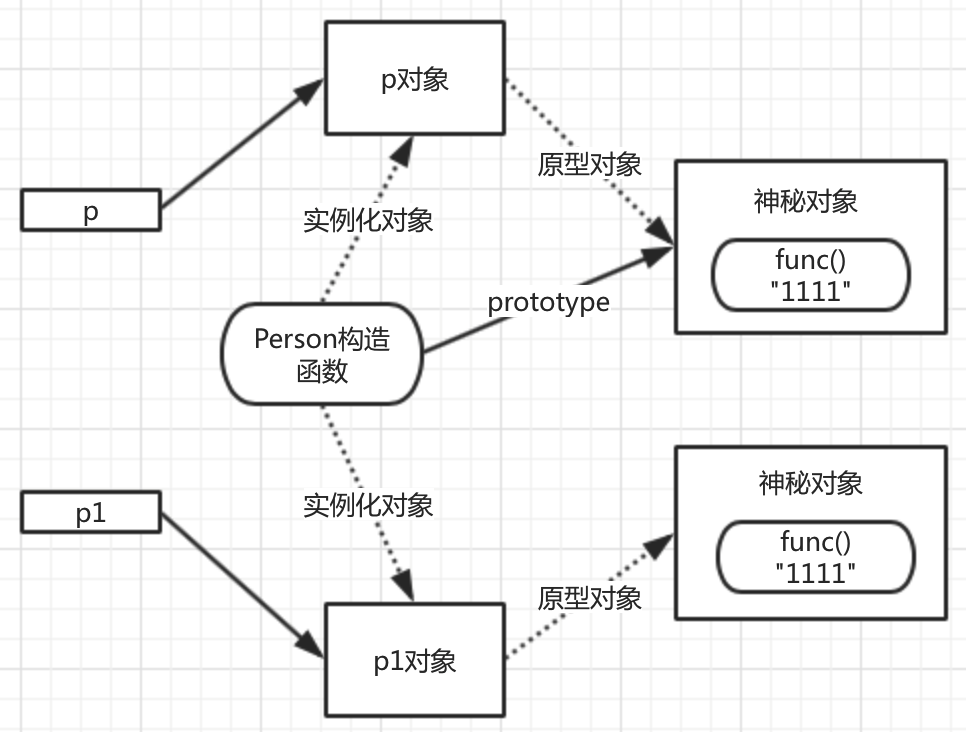
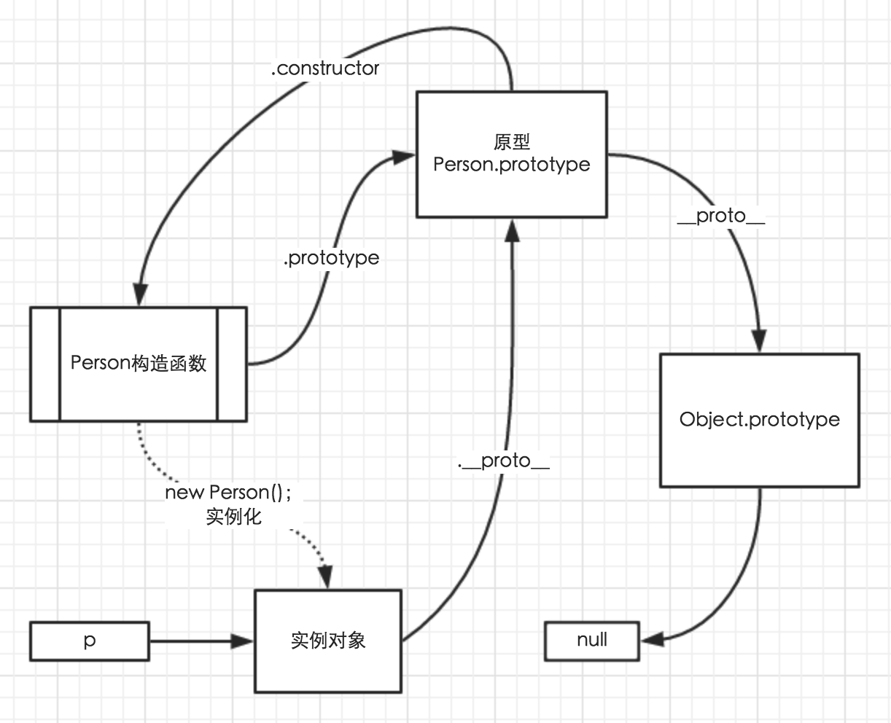
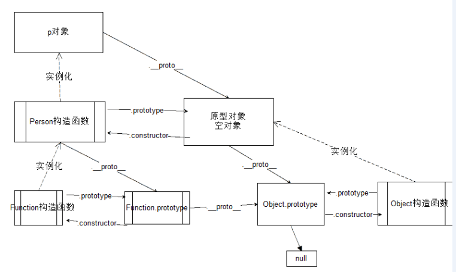

# 变量搜索机制

1. 先检查有没有局部作用域，如果有的话，先查找是不是这个局部作用域定义的变量
2. 寻找上一级作用域
3. 直到找到全局作用域，如果全局作用域也找不到这个变量，这个变量就是未定义的 undefined

# 函数声明提前

**在一个作用域中，都会优先执行函数声明以及变量声明**

```JavaScript
console.log(a);//是一个函数
var a = 3;
function a(){}
console.log(a);//3
```

相当于：

```JavaScript
var a;
function a(){}
console.log(a);//是一个函数
a=3;
console.log(a)//3
```

---

```JavaScript
bar();//报错
var bar = function(){

}
```
相当于：

```JavaScript
var bar;
bar();
bar = function(){};
```

函数声明是可以提升的，而函数表达式不可以提升。当我们定义一个函数表达式，在这个表达式前面是访问不到的。

```JavaScript
//函数声明，变量fn以及其实现被提升到顶部
function fn(){
    console.log('函数')
}
//函数表达式,仅变量fn2被提升到顶部，实现没有被提升
var fn2 = function(){
    console.log('函数变量形式')
}
```

---

```JavaScript
//此时的bar不会作为函数的名称，所以不能使用bar()来调用函数
var foo = function bar(name) {
	console.log("hello"+name);
};
//alert(typeof bar);
foo("world");//"hello"
//console.log(bar);//undefined
console.log(foo.toString());
//bar();//报错
```

# 属性访问权限设置

- Object.defineProperty（a，b，c）;
    + a 必填。设置的对象
    + b 必填。设置的属性名（键值）
    + c 是一个用于描述属性值得json数据。有4个属性
        * configurable 默认为true（可删除，修改，设置）
            - 1.可否被删除
            - 2.他的属性值可否被批改
            - 3.可否把属性设置成接见器属性
        * eumerable 可否被for-in轮回到
        * writable  默示属性值可否被批改
        * value 属性值

注意：Object.defineProperty方法是ES5的一部分，所以在IE9及现代浏览器，IE8中只得到了部分实现。

# 实例化过程

- 实例化的过程其实就是拷贝构造函数属性的过程
- 除了拷贝以外还会自动生成一个constructor属性，用于识别其是根据哪个构造函数创建的实例

# 构造函数的返回值

- 如果不写返回值，默认返回的是新创建出来的对象
- 如果有return语句，return的是空值（return;），或者是基本类型的值或者null，都会默认返回新创建出来的对象
- 如果返回的是object类型的值，将不会返回刚才新创建的对象，取而代之的是return后面的值

# 原型

原型对象本质：**原型对象的属性和方法可以被所有实例共享**

通过原型创建对象，其实创建的是两个对象：
- 构造函数对象
- 原型对象

当我们实例化的时候，该实例自动拷贝构造函数的所有属性和方法，而对于原型对象，则不拷贝，而是通过一个属性‘铁链’

## 属性访问搜索法则

1. 首先在当前对象中查找，如果找到，停止查找，直接使用，如果没有找到，继续下一步
2. 在该对象的原型中查找，如果找到，停止查找，直接使用，如果没有找到，继续下一步
3. 在该对象的原型的原型中查找，如果找到，停止查找，直接使用，如果没有找到，继续下一步
4. 继续往上查找，直到查找到Object.prototype还没有, 那么是属性就返回 undefied，是方法，就报错xxx is not a function。

## 实例属性和原型属性判断

- hasOwnProperty() 方法可以判定一个属性是存在于构造对象的实例上还是原型对象上。该方法继承自 Object。
    + 如果是实例对象，返回ture
    + 如果是原型对象，返回false

## 赋值的错误

- 如果是访问数据, 当前对象中如果没有该数据就到构造函数的原型属性中去找
- 如果是写数据, 当对象中有该数据的时候, 就是修改值; 如果对象没有该数据, 那么就添加值，**不会去写原型中的数据**

```JavaScript
function Person() {}
Person.prototype.name = '张三';

var p1 = new Person();
var p2 = new Person();

p1.name = '李四';

console.log( p1.name );
console.log( p2.name );
```

## 直接替换原型会出现的问题

```JavaScript
function Person () { }
Person.prototype.func = function () {
    console.log( 'something' );
};

var p = new Person();

Person.prototype.func = function () {
    console.log( 'something' );
};

var p1 = new Person();

p.func();
p1.func();
```

替换原型之后，在替换前创建出来的对象和替换后创建出来的对象的原型对象不一致。如：




## 属性屏蔽

通过delete关键字可以删除实例中的属性或方法

```JavaScript
function Product(){
    //属性
    this.name='神仙';
    // 属性
    this.description = ''
    this.buy = function(){
        alert('构造函数对象')
    }
}

Product.prototype={
    name:'魔鬼',
    buy:function(){
        alert('原型对象')
    }
}

var product = new Product()
console.log(product.name)

delete product.name
console.log(product.name)

console.log(product.buy())

delete product.buy
console.log(product.buy())

console.log(Product.prototype.buy())
```

## 原型链结构

默认的原型链结构就是:

当前对象 -> 构造函数.prototype -> Object.prototype -> null




在实现继承的时候, 有时会利用替换原型链结构的方式实现原型继承,那么原型链结构就会发生改变

```JavaScript
function ItcastCollection () {
}
ItcastCollection.prototype = [];
var arr = new ItcastCollection();
```
上面代码的原型链：arr -> [] -> Array.prototype -> Object.prototype -> null

## Object.prototype常用成员

- constructor 属性 指向该原型相关的构造函数
- hasOwnProperty 方法 判断对象本身是否拥有某个属性
    + obj.hasOwnProperty("属性名")
- isPrototypeOf 方法 判断一个对象是不是另一个对象的原型对象 
    + obj1.isPrototypeOf(obj2)
- propertyIsEnumerable 方法 先判断属性是否属于对象本身，如果不是，返回false，如果是，就继续判断属性是否可以被遍历，如果是才返回ture，反之则false
- toString toLocaleString 方法 转换成字符串
- toLocaleString转换成本地格式的字符串
- valueOf 方法 当对象参加运算的时候，会首先调用valueOf方法获取对象的值，如果获取的值不能参与运算，则调用toString方法
- __proto__ 属性 指向对象关联的原型对象

# Function 的使用

语法:

- Function函数所有的参数全都是字符串
- Function函数的作用就是将所有的参数组合起来，变成一个函数
    + 如果只传一个参数，那么这个函数必然是函数体
    + 如果传多个参数，那么最后一个参数表示函数体，前面的参数代表将要创建的函数的参数
    + 如果不传参数，表示创建一个空函数
- new Function(arg1, arg2, arg3, ..., argN, body);

```JavaScript
//传统的方式
function foo(){
    console.log("你好");
}

//使用Function
var func = new Function("console.log('你好');");

//传统的方式
var func = new Function(
    'num1',
    'num2',
    'console.log( num1 + num2 );'
);

// 传统
function foo ( a, b, c ){
    var res = a > b ? a : b;
    res = res > c ? res : c;
    return res;
}

// Function
var func = new Function( 'a',
    'b',
    'c',
    'var res = a > b ? a : b;res = res > c ? res : c;return res;' )
```

- Function也可以被当做一个构造函数
- 通过Function new出来函数可以被当做是实例化的对象
- 那么Function这个构造函数也有原型对象（一个空的函数）
- Function的原型对象的原型对象是Object.prototype

# 完整原型链



# instanceof关键字

判断该构造函数的原型是否存在于该对象的原型链上

# 继承

继承的实现方式

1. 混入式继承 for-in
2. 原型继承 通过更改原型链的结构，实现的继承，就是原型继承
3. 经典继承 var 对象名 = Object.create(要继承的对象)，有兼容性问题

