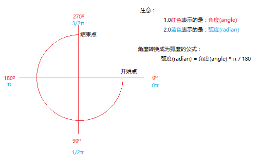
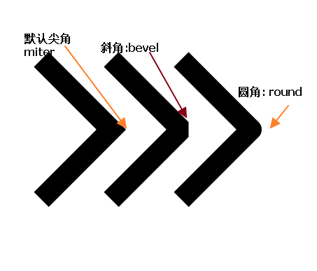
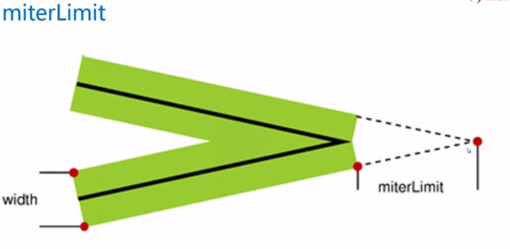

# 基本方法

## getContext

- 得到canvas的上下文对象（是所有的绘制操作api的入口或者集合，相当于是得到画布的控制权，之后便可以通过js在画布上画内容了）
- 传入一个字符串参数
    + 传入“2d”表示当前的画布支持2D绘图
    + 传入”webgl”表示支持3D绘图（3d在ie中只有ie11才支持）

```javascript
var canvas  = document.getElementById( 'cavsElem' ); //获得画布
var ctx = canvas.getContext( '2d' );//注意：2d小写， 3d：webgl
```

# canvas的坐标系

canvas的坐标系与网页一致，X轴方向为从左往右，Y轴方向为从上往下

# 绘制路径

## 设置绘制起点(moveTo)

- ctx.moveTo(x, y);
- 设置上下文绘制路径的起点。相当于移动画笔到某个位置
- **绘制线段前必须先设置起点，不然绘制无效。**

## 绘制直线(lineTo)

- ctx.lineTo(x, y);
- 从x,y的位置绘制一条直线到起点或者上一个线头点。
- **如果调用lineTo前，没有先调用moveTo，则会当做为moveTo**

## 路径开始和闭合

- 开始路径：ctx.beginPath();
- 闭合路径：ctx.closePath();
- 如果复杂路径绘制，必须使用路径开始和结束。闭合路径会自动把最后的线头和开始的线头连在一起。
- beginPath: 核心的作用是将绘制的不同形状进行隔离
    + 每次执行此方法，表示重新绘制一个路径,跟之前的绘制的痕迹可以进行分开样式设置和管理。

## 描边(stroke)

- ctx.stroke();
- 根据路径绘制线。路径只是草稿，真正绘制线必须执行stroke

## 填充(fill)

- ctx.fill();
- 填充，是将闭合的路径的内容填充具体的颜色。默认黑色。
- 交叉路径的填充问题，“非零环绕原则”，顺逆时针穿插次数决定是否填充（了解即可，很少用到复杂路径）。

## 路径的一些属性

- strokeStyle   设置路径的描边样式
- fillStyle 设置路径的填充样式
- 一般先进行设置样式然后再进行绘制

以上两个值都可以接受颜色名,16进制数据，rgb值，甚至rgba。

```JavaScript
ctx.strokeStyle = "red";      
ctx.strokeStyle = "#ccc";      
ctx.strokeStyle = "rgb(255,0,0)";      
ctx.strokeStyle = "rgba(255,0,0,6)";
```

- lineWidth 设置路径的宽度

```JavaScript
var canvas = document.getElementById("demo");
canvas.width  = 600;
canvas.height = 600;
canvas.style.border = "1px solid #000";
var ctx = canvas.getContext("2d");

//开始画线
ctx.moveTo(100,100);

ctx.lineTo(100,100);
ctx.lineTo(200,100);
ctx.lineTo(100,200);

ctx.closePath();

//属性：
//设置描边的颜色
ctx.strokeStyle = "red";// red #000000 rgb  rgba
//设置填充色
ctx.fillStyle = "yellow";
//设置描边的宽度
ctx.lineWidth = 4;

ctx.stroke();

ctx.fill();
```

# 绘制矩形

## rect(x, y, width, height)

- x, y是矩形左上角坐标，width和height都是以像素计。
- rect方法只是规划了矩形的路径，并没有填充和描边。

## strokeRect、fillRect

- strokeRect(x, y, width, height)   注意此方法绘制完路径后立即进行stroke绘制
- fillRect(x, y, width, height) 方法执行完成后立即对当前矩形进行fill填充。

## 清除矩形（clearRect）

- clearRect(x, y, width, hegiht) 清除某个矩形内的绘制的内容，相当于橡皮擦。

```JavaScript
var canvas = document.getElementById("demo");
canvas.width = 600;
canvas.height = 600;
canvas.style.border = "1px solid #000000";
var ctx = canvas.getContext("2d");

ctx.rect(100,100,200,100);
ctx.fill();

ctx.strokeRect(100,300,200,100);

ctx.fillRect(100,500,200,100);

ctx.clearRect(100,500,50,50);
```

# 绘制圆形（arc）

- arc() 方法创建弧/曲线（用于创建圆或部分圆）。
- 语法：arc(x,y,r,sAngle,eAngle,counterclockwise);
    + x,y：圆心坐标。
    + r：半径大小。
    + sAngle:绘制开始的弧度。 圆心到最右边点是0度，默认顺时针方向弧度增大。
    + eAngel:结束的弧度，注意是弧度。π
    + counterclockwise（可选）。是否是逆时针。true是逆时针，false：顺时针。默认是false。
    + 弧度和角度的转换公式： rad = deg*Math.PI/180;

## canvas计算圆角度的方式


```JavaScript
var canvas = document.getElementById("demo");
canvas.width = 600;
canvas.height = 600;
canvas.style.border = "1px solid #000000";
var ctx = canvas.getContext("2d");
ctx.moveTo(300,300);
ctx.arc(300,300,200,90 * Math.PI /180,120 * Math.PI / 180, false);
ctx.fillStyle = "red";
ctx.fill();
```

注意：
- 使用arc绘图的时候, 如果没有设置moveTo，那么会从开始的绘弧的地方作为起始点. 如果设置了, 那么会连线该点与圆弧的起点.
- 如果使用stroke方法, 那么会从开始连线到圆弧的起始位置. 如果是fill方法, 会自动闭合路径填充.

# 绘制文字

## fillText

- fillText(text,x,y,maxwidth);
    + text是输出的文本
    + x, y是矩形左上角坐标
    + maxWidth（可选）允许的最大文本宽度，以像素计
- fillText方法在画布上绘制填色的文本。文本的默认颜色是黑色。

## strokeText

- strokeText(text,x,y,maxwidth);
    + text是输出的文本
    + x, y是矩形左上角坐标
    + maxWidth（可选）允许的最大文本宽度，以像素计
- strokeText方法在画布上绘制文本（没有填色）。文本的默认颜色是黑色。

## measureText

- measureText(text).width;
- measureText方法返回一个对象，该对象包含以像素计的指定字体宽度

## 绘制上下文的文字属性

- font设置或返回文本内容的当前字体属性
- font属性使用的语法与CSS的font属性相同。例如：ctx.font = "18px '微软雅黑'";
- textAlign 设置或返回文本内容的水平对齐方式
    + start : 默认。文本在指定的位置开始。
    + end : 文本在指定的位置结束。
    + center: 文本的中心被放置在指定的位置。
    + left : 文本左对齐。
    + right : 文本右对齐。
 - textBaseline 设置或返回在绘制文本时使用的当前文本基线
    + alphabetic ： 默认。文本基线是普通的字母基线。
    + top ： 文本基线是 字符的顶端。
    + hanging ： 文本基线是悬挂基线。
    + middle ： 文本基线是字符的正中。
    + ideographic： 文本基线是字符基线。
    + bottom ： 文本基线是字符的底端。

```JavaScript
ctx.moveTo( 300, 300 );
ctx.fillStyle = "purple";               //设置填充颜色为紫色
ctx.font = '20px "微软雅黑"';           //设置字体
ctx.textBaseline = "bottom";            //设置字体底线对齐绘制基线
ctx.textAlign = "left";                 //设置字体对齐的方式
ctx.strokeText( "left", 450, 400 );
ctx.fillText( "Top-g", 100, 300 );        //填充文字
```

# 绘制图片

- context.drawImage(img,x,y);
    + x,y 绘制图片左上角的坐标， img是绘制图片的dom对象。

- context.drawImage(img,x,y,width,height);
    + 在画布上绘制图像，并重新规定图像的宽度和高度
    + width 绘制图片的宽度，height：绘制图片的高度
    + 如果指定宽高，最好成比例，不然图片会被拉伸

- context.drawImage(img,sx,sy,swidth,sheight,x,y,width,height);
    + 图片裁剪，并在画布上定位被剪切的部分
    + sx,sy 裁剪的左上角坐标
    + swidth：裁剪图片的高度，sheight:裁剪的高度

```html
<body>
    
    <canvas id="demo"></canvas>
    <script type="text/javascript">
    var canvas = document.getElementById("demo");
    canvas.width = 600;
    canvas.height = 600;
    canvas.style.border = "1px solid #000000";
    var ctx = canvas.getContext("2d");
    //第一步要得到图片：
    var img = document.getElementById("img");
    //第二步开始画:注意在绘制的时候很有可能图片没有加载成功，所以最好将绘制的代码放到onload中。
    img.onload = function(){
        //1.0使用传入三个参数的drawImage
        ctx.drawImage(img,100,100);
        //2.0使用传入五个参数的drawImage
        ctx.drawImage(img,500,500,100,100);
        //3.0使用传入九个参数的drawImage
        ctx.drawImage(img,83,21,150,200,300,300,100,100);
    }
    </script>
</body>
```

# 设置阴影

在canvas中，设置阴影尽量少用，**性能差**。

- shadowColor   设置或返回用于阴影的颜色
- shadowBlur    设置或返回用于阴影的模糊级别，大于1的正整数，数值越高，模糊程度越大
- shadowOffsetX 设置或返回阴影距形状的水平距离
- shadowOffsetY 设置或返回阴影距形状的垂直距离

```JavaScript
ctx.fillStyle = "rgba(255,0,0, .9)"
ctx.shadowColor = "teal";
ctx.shadowBlur = 10;
ctx.shadowOffsetX = 10;
ctx.shadowOffsetY = 10;
ctx.fillRect(100, 100, 100, 100);
```

# 渐变

**一般不用，都是用图片代替，canvas绘制图片效率更高**。

## 线性渐变

- 线性渐变可以用于矩形、圆形、文字等颜色样式
- 线性渐变是一个对象
- createLinearGradient(x0,y0,x1,y1);
    + x0:起点的横坐标
    + y0:起点的纵坐标
    + x1:结束点的横坐标
    + y1:结束点的纵坐标

```JavaScript
//创建一个线性渐变对象
var grd=ctx.createLinearGradient(0,0,600,0);
//添加一个渐变颜色，第一个参数介于0.0与1.0之间的值，表示渐变中开始与结束之间的位置。
grd.addColorStop(0,"black");
grd.addColorStop(0.5,"red");
grd.addColorStop(0.7,"green");
grd.addColorStop(1,"white");  //添加一个渐变颜色
ctx.fillStyle =grd;           //关键点，把渐变设置到 填充的样式
ctx.fillRect(0,0,600,300);
```

## 圆形渐变

- 创建放射状/圆形渐变对象。可以填充文本、形状等
- createRadialGradient(x0,y0,r0,x1,y1,r1);
    + x0:渐变的开始圆的横坐标
    + y0:渐变的开始圆的纵坐标
    + r0:渐变的开始圆的半径
    + x1:渐变的结束圆的横坐标
    + y1:渐变的结束圆的纵坐标
    + r1:渐变的结束圆形的半径

```JavaScript
var cjb = ctx.createRadialGradient(300,300,50,300,300,200);
cjb.addColorStop(0,"red");
cjb.addColorStop(1,"yellow");
ctx.fillStyle = cjb;
ctx.arc(300,300,200,0, 2 * Math.PI);
ctx.fill();
```

# 绘制背景图

- createPattern(img,repeat) 方法在指定的方向内重复指定的元素
    + image 规定要使用的图片、画布或视频元素。
    + repeat    重复方式
        * repeat    默认。该模式在水平和垂直方向重复。
        * repeat-x  该模式只在水平方向重复。
        * repeat-y  该模式只在垂直方向重复。
        * no-repeat 该模式只显示一次（不重复）。

# 变换

## 缩放

- scale()方法缩放当前绘图，更大或更小
- context.scale(scalewidth,scaleheight)
    + scalewidth    缩放当前绘图的宽度 (1=100%, 0.5=50%, 2=200%, 依次类推)
    + scaleheight :  缩放当前绘图的高度 (1=100%, 0.5=50%, 2=200%, etc.)
- **缩放的是整个画布，缩放后，继续绘制的图形会被放大或缩小**。

```JavaScript
var canvas = document.getElementById("demo");
canvas.width = 600;
canvas.height = 600;
canvas.style.border = "1px solid #000000";
var ctx = canvas.getContext("2d");
ctx.strokeRect(0,0,100,100);

//缩放
ctx.scale(2,2);
ctx.strokeRect(0,0,100,100);
ctx.strokeRect(100,100,10,10);
```

## 位移画布的圆点

- translate()方法重新映射画布上的原点位置
- context.translate(x,y)
    + x 添加到水平坐标（x）上的值
    + y 添加到垂直坐标（y）上的值
- **发生位移后，相当于把画布的0,0坐标更换到新的x,y的位置，所有绘制的新元素都被影响**。

## 旋转（以画布当前的圆点为中心点开进行）（重点）

- rotate()方法旋转当前的绘图
- context.rotate(angle)
    + angle 参数是弧度（PI）
- **旋转是以当前画布的圆点来进行旋转**。

```JavaScript
var canvas = document.getElementById("demo");
canvas.width = 600;
canvas.height = 600;
canvas.style.border = "1px solid #000000";
var ctx = canvas.getContext("2d");
ctx.strokeRect(0,0,100,100);

//位移
ctx.translate(200,200);
//旋转
ctx.rotate(30 * Math.PI / 180);
ctx.moveTo(0,0);
ctx.lineTo(400,0);
ctx.moveTo(0,0);
ctx.lineTo(0,400);
ctx.stroke();

ctx.strokeRect(0,0,50,50);
```

## 绘制环境保存和还原

- context.save() 保存当前环境的状态（可以把当前绘制环境进行保存到缓存中）
- context.restore() 返回之前保存过的路径状态和属性(获取最近缓存的ctx)

```JavaScript
var canvas = document.getElementById("demo");
canvas.width = 600;
canvas.height = 600;
canvas.style.border = "1px solid #000000";
var ctx = canvas.getContext("2d");

ctx.strokeRect(0,0,100,100);
ctx.save();//环境状态的保存
ctx.scale(2,2);
ctx.strokeRect(0,0,100,100);
ctx.restore();//环境状态的还原
ctx.strokeRect(100,100,50,50);
```

## 设置绘制环境的透明度

- context.globalAlpha=number;
    + number    透明值。必须介于 0.0（完全透明)与 1.0（不透明） 之间。
- **设置透明度是全局的透明度的样式**。

## 画布限定区域绘制

- context.clip()方法从原始画布中剪切任意形状和尺寸

注意：
- 一旦剪切了某个区域，则所有之后的绘图都会被限制在被剪切的区域内（不能访问画布上的其他区域）。
- 一般配合绘制环境的保存和还原。

# 画布保存为图片

- toDataURL()把canvas绘制的内容输出成字符串（base64）。
- 语法：canvas.toDataURL(type, encoderOptions);
    + type  设置输出的类型，比如 image/png、image/jpeg等
    + encoderOptions： 0-1之间的数字，用于标识输出图片的质量，1表示无损压缩，类型为： image/jpeg 或者image/webp才起作用。

```html
<body>
  <canvas id="demo"></canvas>
  
  <script>
    var canvas = document.getElementById("demo");
    canvas.width = 600;
    canvas.height = 600;
    canvas.style.border = "1px solid #000";
    var ctx = canvas.getContext("2d");
    ctx.fillStyle = "red";
    var x = 10;
    ctx.fillRect(x,10,50,50);

    var img = document.getElementById("img");

    setInterval(function(){
        canvas.width = canvas.width;
        ctx.fillStyle = "red";
        x ++;
        ctx.fillRect(x,10,50,50);

        img.src = canvas.toDataURL("image/png",1)
  },100);
  </script>
</body>
```

# 画布渲染画布

- context.drawImage(img,x,y)
    + img ：也可以是画布，也就是把一个画布整体的渲染到另外一个画布上。

```JavaScript
var canvas1 = document.querySelector('#cavsElem1');
var canvas2 = document.querySelector('#cavsElem2');
var ctx1 = canvas1.getContext('2d');
var ctx2 = canvas2.getContext('2d');
ctx1.fillRect(20, 20, 40, 40);      //在第一个画布上绘制矩形
ctx2.drawImage(canvas1, 10, 10);    //将第一个画布整体绘制到第二个画布上
```

# 线条样式

- lineCap   设置或返回线条的结束端点(线头、线冒)样式
    + butt  默认。向线条的每个末端添加平直的边缘。
    + round 向线条的每个末端添加圆形线帽。
    + square    向线条的每个末端添加正方形线帽。

样式.png)

- lineJoin  设置或返回两条线相交时，所创建的拐角类型
    + bevel 创建斜角。
    + round 创建圆角。
    + miter 默认。创建尖角



- miterLimit    设置或返回最大斜接长度
    + 斜接长度指的是在两条线交汇处内角和外角之间的距离。
    + 一般用默认值：10就可以了。除非需要特别长的尖角时，使用此属性。



# 贝塞尔曲线

## 绘制一条二次贝塞尔曲线

- context.quadraticCurveTo(cpx,cpy,x,y);
    + cpx   贝塞尔控制点的 x 坐标
    + cpy   贝塞尔控制点的 y 坐标
    + x 结束点的 x 坐标
    + y 结束点的 y 坐标

```JavaScript
ctx.beginPath();
ctx.moveTo(20,20);
//绘制2次方曲线，贝赛尔曲线
ctx.quadraticCurveTo(20,100,200,20);
ctx.stroke();
```


## 绘制一条三次贝塞尔曲线

- context.quadraticCurveTo(cpx,cpy,x,y);
    + cp1x  第一个贝塞尔控制点的 x 坐标
    + cp1y  第一个贝塞尔控制点的 y 坐标
    + cp2x  第二个贝塞尔控制点的 x 坐标
    + cp2y  第二个贝塞尔控制点的 y 坐标
    + x 结束点的 x 坐标
    + y 结束点的 y 坐标   

```JavaScript
//绘制复杂的贝塞尔曲线
ctx.beginPath();
ctx.moveTo(400,400);
ctx.bezierCurveTo(500, 200, 600, 600, 700, 300);
ctx.stroke();
```


# 创建两条切线的弧

- arcTo在画布上创建介于当前起点和两个点形成的夹角的切线之间的弧
- context.arcTo(x1,y1,x2,y2,r); //类比：css3中的圆角。
    + x1    弧的端点1的 x 坐标
    + y1    弧的端点1的 y 坐标
    + x2    弧的端点2(终点)的 x 坐标
    + y2    弧的端点2(终点)的 y 坐标
    + r 弧的半径  

```JavaScript
ctx.beginPath();
ctx.moveTo(20,20);
ctx.beginPath();
ctx.moveTo(100,100);
ctx.lineTo(200,100);
ctx.arcTo(240, 100, 240, 110, 40);
ctx.lineTo(240, 300);
ctx.stroke();
```


# 判断点是否在路径中

- context.isPointInPath(x,y);
    + 返回 true，表示指定的点位于当前路径中；否则返回 false。

# 文本宽度计算

- context.measureText(text).width;

```JavaScript
var canvas = document.getElementById("demo");
canvas.width = 600;
canvas.height = 600;
canvas.style.border = "1px solid #000";
var ctx = canvas.getContext("2d");
ctx.font = "20px 宋体";
ctx.fillText("abc",100,100);
alert(ctx.measureText("abc").width);
```
