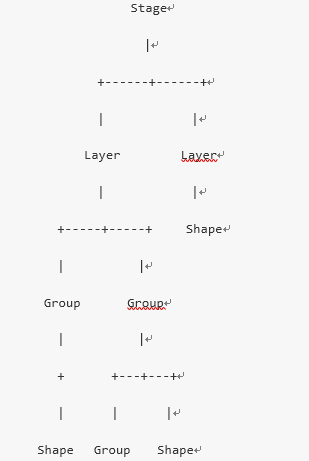

# 介绍

关于Konva的详细介绍及API文档可通过[官网](https://konvajs.github.io/)查看

# Konva的视图结构

- 整个视图看做是一个舞台 stage
- 舞台中可以绘制很多个层 layer
- layer下面可以有很多的group或者Shape
- group下面可以有多个形状 Shape（矩形、图片、其他形状等）



# Konva矩形案例

```JavaScript
//第一步：创建舞台
var stage = new Konva.Stage({
    container: 'container',     //需要存放舞台的Dom容器
    width: window.innerWidth,   //设置全屏
    height: window.innerHeight
});

//第二步：创建层
var layer = new Konva.Layer();  //创建一个层
stage.add(layer);               //把层添加到舞台

//第三步： 创建矩形
var rect = new Konva.Rect({     //创建一个矩形
    x: 100,                     //矩形的x坐标，相对其父容器的坐标
    y: 100,                      
    width: 100,                 //矩形的宽度
    height: 100,                //矩形高度
    fill: 'gold',               //矩形填充的颜色
    stroke: 'navy',             //矩形描边的颜色
    strokeWidth: 4,             //填充宽度
    opactity: .2,               //矩形的透明度
    scale: 1.2,                 //矩形的缩放 1：原来大小
    rotation: 30,               //旋转的角度，是deg不是弧度。
    cornerRadius: 10,           //圆角的大小（像素）
    id: 'rect1',                //id属性，类似dom的id属性
    name: 'rect',
    draggable: true             //是否可以进行拖拽
});

//创建一个组
var group = new Konva.Group({
    x: 40,      
    y: 40,
});
group.add(rect);  //把矩形添加到组中

//第四步： 把形状放到层中
layer.add( group ); //把组添加到层中
layer.draw();       //绘制层到舞台上
```

# Konva的动画系统

## tween对象

- tween是控制Konva对象进行动画的核心对象。
- tween可以控制所有数字类型的属性进行动画处理，比如：x, y, rotation, width, height, radius, strokeWidth, opacity, scaleX等

```JavaScript
var tween = new Konva.Tween({
    node: rect,             //要进行动画的Konva对象
    x: 300,                 //要进行动画的属性
    opacity: .8,            
    duration: 1,            //持续时间
    easing: Konva.Easings.EaseIn, //动画的动画效果
    yoyo: true,             //是否进行循环播放的设置
    onFinish: function() {
        //动画执行结束后，执行此方法
    }
});

tween.play();   //启动动画
```

### tween的控制方法

- tween.play(), //播放动画
- tween.pause(), //暂停动画
- tween.reverse(), //动画逆播放
- tween.reset(), //重置动画
- tween.finish(), //立即结束动画

### tween的缓动控制选项

- Konva.Easings.Linear //线性
- Konva.Easings.EaseIn //缓动，先慢后快
- Konva.Easings.EaseOut //先快后慢
- Konva.Easings.EaseInOut //两头慢，中间快
- Konva.Easings.BackEaseIn //往回来一点，然后往前冲
- Konva.Easings.BackEaseOut
- Konva.Easings.BackEaseInOut
- Konva.Easings.ElasticEaseIn
- Konva.Easings.ElasticEaseOut
- Konva.Easings.ElasticEaseInOut
- Konva.Easings.BounceEaseIn
- Konva.Easings.BounceEaseOut
- Konva.Easings.BounceEaseInOut
- Konva.Easings.StrongEaseIn //强力
- Konva.Easings.StrongEaseOut
- Konva.Easings.StrongEaseInOut

## 动画to的使用

- to就是对tween的封装，比较简单好用。

```JavaScript
var rect = new Konva.Rect({
    x: 10,
    y: 10,
    width: 100,
    height: 100,
    fill: 'red'
});
layer.add(rect);
layer.draw();

//动画系统
rect.to({
    x: 100,
    y: 100,
    opactity: .1,
    duration: 3,
    onFinish: function() {
    }
});
```

## Animate的应用

```JavaScript
var anim = new Konva.Animation(function(frame) {
    //动画系统提供的frame有三个属性可以使用：
    var time = frame.time, // 动画执行的总时间
    timeDiff = frame.timeDiff, // 距离上一帧的时间
    frameRate = frame.frameRate; // 帧率（既1000/间隔时间）

    //动画的动作

}, layer);

anim.start();//启动动画

//anim.stop();//结束动画
```

- Animate是根据当前机器的性能执行动画，比较难以控制

## 循环播放动画的实现

```JavaScript
//总体思路，使用tween 配合onFinish事件中重新播放动画，达到循环播放的效果
var loopTween = new Konva.Tween({
    node: star, //设置要表现动画的 Konva对象
    rotation: 360,  //旋转360度
    duration: 2,    //动画持续时间
    easing: Konva.Easings.Linear,
    onFinish: function() {
        // this === loopTween //true
        this.reset();//重置动画
        this.play(); //重新播放动画
    }
});
loopTween.play();
```

## 回放且循环播放动画

- yoyo属性可以进行对动画进行播放完后，回放当前动画，并持续循环来回切换播放。

```JavaScript
rect.to({
    duration: 2,
    scale: 1.5,
    yoyo: true// 此设置也可以用于 tween
});
```

# Konva的事件

Konva支持事件：mouseover, mouseout, mouseenter, mouseleave, mousemove, mousedown, mouseup, mousewheel, click, dblclick, dragstart, dragmove, and dragend

```javaScript
var rect = new Konva.Rect({
    x: 100,
    y: 100,
    fill: 'red',
    width: 200,
    height: 200
});

//绑定事件
rect.on('click', function(){
    console.log('^_^  ^_^');
});

//绑定多个事件
rect.on('click mousemove',function(e){
});

//解除绑定事件
rect.off('click');

//触发事件
rect.fire('click');
```

# Konva的选择器

- ID选择法：stage.find('#id');  此方法返回的是一个数组
- name选择法：group.findOne('.name');   返回一个Konva对象
- type选择法： group.find('Circle');    查找所有的圆形Konva对象

```javaScript
//组中查找圆形的Konva对象
groupCircle.find('Circle').each(function( circle, index ){
    circle.setZIndex( 3 - index );
});
```
