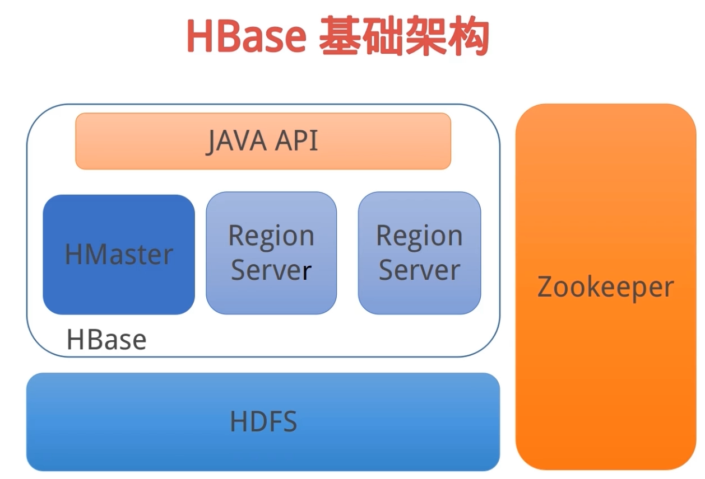
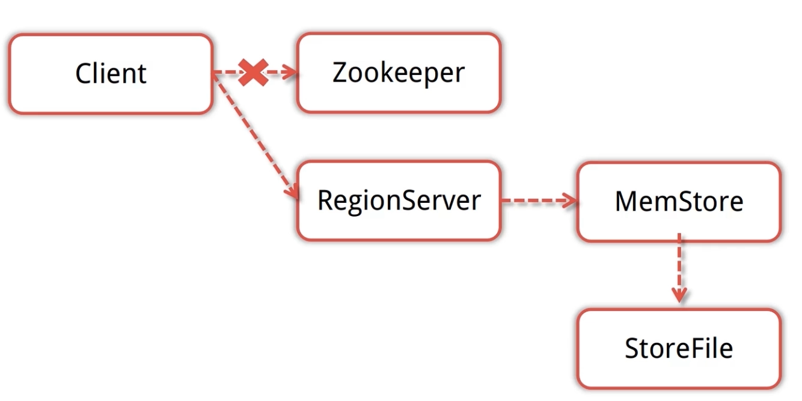
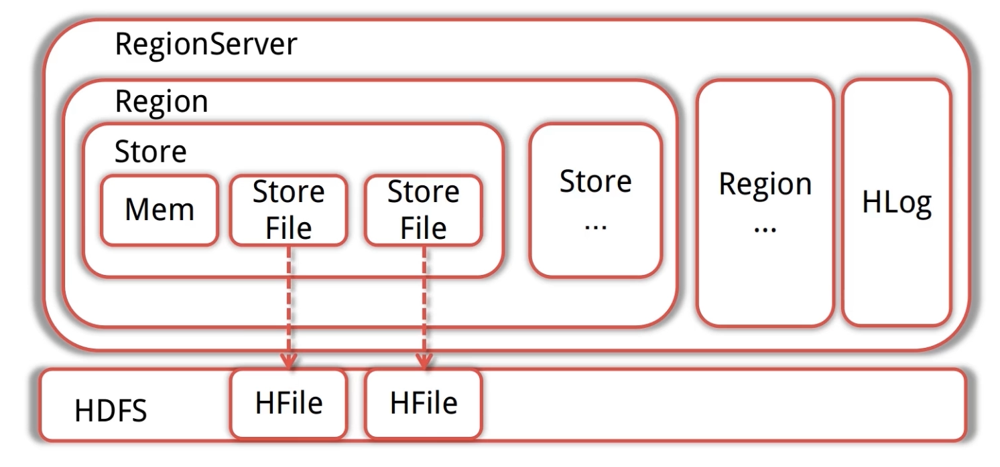
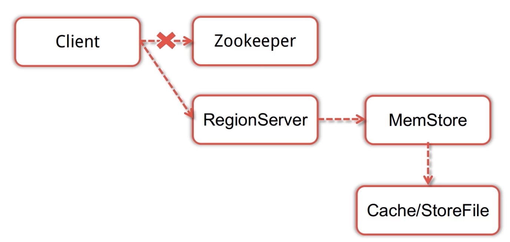

# CAP定理

- 一致性（Consistency）：所有节点在同一时间具有相同的数据
- 可用性（可用性）：保证每个请求不管成功还是失败都有响应，但不保证获取的数据是正确的
- 分区容错性（Partition tolerance）：系统中任意信息的丢失和失败不会影响系统的继续运作，系统如果不能在某一时限内达成数据一致性，就必须在上面两个操作之间做出选择

# HBase简介

- 是一个高可靠性、高性能、面向列、可伸缩的分布式存储系统
- 是在Hadoop（基于HDFS）之上提供的类似Bigtable的能力
- 可以存储超大数据并适合用来进行大数据实时查询
- 利用Hadoop HDFS作为其文件存储系统，利用Hadoop MapReduce来处理HBase中的海量数据，利用Zookeeper作为协调工具。

## HBase特点

- 大：一个表可以有上亿行，上百万列
- 面向列：面向列(族)的存储和权限控制，列(族)独立检索
- 稀疏：对于为空(null)的列，并不占用存储空间，因此，表可以设计的非常稀疏

## HBase与HDFS

- HBase建立在HDFS之上，利用了其容错能力
- HBase提供对数据的随机实时读/写访问功能
- HBase内部使用哈希表，并存储索引，可以将HDFS文件中的数据进行快速查找

## HBase使用场景

- 瞬间写入量大，传统数据库不好支撑或成本比较高
- 数据需要长久保存，且量会持久增长到比较大的场景
- 不使用与有join，多级索引，表关系复杂的数据模型

## HBase与RDBMS区别

|            |         HBase         |         RDBMS         |
| ---------- | :-------------------: | :-------------------: |
| 数据库大小 |          PB           |        GB、TB         |
| 数据类型   |         Bytes         |    丰富的数据类型     |
| 事务支持   | ACID只支持单个Row级别 | 对表和Row全面支持ACID |
| 索引       |     只支持Row-key     |         支持          |
| 吞吐量     |      百万查询/秒      |      数千查询/秒      |

### 存储结构对比

|  ID  | FILENAME  |  FILEPATH  | FILETYPE | FILESIZE | CREATOR |
| :--: | :-------: | :--------: | :------: | :------: | :-----: |
|  1   | File1.txt |   /home    |   txt    |   1024   |   Tom   |
|  2   | File2.jpg | /home/pics |   jpg    |   5032   |  Jerry  |

| RowKey |    FileInfo    | SaveInfo |
| :----: | :------------- | :------- |
|   1    | name:file1.txt type:txt  size:1024 | path:/home creator:Tom    |
|   2    | name:file2.jpg type:jpg  size:5032 | path:/home/pics creator:Jerry |

# HBase概念

- NameSpace：可以理解为RDBMS的“数据库”
- Table：表名必须能用在文件路径里的合法名字
- Row：在表里面，每一行代表着一个数据对象，每一行都是以一个行健（RowKey）
  - RowKey：
    - 可以唯一标识一行记录，不可被改变
    - 行健并没有什么特定的数据类型，以二进制的字节来存储，是任意字符串(最大长度是 64KB，实际应用中长度一般为 10-100bytes)
    - 存储时，数据按照Row key的字典序(byte order)排序存储。设计key时，要充分利用排序存储这个特性，将经常一起读取的行存储放到一起。(位置相关性)。注意：字典序对int排序的结果是1,10,100,11,12,13,…要保持整形的自然序，行键必须用0作左填充。
    - 行的一次读写是原子操作 (不论一次读写多少列)。
- Column：HBase的列由Column Family和Column qualifier组成，有冒号进行间隔。如：family:qualifier
  - Column family：一个列族可以包含多个列，在定义HBase表的时候需要提前设置好列族
  - Column qualifier：列族中的数据通过列标识来进行映射，可以理解为一个键值对，Column qualifier就是key
- Cell：每一个行健，列族和列标识共同组成一个单元：{row key, column(=family + qualifier), version}
- Timestamp：每个值都会有一个timestamp，作为该值特定版本的标识符

# HBase基础架构

## Client

- 包含访问hbase的接口，client维护着一些cache来加快对hbase的访问，比如regione的位置信息。

## Zookeeper

- 是集群的协调器
- HMaster启动将系统表加载到Zookeeper
  - 存贮所有Region的寻址入口
  - 存储Hbase的schema,包括有哪些table，每个table有哪些column family
- 提供HBase RegionServer状态信息
  - 实时监控Region Server的状态，将Region server的上线和下线信息实时通知给Master

## HMaster

- 是HBase主/从集群架构中的中央节点
- 将region分配RegionServer，协调RegionServer的负载并维护集群的状态
  - 发现失效的region server并重新分配其上的region（从HDFS中回复数据）
- 维护表和Region的元数据，不参与数据的输入/输出过程
  - HDFS上的垃圾文件回收

## RegionServer

- 维护HMaster分配给他的Region，处理对这些Region的IO请求
- 负责切分正在运行过程中变得过大的region

> 可以看到，client访问hbase上数据的过程并不需要master参与（寻址访问zookeeper和region server，数据读写访问regione server），master仅仅维护者table和region的元数据信息，负载很低。

## HBase写流程

---

1. Client先访问Zookeeper，得到对应的RegionServer地址
2. Client对RegionServer发起写请求，RegionServer将接受的数据写入内存
3. 当MEMStore的大小达到一定值后，flush到StoreFile并存储到HDFS

## HBase读流程

1. Client先访问Zookeeper，得到对应的RegionServer地址
2. Client对RegionServer发起读请求
3. 当RegionServer收到Client的读请求后，先扫描自己的MemStore，再扫描BlockCache（加速读内容缓存区），如果还是没有找到则到storefile中读取，然后将数据返回给Client

## HBase启动

- HMaster启动，注册到Zookeeper，等待RegionServer汇报
- RegionServer注册到Zookeeper，并向HMaster汇报
- 对各个RegionServer（包括失效的）的数据进行整理，分配Region和meta信息

## RegionServer失效

- HMaster将失效RegionServer上的Region分配到其他节点
- HMaster更新hbase:meta表以保证数据正常访问

## HMaster失效

- 处于Backup状态的其他HMaster节点推选一个转为Active状态
- 在没有Active的HMaster时，数据能正常读写，但是不能创建删除表，也不能更改表结构

# HBase调优

## 导致HBase性能下降的因素

- jvm内存分配与GC回收策略
- 与HBase运行机制相关的部分配置不合理（hbase-site.xml）
- 表结构设计及用户使用方式不合理

## HBase两大性能消耗操作

- HBase写入时当memstore达到一定的大小会flush到磁盘保存成HFile，当HFile小文件太多会执行compact操作进行合并
  - minor compaction：选取一些小的，相邻的StoreFile将他们合并成一个更大的StoreFile
  - major compaction：将所有的StoreFile合并成一个StoreFile，清理无意义数据（这些数据一般在运行过程中只是标记状态，并没有实际删除，在major compaction时才会删除）：被删除的数据、TTL过期数据、版本号超过设定版本号的数据
  - 触发compact检查的时机
    - MemStore被flush到磁盘
    - 用户执行shell命令compact、major_compact或者调用了相应的API
    - HBase后台线程周期性触发检查
- 当Region的大小达到某个阈值时，会执行split操作

## HBase服务端优化原则

为了不影响实际业务，需要将HBase的split和major compaction自动执行关闭，通过手动的方式或者编写定时任务的方式在业务量较低的时间进行。

# Phoenix

## 简介

- 构建在Apache HBase之上的一个SQL中间层
- 可以在HBase上执行SQL查询，性能强劲
- 较完善的查询支持，支持二级索引，查询效率较高
- 通过HBase协处理器，在服务端进行操作，从而最大限度的减少客户端和服务器的数据传输
- 通过定制的过滤器对数据进行处理
- 使用本地HBase API而不是通过MapReduce框架，这样能最大限度的降低启动成本

## 优势

- Put the SQL back in NoSQL，程序员熟知SQL语句
- 具有完整ACID事务功能的标准SQL和JDBC API的强大功能
- 完全可以和其他Hadoop产品例如Spark、Hive、Pig、Flume以及MapReduce集成

## 功能特性

- 多租户
- 二级索引
- 用户定义函数
- 行时间戳列
- 分页查询
- 视图

