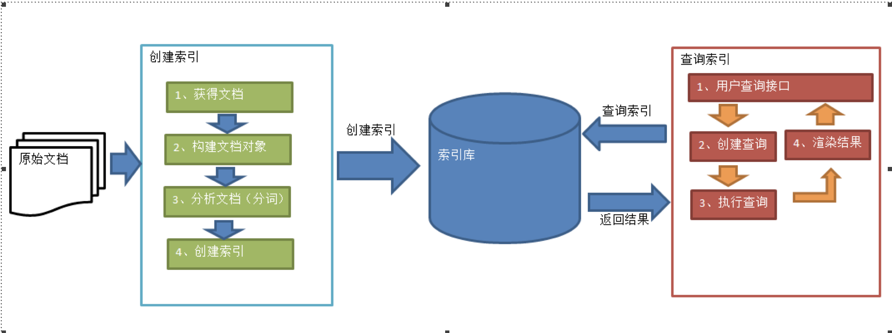
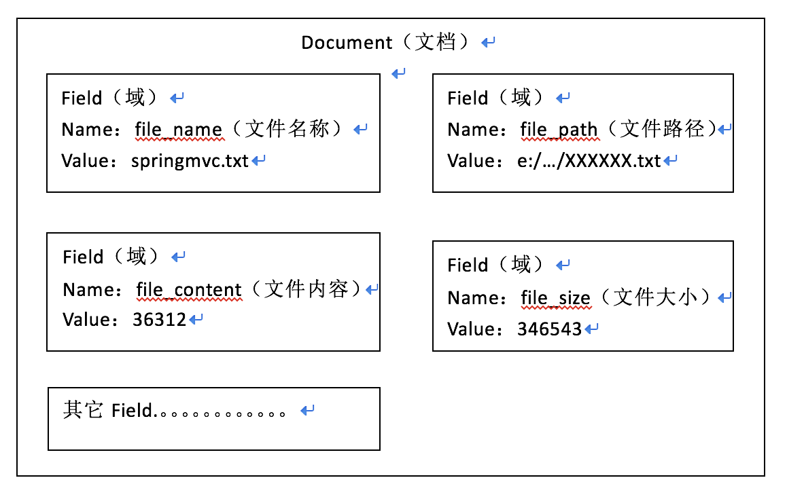
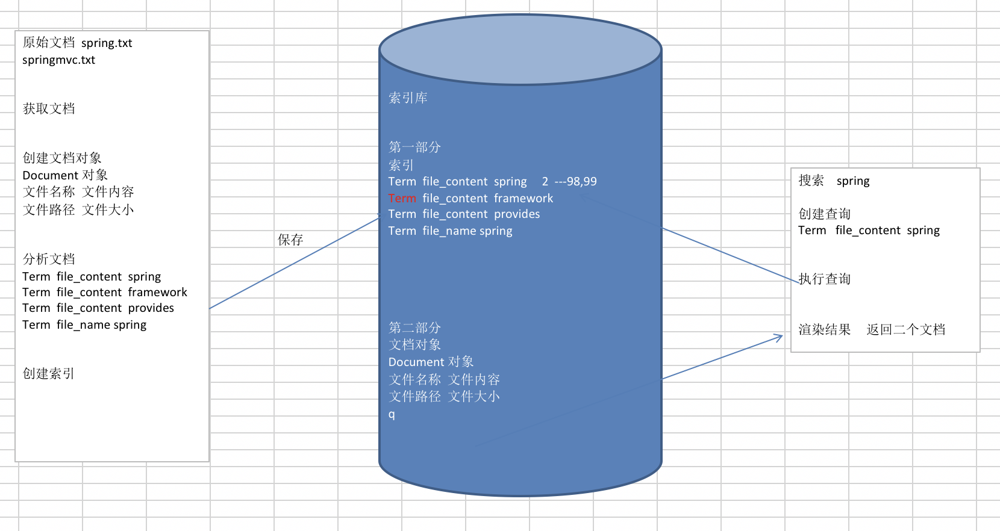

# 全文索引

将非结构化数据中的一部分信息提取出来，重新组织，使其变得有一定结构，然后对此有一定结构的数据进行搜索，从而达到搜索相对较快的目的。这部分从非结构化数据中提取出的然后重新组织的信息，我们称之索引。

这种先建立索引，再对索引进行搜索的过程就叫全文检索(Full-text Search)。

虽然创建索引的过程也是非常耗时的，但是索引一旦创建就可以多次使用，全文检索主要处理的是查询，所以耗时间创建索引是值得的。

# 索引和搜索流程

## 创建文档对象

在索引前需要将原始内容创建成文档（Document），文档中包括多个域（Field），域中存储内容。

可以将磁盘上的一个文件当成一个document，Document中包括一些Field（file_name文件名称、file_path文件路径、file_size文件大小、file_content文件内容），如下图：

注意：**每个Document可以有多个Field，不同的Document可以有不同的Field，同一个Document可以有相同的Field（域名和域值都相同）**

每个文档都有一个唯一的编号，就是文档id。

## 分析文档

将原始内容创建为包含域（Field）的文档（document），需要再对域中的内容进行分析，分析的过程是经过对原始文档提取单词、将字母转为小写、去除标点符号、去除停用词等过程生成最终的语汇单元，可以将语汇单元理解为一个一个的单词。

比如下边的文档经过分析如下：

原文档内容：

> Lucene is a Java full-text search engine.  Lucene is not a complete
application, but rather a code library and API that can easily be used
to add search capabilities to applications.

分析后得到的语汇单元：
lucene、java、full、search、engine。。。。

**每个单词叫做一个Term，不同的域中拆分出来的相同的单词是不同的term。term中包含两部分一部分是文档的域名，另一部分是单词的内容**。

例如：文件名中包含apache和文件内容中包含的apache是不同的term。

## 创建索引

对所有文档分析得出的语汇单元进行索引，索引的目的是为了搜索，最终要实现只搜索被索引的语汇单元从而找到Document（文档）。

注意：创建索引是对语汇单元索引，通过词语找文档，这种索引的结构叫倒排索引结构。

倒排索引结构也叫反向索引结构，包括索引和文档两部分，索引即词汇表，它的规模较小，而文档集合较大。

## 创建查询

用户输入查询关键字执行搜索之前需要先构建一个查询对象，查询对象中可以指定查询要搜索的Field文档域、查询关键字等，查询对象会生成具体的查询语法

例如：
语法 “fileName:lucene”表示要搜索Field域的内容为“lucene”的文档

## 执行查询

根据查询语法在倒排索引词典表中分别找出对应搜索词的索引，从而找到索引所链接的文档链表。

比如搜索语法为“fileName:lucene”表示搜索出fileName域中包含Lucene的文档。

搜索过程就是在索引上查找域为fileName，并且关键字为Lucene的term，并根据term找到文档id列表。

## 创建索引查询索引的全过程

