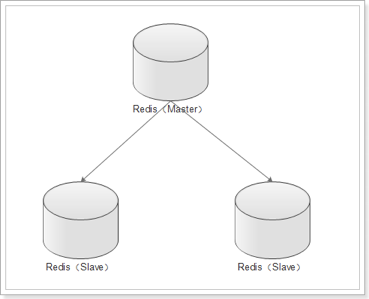
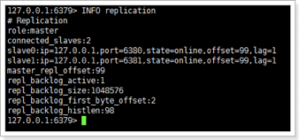
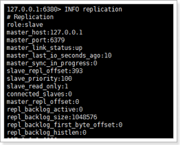
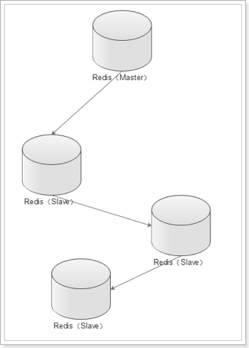
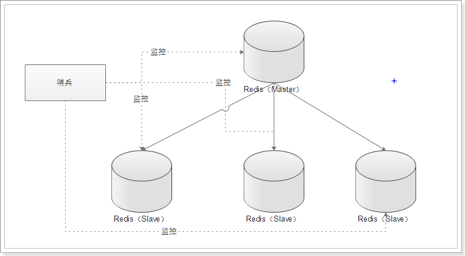
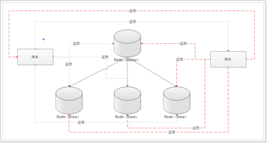
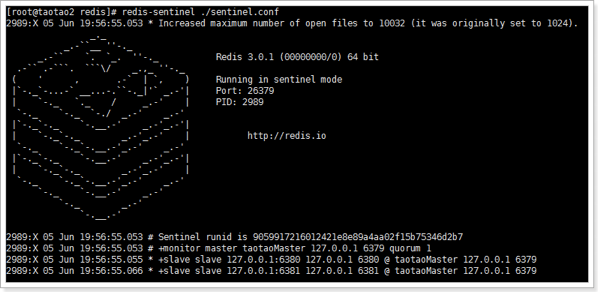

# 好处

1. 避免redis单点故障
2. 构建读写分离架构，满足读多写少的应用场景

# 主从架构



# 配置

## 多实例启动

创建不同的目录，如：6379、6380、6381，分别将redis安装目录下的redis.conf拷贝到这些目录下。

分别进入这些目录，分别修改配置文件的端口和pidfile文件路径。

分别启动不同的redis实例

## 主从配置

主从配置只需要在从库中指定主库即可。redis支持2种配置方式：

1. 在redis.conf中配置slaveof。这种配置是永久的。

  ```
  slaveof <masterip> <masterport>
  ```

2. 使用redis-cli客户端连接到redis服务，执行slaveof命令。这种方式是临时的，redis服务重启后，会失效

  ```
  slaveof <masterip> <masterport>
  ```

可以通过`INFO replication`命令查看主从信息

主库信息：



- role：角色
- connected_slaves：从库数量
- slave0：从库信息

从库信息：



# 从库只读

默认情况下，redis将作为slave角色的库设置成只读。可以在配置文件中修改只读状态：`slave-read-only on`

# 复制过程原理

1. 当从库和主库建立MS关系后，会向主数据库发送SYNC命令
2. 主库接收到SYNC命令后会开始在后台保存快照（RDB持久化过程），并将期间接收到的写命令缓存起来
3. 当快照完成后，主Redis会将快照文件和所有缓存的写命令发送给从Redis
4. 从Redis接收到后，会载入快照文件并且执行收到的缓存的命令
5. 之后，主Redis每当接收到写命令时就会将命令发送从Redis，从而保证数据的一致

# 无磁盘复制

主库接收到SYNC的命令时会执行RDB过程，即使在配置文件中禁用RDB持久化也会生成，那么如果主库所在的服务器磁盘IO性能较差，那么这个复制过程就会出现瓶颈。庆幸的是，Redis在2.8.18版本开始实现了无磁盘复制功能。

原理：

Redis在与从数据库进行复制初始化时不会将快照存储到磁盘，而是直接通过网络发送给从数据库，避免了IO性能差问题。

开启无磁盘复制：`repl-diskless-sync yes`

# 主从从架构



由于主从架构中，多一个从库会给主库带来更多的负担，因此演变为主从从架构，可以减轻主库的压力。同时这种架构可以使主库和第一个从库取消所有持久化的工作，数据都在内存，大大提高性能，而持久化工作可以由后面的从库完成。

# 主从架构出现宕机

## 从Redis宕机

这个相对而言比较简单，在Redis中从库重新启动后会自动加入到主从架构中，自动完成同步数据。

在Redis2.8版本后，主从断线后恢复的情况是增量复制。

## 主Redis宕机

1. 在从数据库中执行`SLAVEOF NO ONE`命令，断开主从关系并且提升为主库继续服务
2. 将主库重新启动后，执行`SLAVEOF`命令，将其设置为其他库的从库，这时数据就能更新回来；\

## 哨兵（sentinel）

出现宕机时，手动完成恢复的过程其实是比较麻烦的并且容易出错。Redis提供的哨兵（sentinel）功能，就是对redis的运行情况监控。它是一个独立的进程。有两个功能：

1. 监控主库和从库是否运行正常
2. 主库出现故障后自动将从库转化为主库

### 单哨兵架构



### 多哨兵架构



### 配置哨兵

#### 单个哨兵

启动哨兵进程首先需要创建哨兵配置文件：`vim sentinel.conf`

输入内容：`sentinel monitor taotaoMaster 127.0.0.1 6379 1`

说明：

- taotaoMaster：监控主数据的名称，自定义即可，可以使用大小写字母和".-_"符号
- 127.0.0.1：监控的主数据库的IP
- 6379：监控的主数据库的端口
- 1：最低通过票数

启动哨兵进程：`redis-sentinel ./sentinel.conf`



由上图可以看到：

- 哨兵已经启动，它的id为9059917216012421e8e89a4aa02f15b75346d2b7
- 为master数据库添加了一个监控
- 发现了2个slave（由此可以看出，哨兵无需配置slave，只需要指定master，哨兵会自动发现slave）

主库宕机输出日志

```
---说明master服务已经宕机
2989:X 05 Jun 20:16:50.300 # +sdown master taotaoMaster 127.0.0.1 6379

---开始恢复故障
2989:X 05 Jun 20:16:50.300 # +try-failover master taotaoMaster 127.0.0.1 6379

---投票选举哨兵leader，现在就一个哨兵所以leader就自己
2989:X 05 Jun 20:16:50.304 # +vote-for-leader 9059917216012421e8e89a4aa02f15b75346d2b7 1

---选中leader
2989:X 05 Jun 20:16:50.304 # +elected-leader master taotaoMaster 127.0.0.1 6379

---选中其中的一个slave当做master
2989:X 05 Jun 20:16:50.304 # +failover-state-select-slave master taotaoMaster 127.0.0.1 6379

---选中6381
2989:X 05 Jun 20:16:50.357 # +selected-slave slave 127.0.0.1:6381 127.0.0.1 6381 @ taotaoMaster 127.0.0.1 6379

---发送slaveof no one命令
2989:X 05 Jun 20:16:50.357 * +failover-state-send-slaveof-noone slave 127.0.0.1:6381 127.0.0.1 6381 @ taotaoMaster 127.0.0.1 6379

---等待升级master
2989:X 05 Jun 20:16:50.420 * +failover-state-wait-promotion slave 127.0.0.1:6381 127.0.0.1 6381 @ taotaoMaster 127.0.0.1 6379

---升级6381为master
2989:X 05 Jun 20:16:50.515 # +promoted-slave slave 127.0.0.1:6381 127.0.0.1 6381 @ taotaoMaster 127.0.0.1 6379

---故障恢复完成
2989:X 05 Jun 20:16:52.438 # +failover-end master taotaoMaster 127.0.0.1 6379

---主数据库从6379转变为6381
2989:X 05 Jun 20:16:52.438 # +switch-master taotaoMaster 127.0.0.1 6379 127.0.0.1 6381

---添加6380为6381的从库
2989:X 05 Jun 20:16:52.438 * +slave slave 127.0.0.1:6380 127.0.0.1 6380 @ taotaoMaster 127.0.0.1 6381

---添加6379为6381的从库
2989:X 05 Jun 20:16:52.438 * +slave slave 127.0.0.1:6379 127.0.0.1 6379 @ taotaoMaster 127.0.0.1 6381

---发现6379已经宕机，等待6379的恢复
2989:X 05 Jun 20:17:22.463 # +sdown slave 127.0.0.1:6379 127.0.0.1 6379 @ taotaoMaster 127.0.0.1 6381
```

#### 多个哨兵

`vim sentinel.conf`输入内容：

```
sentinel monitor taotaoMaster 127.0.0.1 6381 2
sentinel monitor taotaoMaster2 127.0.0.1 6381 1
```
