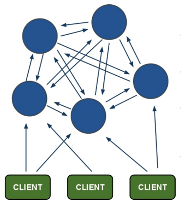
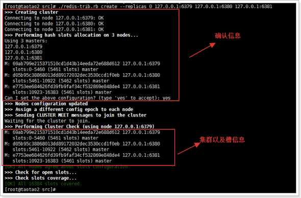
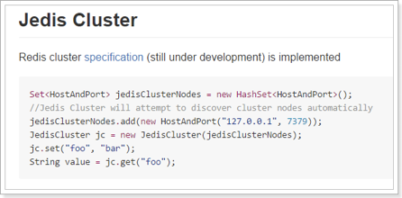
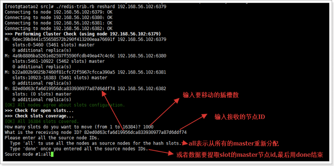
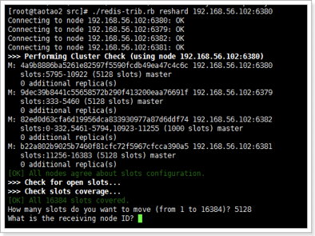
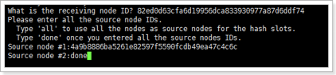
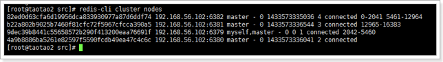
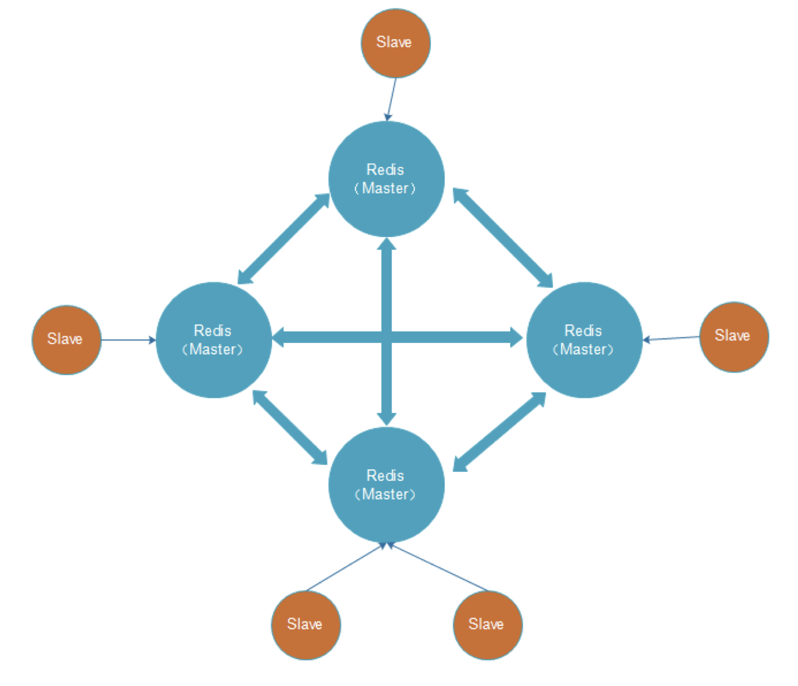
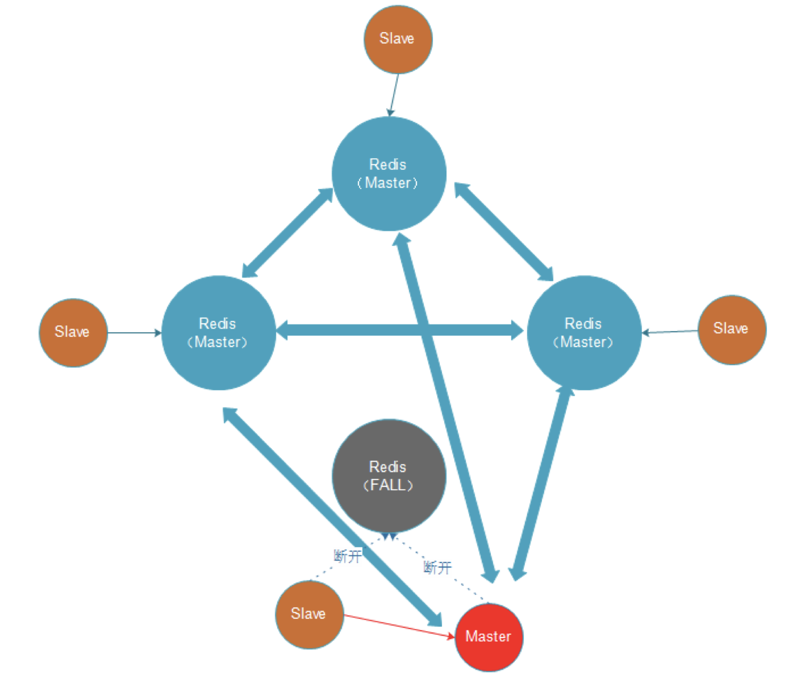
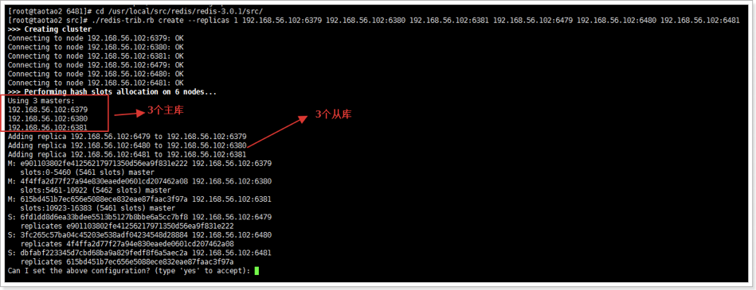

# 架构



- 所有的redis节点彼此互联(PING-PONG机制),内部使用二进制协议优化传输速度和带宽.
- 节点的fail是通过集群中超过半数的节点检测失效时才生效.（即有半数以上的节点将其标记为失效时）
- 客户端与redis节点直连,不需要中间proxy层.客户端不需要连接集群所有节点,连接集群中任何一个可用节点即可
- redis-cluster把所有的物理节点映射到[0-16383]slot（插槽）上,cluster 负责维护node<->slot<->value

# 创建集群

## 修改配置文件

- 创建不同redis服务的目录，如：6379、6380、6381
- 配置文件中开启集群`cluster-enabled yes`
- 指定集群的配置文件`cluster-config-file "nodes-xxxx.conf"`

创建集群前，需要安装ruby环境。因为启动集群的命令`redis-trib.rb`是ruby写的

```shell
yum -y install zlib ruby rubygems
gem install redis
```

创建集群的命令

```shell
./redis-trib.rb create --replicas 0 192.168.56.102:6379 192.168.56.102:6380 192.168.56.102:6381
```

--replicas 0：指定了从库的数量为0



创建完成后，客户端只需要连接任意一个节点，就可访问整个集群的数据。因为访问到不同插槽的数据时，redis会让客户端自动跳转到对应的节点上

# 使用Jedis连接到集群



说明：这里的jc不需要关闭，因为内部已经关闭连接了。

# 插槽

## 插槽的分配

通过`cluster nodes`命令可以查看当前集群的信息。该信息反映出了集群中的每个节点的id、身份、连接数、插槽数等。

当我们执行`set abc 123`命令时，redis执行步骤：

1. 接收命令set abc 123
2. 通过key（abc）计算出插槽值，然后根据插槽值找到对应的节点
3. 重定向到该节点执行命令

整个Redis提供了16384个插槽，也就是说集群中的每个节点分得的插槽数总和为16384。

./redis-trib.rb 脚本实现了是将16384个插槽平均分配给了N个节点。

**注意：如果插槽数有部分是没有指定到节点的，那么这部分插槽所对应的key将不能使用。**

## 插槽和key的关系

计算key的插槽值：**key的有效部分** 使用CRC16算法计算出哈希值，再将哈希值对16384取余，得到插槽值。

有效部分指：

1. 如果key中包含了{符号，且在{符号后存在}符号，并且{和}之间至少有一个字符，则有效部分是指{和}之间的部分
  - key={hello}_tatao的有效部分是hello
2. 如果不满足上一条情况，整个key都是有效部分
  - key=hello_taotao的有效部分是全部

# 添加集群节点

准备工作：配置一个支持集群的redis服务并启动

添加集群节点命令：`./redis-trib.rb add-node 新节点IP:端口 集群中某一个节点IP:端口`。

添加完节点后，还需要给节点分配插槽，否则该节点不能使用。

重新分配插槽命令：`./redis-trib.rb reshard 集群中某一个节点IP:端口`



# 删除集群节点

想要删除集群节点中的某一个节点，需要严格执行2步：

1. 将这个节点上的所有插槽转移到其他节点上
  1. 假设我们想要删除6380这个节点
  2. 执行脚本：`./redis-trib.rb reshard 192.168.56.102:6380`
  3. 选择需要转移的插槽的数量，因为3380有5128个，所以转移5128个

    

  4. 输入转移的节点的id，我们转移到6382节点：82ed0d63cfa6d19956dca833930977a87d6ddf7
  5. 输入插槽来源id，也就是6380的id
  6. 输入done，开始转移

    

  7. 查看集群信息，可以看到6380节点已经没有插槽了

    

2. 使用`redis-trib.rb`删除节点
  1. `./redis-trib.rb del-node host:port node_id`
  2. 删除后通过`redis-cli cluster nodes`验证是否已删除

# 故障转移

## 故障机制

1. 集群中的每个节点都会定期的向其它节点发送PING命令，并且通过有没有收到回复判断目标节点是否下线；
2. 集群中每一秒就会随机选择5个节点，然后选择其中最久没有响应的节点发PING命令；
3. 如果一定时间内目标节点都没有响应，那么该节点就认为目标节点**疑似下线**；
4. 当集群中的节点**超过半数**认为该目标节点疑似下线，那么该节点就会被标记为**下线**；
5. 当集群中的任何一个节点下线，就会导致插槽区有空档，不完整，那么该集群将不可用。

解决：

- 在Redis集群中可以使用主从模式实现某一个节点的高可用
- 当该节点（master）宕机后，集群会将该节点的从数据库（slave）转变为（master）继续完成集群服务。

## 集群中主从复制架构



出现故障时：



### 创建主从集群

以6个节点为例，3主3从：
- 6379（主） 6479（从）
- 6380（主） 6480（从）
- 6381（主） 6481（从）


1. 启动redis实例：

  ```shell
  cd 6379/ && redis-server ./redis.conf && cd ..
  cd 6380/ && redis-server ./redis.conf && cd ..
  cd 6381/ && redis-server ./redis.conf && cd ..
  cd 6479/ && redis-server ./redis.conf && cd ..
  cd 6480/ && redis-server ./redis.conf && cd ..
  cd 6481/ && redis-server ./redis.conf && cd ..
  ```

2. 创建集群，指定了从库数量为1，创建顺序为主库（3个）、从库（3个）

  先指定主，再指定从：
  ```shell
  ./redis-trib.rb create --replicas 1 192.168.56.102:6379 192.168.56.102:6380 192.168.56.102:6381 192.168.56.102:6479 192.168.56.102:6480 192.168.56.102:6481
  ```

  

创建完后，插槽会分配给主库，从库不会被分配到。

#### 宕机情况

- 如果从库宕机，由于插槽没有空挡，不会影响集群使用。重新启动从库即可恢复原来的状态。
- 如果主库宕机，则其从库会转化成主库，并接手主库的插槽在集群中工作。如果原来的主库恢复，则仍然会作为主库工作（恢复原来的状态），从库会继续作为其从库。

# 集群中需要注意事项

- 多键的命令操作（如MGET、MSET），如果每个键都位于同一个节点，则可以正常支持，否则会提示错误。
- 集群中的节点只能使用0号数据库，如果执行SELECT切换数据库会提示错误。
