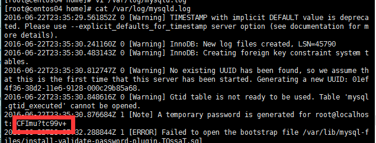

**在CentOS7中，需要先删除MariaDB。因为CentOS的默认数据库已经不再是MySQL了，而是MariaDB。**

```shell
rpm -qa |grep mariadb
rpm -e --nodeps mariadb-libs-5.5.35-3.el7.x86_64
```

使用rpm安装mysql（需要先下载好对应的安装文件）：

```shell
rpm -ivh mysql-community-common-5.7.13-1.el7.x86_64.rpm
rpm -ivh mysql-community-libs-5.7.13-1.el7.x86_64.rpm
rpm -ivh mysql-community-client-5.7.13-1.el7.x86_64.rpm
rpm -ivh mysql-community-server-5.7.13-1.el7.x86_64.rpm
```

执行 `cat /var/log/mysqld.log（cat /var/log/mysqld.log | grep root）`，查看初始密码：



使用临时密码登陆mysql：`mysql -uroot -p`

然后执行语句：`set password for root@localhost = password('123');`

以后就可以正常使用了
