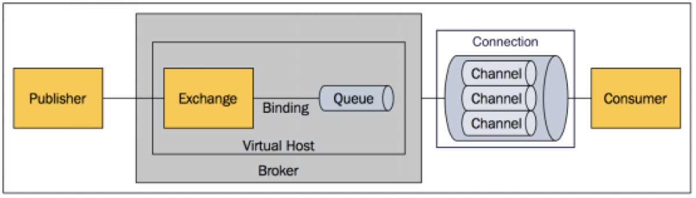
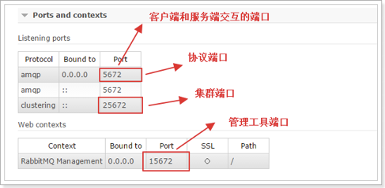
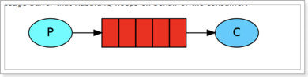
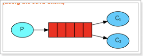
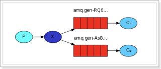
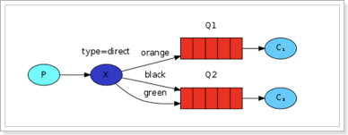
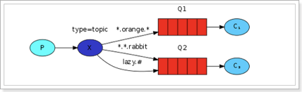
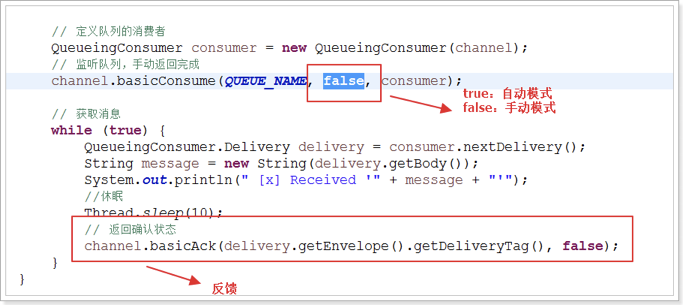
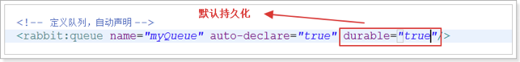

# AMQP

AMQP是一个提供统一消息服务的应用层标准高级消息队列协议

# 安装

安装步骤：

1. 先安装。erlang（编写rabbitmq的语言）、rabbitmq
2. 启动
3. 网页登录
4. 添加用户
5. 配置权限
6. 添加虚拟主机，及配置可访问该主机的用户

# 核心组件



- Message：消息，消息是不具名的，它由消息头和消息体组成。消息体是不透明的，而消息头则由一系列的可选属性组成，这些属性包括routing-key（路由键）、priority（相对于其他消息的优先权）、delivery-mode（指出该消息可能需要持久性存储）等。
- Publisher：消息的生产者。
- Exchange：交换器，用来接收生产者发送的消息并将这些消息路由给服务器中的队列。
- Queue：消息队列，用来保存消息直到发送给消费者。
- Binding：绑定，用于消息队列和交换器之间的关联。Exchange和Queue的绑定可以是多对多的关系。
- Connection：网络连接，比如一个TCP连接。
- Channel：信道，多路复用连接中的一条独立的双向数据流通道。信道是建立在真实的TCP连接内的虚拟连接，AMQP 命令都是通过信道发出去的，不管是发布消息、订阅队列还是接收消息，这些动作都是通过信道完成。因为对于操作系统来说建立和销毁 TCP 都是非常昂贵的开销，所以引入了信道的概念，以复用一条 TCP 连接。
- Consumer：消息的消费者，表示一个从消息队列中取得消息的客户端应用程序。
- Virtual Host：虚拟主机，表示一批交换器、消息队列和相关对象。虚拟主机是共享相同的身份认证和加密环境的独立服务器域。每个 vhost 本质上就是一个 mini 版的 RabbitMQ 服务器，拥有自己的队列、交换器、绑定和权限机制。vhost 是 AMQP 概念的基础，必须在连接时指定。RabbitMQ 默认的 vhost 是 / 。
- Broker：表示消息队列服务器实体。

# 端口信息



# 使用

## 队列

rabbit中，队列分为5种

```xml
<dependency>
	<groupId>com.rabbitmq</groupId>
	<artifactId>amqp-client</artifactId>
	<version>3.4.1</version>
</dependency>
```

### 简单队列

一个生产者对应一个消费者



- P：消息的生成者
- C：消息的消费者
- 红：队列

1. 生产者：发送消息到队列
2. 消费者：监听队列，获取消息

创建连接：

```java
public class ConnectionUtil {
    public static Connection getConnection() throws Exception {
        //定义连接工厂
        ConnectionFactory factory = new ConnectionFactory();
        //设置服务地址
        factory.setHost("localhost");
        //端口
        factory.setPort(5672);
        //设置账号信息，用户名、密码、vhost
        factory.setVirtualHost("/taotao");
        factory.setUsername("taotao");
        factory.setPassword("taotao");
        // 通过工程获取连接
        Connection connection = factory.newConnection();
        return connection;
    }
}
```

发送消息：

```java
public class Send {
    private final static String QUEUE_NAME = "test_queue";

    public static void main(String[] argv) throws Exception {
        // 获取到连接以及mq通道
        Connection connection = ConnectionUtil.getConnection();
        // 从连接中创建通道
        Channel channel = connection.createChannel();

        // 声明（创建）队列，如果没有这个队列，则创建；有则不重复创建
        channel.queueDeclare(QUEUE_NAME, false, false, false, null);

        // 消息内容
        String message = "Hello World!";
        channel.basicPublish("", QUEUE_NAME, null, message.getBytes());

        //关闭通道和连接
        channel.close();
        connection.close();
    }
}
```

监听队列，获取消息。获取消息基本上是实时的。

```java
public class Recv {
    private final static String QUEUE_NAME = "test_queue";

    public static void main(String[] argv) throws Exception {

        // 获取到连接以及mq通道
        Connection connection = ConnectionUtil.getConnection();
        Channel channel = connection.createChannel();

        // 声明队列。防止队列不存在时，监听报错
        channel.queueDeclare(QUEUE_NAME, false, false, false, null);

        // 定义队列的消费者
        QueueingConsumer consumer = new QueueingConsumer(channel);
        // 监听队列
        channel.basicConsume(QUEUE_NAME, true, consumer);

        // 获取消息
        while (true) {
            QueueingConsumer.Delivery delivery = consumer.nextDelivery();
            String message = new String(delivery.getBody());
            System.out.println(" [x] Received '" + message + "'");
        }
    }
}
```

### work模式

一个生产者对应多个消费者。

**消息只能被其中一个消费者获取**。

作用：通过多个消息者共同完成一个大的任务。



生产者。向队列中发送100个消息：

```java
// 获取到连接以及mq通道
Connection connection = ConnectionUtil.getConnection();
Channel channel = connection.createChannel();

// 声明队列
channel.queueDeclare(QUEUE_NAME, false, false, false, null);

for (int i = 0; i < 100; i++) {
    // 消息内容
    String message = "" + i;
    channel.basicPublish("", QUEUE_NAME, null, message.getBytes());
    System.out.println(" [x] Sent '" + message + "'");

    Thread.sleep(i * 10);
}

channel.close();
connection.close();
```

消费者：

```java
// 获取到连接以及mq通道
Connection connection = ConnectionUtil.getConnection();
Channel channel = connection.createChannel();

// 声明队列
channel.queueDeclare(QUEUE_NAME, false, false, false, null);

// 同一时刻服务器只会发一条消息给消费者
// 消费者已处理完，可以马上获取下一条消息进行处理
// 如果不设置，则会根据消费者数量平均分配
channel.basicQos(1);

// 定义队列的消费者
QueueingConsumer consumer = new QueueingConsumer(channel);
// 监听队列，手动返回完成
channel.basicConsume(QUEUE_NAME, false, consumer);

// 获取消息
while (true) {
    QueueingConsumer.Delivery delivery = consumer.nextDelivery();
    String message = new String(delivery.getBody());
    System.out.println(" [x] Received '" + message + "'");
    //休眠 可以多定义几个消费者，通过休眠时间指定消费者的处理效率
    Thread.sleep(10);
    // 返回确认状态
    channel.basicAck(delivery.getEnvelope().getDeliveryTag(), false);
}
```

### 订阅模式

一个生产者，多个消费者。



和work模式的区别：
1. 生产者将消息发送到交换机，而不是队列
2. 一个消费者一个队列，而不是共用一个队列
3. 同一个消息可以被多个消费者获取

订阅模式逻辑实现：
1. 生产者将消息发送到交换机
2. 将队列绑定到交换机
3. 消费者监听队列获取消息

注意：**如果没有队列绑定到交换机，发送到交换机的消息将丢失**。也就说，交换机不能存储消息，消息只能存储于队列。

消费者：

```java
private final static String EXCHANGE_NAME = "test_exchange_fanout";

public static void main(String[] argv) throws Exception {
    // 获取到连接以及mq通道
    Connection connection = ConnectionUtil.getConnection();
    Channel channel = connection.createChannel();

    // 声明exchange
    channel.exchangeDeclare(EXCHANGE_NAME, "fanout");

    // 消息内容
    String message = "Hello World!";
    channel.basicPublish(EXCHANGE_NAME, "", null, message.getBytes());
    System.out.println(" [x] Sent '" + message + "'");

    channel.close();
    connection.close();
}
```

消费者：

```java
private final static String QUEUE_NAME = "test_queue_work";

private final static String EXCHANGE_NAME = "test_exchange_fanout";

public static void main(String[] argv) throws Exception {

    // 获取到连接以及mq通道
    Connection connection = ConnectionUtil.getConnection();
    Channel channel = connection.createChannel();

    // 声明队列
    channel.queueDeclare(QUEUE_NAME, false, false, false, null);

    // 绑定队列到交换机
    channel.queueBind(QUEUE_NAME, EXCHANGE_NAME, "");

    // 同一时刻服务器只会发一条消息给消费者
    channel.basicQos(1);

    // 定义队列的消费者
    QueueingConsumer consumer = new QueueingConsumer(channel);
    // 监听队列，手动返回完成
    channel.basicConsume(QUEUE_NAME, false, consumer);

    // 获取消息
    while (true) {
        QueueingConsumer.Delivery delivery = consumer.nextDelivery();
        String message = new String(delivery.getBody());
        System.out.println(" [x] Received '" + message + "'");
        Thread.sleep(10);

        channel.basicAck(delivery.getEnvelope().getDeliveryTag(), false);
    }
}
```

### 路由模式



路由模式和订阅模式的区别：队列绑定交换机时可以指定路由key。

上面代码，生产者只需要将交换机声明为路由的交换机

```java
channel.exchangeDeclare(EXCHANGE_NAME, "direct");
```

发送消息时，需要指定所要发送的key

```java
channel.basicPublish(EXCHANGE_NAME, "key", null, message.getBytes());
```

消费者绑定交换机时，绑定指定要绑定的key

```java
channel.queueBind(QUEUE_NAME, EXCHANGE_NAME, "key");
```

### 通配符模式



与路由模式区别：
路由模式的key是精确匹配的，而通配符模式可以通过 # 或者 * 进行配置，达到动态的效果

其中：

- #表示一个或多个词
- *表示不多不少的一个词

生产者：

将交换机指定为通配符方式：

```java
channel.exchangeDeclare(EXCHANGE_NAME, "topic");
```

发送消息时，需要指定所要发送的key

```java
// key可以使用模块或者实体名作为前缀，通过后缀来指定不同的操作
channel.basicPublish(EXCHANGE_NAME, "item.insert", null, message.getBytes());
```

消费者：

```java
channel.queueBind(QUEUE_NAME, EXCHANGE_NAME, "item.#");
```

```java
// 可以同时绑定多个
channel.queueBind(QUEUE_NAME, EXCHANGE_NAME, "item.update");
channel.queueBind(QUEUE_NAME, EXCHANGE_NAME, "item.delete");
```

## 消费者的消费模式

有两种模式：

- 自动模式：客户端从服务器获取消息后，消息无论是否正常执行，服务器都会认为该消息被成功消费。
- 手动模式：客户端从服务器获取消息后，服务器要将该消息标记为不可用状态，需要等待客户端向服务器端反馈，反馈该消息是否成功消费。



## 集成Spring

定义配置文件:

```xml
<!-- 定义RabbitMQ的连接工厂 -->
<rabbit:connection-factory id="connectionFactory" host="127.0.0.1" port="5672" username="taotao" password="taotao" virtual-host="/taotao" />

<!-- MQ的管理，包括队列、交换器等 -->
<rabbit:admin connection-factory="connectionFactory" />

<!-- 定义队列，自动声明 -->
<rabbit:queue name="myQueue" auto-declare="true"/>

<!-- 定义交换器，并绑定队列，及自动声明（即使用时，如果没有，则声明） -->
<rabbit:fanout-exchange name="fanoutExchange" auto-declare="true">
	<rabbit:bindings>
		<rabbit:binding queue="myQueue"/>
	</rabbit:bindings>
</rabbit:fanout-exchange>

<!-- 	<rabbit:topic-exchange name="myExchange">
	<rabbit:bindings>
		<rabbit:binding queue="myQueue" pattern="foo.*" />
	</rabbit:bindings>
</rabbit:topic-exchange> -->

<!-- 定义Rabbit模板，指定连接工厂以及定义exchange或queue -->
<rabbit:template id="amqpTemplate" connection-factory="connectionFactory" exchange="fanoutExchange" />

<!--消费者bean定义-->
<bean id="foo" class="cn.itcast.rabbitmq.spring.Foo" />

<!-- 队列监听 -->
<rabbit:listener-container connection-factory="connectionFactory">
	<!--指定通过listen方法作为消费处理方法-->
	<rabbit:listener ref="foo" method="listen" queue-names="myQueue" />
</rabbit:listener-container>
```

生产者：

```java
public static void main(final String... args) throws Exception {
    AbstractApplicationContext ctx = new ClassPathXmlApplicationContext("classpath:spring/rabbitmq-context.xml");
    //RabbitMQ模板
    RabbitTemplate template = ctx.getBean(RabbitTemplate.class);
    //发送消息
    template.convertAndSend("Hello, world!");
    Thread.sleep(1000);// 休眠1秒
    ctx.destroy(); //容器销毁
}
```

消费者：

```java
public class Foo {
    //具体执行业务的方法
    public void listen(String foo) {
        System.out.println("消费者： " + foo);
    }
}
```

## 队列持久化

持久化：是指将队列以及队列中的消息保存到磁盘，当服务器宕机、重启之后，队列和消息依然存在


