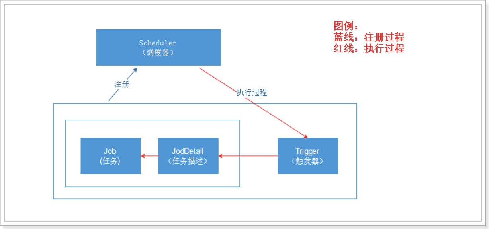

# quartz中的元素

- scheduler 调度器
- job 任务
- jobdetail 任务描述
- trigger 触发器



## 触发器

- simplertrigger 简单触发器
- crontrigger 表达式触发器
  + 根据日历进行任务安排

## Cron Expressions

cron的表达式是字符串，实际上是由七子表达式，描述个别细节的时间表。

1. Seconds：可以用数字0－59 表示
2. Minutes：可以用数字0－59 表示
3. Hours：可以用数字0-23表示
4. Day-of-Month：可以用数字1-31 中的任一一个值，但要注意一些特别的月份
5. Month：可以用0-11 或用字符串  "JAN, FEB, MAR, APR, MAY, JUN, JUL, AUG, SEP, OCT, NOV and DEC" 表示
6. Day-of-Week：可以用数字1-7表示（1 ＝ 星期日）或用字符口串"SUN, MON, TUE, WED, THU, FRI and SAT"表示
7. Year (可选字段)


- "?"字符：表示不确定的值
- ","字符：指定数个值
- "-"字符：指定一个值的范围
- "/"字符：指定一个值的增加幅度。n/m表示从n开始，每次增加m
- "L"字符：用在日表示一个月中的最后一天，用在周表示该月最后一个星期X
- "W"字符：指定离给定日期最近的工作日(周一到周五)
- "#"字符：表示该月第几个周X。6#3表示该月第3个周五

demo：

- 每隔5秒执行一次：*/5 * * * * ?
- 每隔1分钟执行一次：0 */1 * * * ?
- 每天23点执行一次：0 0 23 * * ?
- 每天凌晨1点执行一次：0 0 1 * * ?
- 每月1号凌晨1点执行一次：0 0 1 1 * ?
- 每月最后一天23点执行一次：0 0 23 L * ?
- 每周星期天凌晨1点实行一次：0 0 1 ? * L
- 在26分、29分、33分执行一次：0 26,29,33 * * * ?
- 每天的0点、13点、18点、21点都执行一次：0 0 0,13,18,21 * * ?

# 在java代码中使用

添加依赖：

```xml
<dependency>
	<groupId>org.quartz-scheduler</groupId>
	<artifactId>quartz</artifactId>
	<version>2.2.1</version>
</dependency>
```

通过job接口定义任务：

```java
public class HelloJob implements Job {
    private static Logger _log = LoggerFactory.getLogger(HelloJob.class);

    public HelloJob() {
    }

    public void execute(JobExecutionContext context) throws JobExecutionException {
        _log.info("Hello World! - " + new Date());
    }
}
```

simpletrigger例子：

```java
import static org.quartz.DateBuilder.evenMinuteDate;
import static org.quartz.JobBuilder.newJob;
import static org.quartz.TriggerBuilder.newTrigger;

public class SimpleExample {

    public void run() throws Exception {

        // 定义调度器
        SchedulerFactory sf = new StdSchedulerFactory();
        Scheduler sched = sf.getScheduler();

        // 获取当前时间的下一分钟
        Date runTime = evenMinuteDate(new Date());

        // 定义job
        // 在quartz中，有组的概念，组+job名称 唯一的
        JobDetail job = newJob(HelloJob.class).withIdentity("job1", "group1").build();

        // 定义触发器，在下一分钟启动
        Trigger trigger = newTrigger().withIdentity("trigger1", "group1").startAt(runTime).build();

        // 将job注册到调度器
        sched.scheduleJob(job, trigger);

        // 启动调度器
        sched.start();

        try {
            // wait 65 seconds to show job
            Thread.sleep(65L * 1000L);
            // executing...
        } catch (Exception e) {
            //
        }

        sched.shutdown(true);
    }

    public static void main(String[] args) throws Exception {
        SimpleExample example = new SimpleExample();
        example.run();
    }
}
```

crontrigger例子：

```java
import static org.quartz.CronScheduleBuilder.cronSchedule;
import static org.quartz.DateBuilder.evenMinuteDate;
import static org.quartz.JobBuilder.newJob;
import static org.quartz.TriggerBuilder.newTrigger;

public class SimpleCronExample {

    public void run() throws Exception {
        // 定义调度器
        SchedulerFactory sf = new StdSchedulerFactory();
        Scheduler sched = sf.getScheduler();

        // 定义job
        JobDetail job = newJob(HelloJob.class).withIdentity("job1", "group1").build();

        // 定义触发器，每2秒执行一次
        Trigger trigger = newTrigger().withIdentity("trigger1", "group1")
                .withSchedule(cronSchedule("0 0/1 * * * ?")).build();

        // 将job注册到调度器
        sched.scheduleJob(job, trigger);

        // 启动调度器
        sched.start();

        try {
            Thread.sleep(60L * 1000L);
        } catch (Exception e) {
            //
        }

        // 关闭调度器
        sched.shutdown(true);
    }

    public static void main(String[] args) throws Exception {
        SimpleCronExample example = new SimpleCronExample();
        example.run();
    }
}
```

# trigger与job的关系

一个job可以被多个trigger触发，一个trigger不能同时执行多个job
