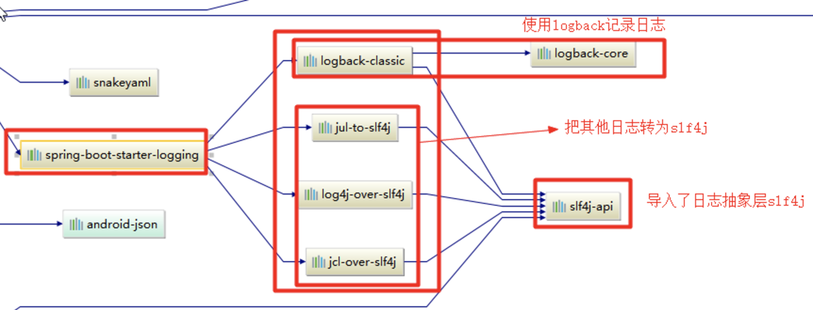

# 主程序类，主入口类

```java
/**
 *  @SpringBootApplication 来标注一个主程序类，说明这是一个Spring Boot应用
 */
@SpringBootApplication
public class HelloWorldMainApplication {

    public static void main(String[] args) {

        // Spring应用启动起来
        SpringApplication.run(HelloWorldMainApplication.class,args);
    }
}

```

@**SpringBootApplication**:

```java
@Target(ElementType.TYPE)
@Retention(RetentionPolicy.RUNTIME)
@Documented
@Inherited
@SpringBootConfiguration
@EnableAutoConfiguration
@ComponentScan(excludeFilters = {
      @Filter(type = FilterType.CUSTOM, classes = TypeExcludeFilter.class),
      @Filter(type = FilterType.CUSTOM, classes = AutoConfigurationExcludeFilter.class) })
public @interface SpringBootApplication {
```

说明：

@**SpringBootConfiguration**:Spring Boot的配置类；

​		标注在某个类上，表示这是一个Spring Boot的配置类；

​		@**Configuration**:在配置类上来标注这个注解；

    - 配置类相当于配置文件；
    - 配置类也是容器中的一个组件；@Component

@**EnableAutoConfiguration**：开启自动配置功能；

```java
@AutoConfigurationPackage
@Import(EnableAutoConfigurationImportSelector.class)
public @interface EnableAutoConfiguration {
```

​ @**AutoConfigurationPackage**：自动配置包

​		@**Import**(AutoConfigurationPackages.Registrar.class)：

  - Spring的底层注解@Import，给容器中导入一个组件；导入的组件为AutoConfigurationPackages.Registrar.class；
  - 将主配置类（@SpringBootApplication标注的类）的所在包及下面所有子包里面的所有组件扫描到Spring容器；

​	  @**Import**(EnableAutoConfigurationImportSelector.class)；

  - **EnableAutoConfigurationImportSelector**：导入哪些组件的选择器；
  - 将所有需要导入的组件以全类名的方式返回；这些组件就会被添加到容器中；
  - 会给容器中导入非常多的自动配置类（xxxAutoConfiguration）；

​		SpringFactoriesLoader.loadFactoryNames(EnableAutoConfiguration.class,classLoader)；==Spring Boot在启动的时候从类路径下的META-INF/spring.factories中获取EnableAutoConfiguration指定的值，将这些值作为自动配置类导入到容器中，自动配置类就生效，帮我们进行自动配置工作；

# 配置文件

用yml文件可以直接使用中文，而properties文件会乱码，因为spring boot是以iso-8859的编码读取properties文件的

## YAML语法

### 基本语法

k:(空格)v：表示一对键值对（**空格必须有**）

属性和值也是大小写敏感；

### 值的写法

#### 字面量：普通的值（数字，字符串，布尔）

k: v：字面直接来写

##### 字符串默认不用加上单引号或者双引号

- ""：双引号；不会转义字符串里面的特殊字符；特殊字符会作为本身想表示的意思
  + name: "zhangsan \n lisi"：输出；zhangsan 换行  lisi
- ''：单引号；会转义特殊字符，特殊字符最终只是一个普通的字符串数据
  + name: 'zhangsan \n lisi'：输出；zhangsan \n  lisi

#### 对象、Map（属性和值）（键值对）

k: v：在下一行来写对象的属性和值的关系；注意缩进

```yaml
friends:
  lastName: zhangsan
	age: 20
```

行内写法：

```yaml
friends: {lastName: zhangsan,age: 18}
```

#### 数组（List、Set）：

用- 值表示数组中的一个元素

```yaml
pets:
 - cat
 - dog
 - pig
```

行内写法

```yaml
pets: [cat,dog,pig]
```

## 配置文件值注入

配置文件

```yaml
person:
    lastName: hello
    age: 18
    boss: false
    birth: 2017/12/12
    maps: {k1: v1,k2: 12}
    lists:
      - lisi
      - zhaoliu
    dog:
      name: 小狗
      age: 12
```

javaBean：

```java
//必须被容器管理
@Component
// @ConfigurationProperties：告诉SpringBoot将本类中的所有属性和配置文件中相关的配置进行绑定，并且在资源文件中的属性的前缀为person
@ConfigurationProperties(prefix = "person")
public class Person {
    private String lastName;
    private Integer age;
    private Boolean boss;
    private Date birth;

    private Map<String,Object> maps;
    private List<Object> lists;
    private Dog dog;

```

```xml
<!--导入配置文件处理器，配置文件进行绑定就会有提示-->
<dependency>
  <groupId>org.springframework.boot</groupId>
	<artifactId>spring-boot-configuration-processor</artifactId>
	<optional>true</optional>
</dependency>
```

## @Value获取值和@ConfigurationProperties获取值比较

|            | @ConfigurationProperties | @Value |
| ---------- | ------------------------ | ------ |
| 功能         | 批量注入配置文件中的属性             | 一个个指定  |
| 松散绑定（松散语法） | 支持                       | 不支持    |
| SpEL       | 不支持                      | 支持     |
| JSR303数据校验 | 支持                       | 不支持    |
| 复杂类型封装     | 支持                       | 不支持    |

## 配置文件注入值数据校验

```java
@Component
@ConfigurationProperties(prefix = "person")
@Validated
public class Person {
   //lastName必须是邮箱格式
    @Email
    //@Value("${person.last-name}")
    private String lastName;
    //@Value("#{11*2}")
    private Integer age;
    //@Value("true")
    private Boolean boss;

    private Date birth;
    private Map<String,Object> maps;
    private List<Object> lists;
    private Dog dog;
```

## @PropertySource&@ImportResource&@Bean

@**PropertySource**：加载指定的配置文件；

```java
/**
 * 加载person.properties文件内容，并且只加载前缀为person的属性
 */
@PropertySource(value = {"classpath:person.properties"})
@Component
@ConfigurationProperties(prefix = "person")
public class Person {
    private String lastName;
    private Integer age;
    private Boolean boss;
```

@**ImportResource**：导入Spring的配置文件，让配置文件里面的内容生效；

Spring Boot里面没有Spring的配置文件，想让Spring的配置文件生效，需要使用@**ImportResource**注解标准在一个配置类上

```java
@ImportResource(locations = {"classpath:beans.xml"})
导入Spring的配置文件让其生效
```

```xml
<?xml version="1.0" encoding="UTF-8"?>
<beans xmlns="http://www.springframework.org/schema/beans"
       xmlns:xsi="http://www.w3.org/2001/XMLSchema-instance"
       xsi:schemaLocation="http://www.springframework.org/schema/beans http://www.springframework.org/schema/beans/spring-beans.xsd">
    <bean id="helloService" class="com.atguigu.springboot.service.HelloService"></bean>
</beans>
```

**SpringBoot不推荐用这种方式，而是推荐使用全注解的方式**

1. 配置类**@Configuration**。相当于Spring的配置文件
2. 使用**@Bean**给容器中添加组件

```java
/**
 * @Configuration：指明当前类是一个配置类；就是来替代之前的Spring配置文件
 * 在配置文件中用<bean><bean/>标签添加组件
 */
@Configuration
public class MyAppConfig {
    //将方法的返回值添加到容器中；容器中这个组件默认的id就是方法名
    @Bean
    public HelloService helloService02(){
        System.out.println("配置类@Bean给容器中添加组件了...");
        return new HelloService();
    }
}
```

## 配置文件占位符

### 随机数

```java
${random.value}、${random.int}、${random.long}
${random.int(10)}、${random.int[1024,65536]}
```

### 占位符获取之前配置的值，可通过冒号（:）指定默认值

```properties
person.last-name=张三${random.uuid}
person.age=${random.int}
person.dog.name=${person.hello:hello}_dog
```

## Profile

### 多Profile文件

springboot默认使用application.properties/yml的配置

可以额外定义多个文件，文件名是application-{profile}.properties/yml来表示不同环境的配置

### yml支持多文档块方式

使用三横杆（---）分隔

```yml
server:
  port: 8081
spring:
  profiles:
    active: prod  #指定使用哪个环境
---
server:
  port: 8083
spring:
  profiles: dev
---
server:
  port: 8084
spring:
  profiles: prod  #指定属于哪个环境
```

### 激活指定profile

激活不同环境有以下几种方式

1. 在配置文件中指定spring.profiles.active=dev
2. 命令行：java -jar spring-boot-02-config-0.0.1-SNAPSHOT.jar --spring.profiles.active=dev
3. 虚拟机参数：-Dspring.profiles.active=dev

## 优先级

springboot启动会扫描以下位置的application.properties或者application.yml文件作为Spring boot的默认配置文件

- 外置，相当于项目中/congfig子目录里。
- 外置，项目根目录
- 内置，resources目录下的config目录内
- 内置，resources目录

优先级按以上列表顺序由高到低

比如：src/main/resources/config下application.properties覆盖src/main/resources下application.properties中相同的属性。

此外，如果你在相同优先级位置同时有application.properties和application.yml，那么application.properties里的属性里面的属性就会覆盖application.yml。

==还可以通过spring.config.location来改变默认的配置文件位置==

**项目打包好以后，我们可以使用命令行参数的形式，启动项目的时候来指定配置文件的新位置；指定配置文件和默认加载的这些配置文件共同起作用形成互补配置；**

```shell
java -jar spring-boot-02-config-02-0.0.1-SNAPSHOT.jar --spring.config.location=G:/application.properties
```

## 外部配置加载顺序

- SpringBoot也可以从以下位置加载配置；优先级从高到低；高优先级的配置覆盖低优先级的配置，所有的配置会形成互补配置
- 由jar包外向jar包内进行寻找；
- 优先加载带profile
- 再来加载不带profile
- @Configuration注解类上的@PropertySource
- 通过SpringApplication.setDefaultProperties指定的默认属性

所有支持的配置加载来源；

[参考官方文档](https://docs.spring.io/spring-boot/docs/current/reference/htmlsingle/#boot-features-external-config)

## 自动配置原理

[配置文件能配置的属性参照](https://docs.spring.io/spring-boot/docs/current/reference/htmlsingle/#common-application-properties)

### 自动配置原理

- SpringBoot启动的时候加载主配置类，由于@EnableAutoConfiguration开启了自动配置功能
- @EnableAutoConfiguration作用
  + 引入EnableAutoConfigurationImportSelector给容器中导入一些组件（selectImports()方法）
  + 其中，关键代码：List<String> configurations = getCandidateConfigurations(annotationMetadata,attributes);获取候选的配置
  + SpringFactoriesLoader.loadFactoryNames()扫描所有jar包类路径下META-INF/spring.factories。把扫描到的这些文件的内容包装成xxxAutoConfiguration和xxxProperties对象，并添加到容器中。
  + META-INF/spring.factories文件样例：
    ```properties
    # Auto Configure
    org.springframework.boot.autoconfigure.EnableAutoConfiguration=\
    org.springframework.boot.autoconfigure.admin.SpringApplicationAdminJmxAutoConfiguration,\
    org.springframework.boot.autoconfigure.aop.AopAutoConfiguration,\
    ...
    ```
  + 每一个这样的xxxAutoConfiguration类都是容器中的一个组件，都加入到容器中；用他们来做自动配置；每一个自动配置类进行自动配置功能；
- 以**HttpEncodingAutoConfiguration（Http编码自动配置）**为例解释自动配置原理

  ```java
  @Configuration   //表示这是一个配置类
  @EnableConfigurationProperties(HttpEncodingProperties.class)  //启动指定类的ConfigurationProperties功能；将配置文件中对应的值和HttpEncodingProperties绑定起来；并把HttpEncodingProperties加入到ioc容器中
  @ConditionalOnWebApplication //Spring底层@Conditional注解，根据不同的条件，如果满足指定的条件，整个配置类里面的配置就会生效；这里判断当前应用是否是web应用，如果是，当前配置类生效
  @ConditionalOnClass(CharacterEncodingFilter.class)  //判断当前项目有没有这个类CharacterEncodingFilter
  @ConditionalOnProperty(prefix = "spring.http.encoding", value = "enabled", matchIfMissing = true)  //判断配置文件中是否存在某个配置  spring.http.encoding.enabled；如果不存在，判断也是成立的
  public class HttpEncodingAutoConfiguration {
    //他已经和SpringBoot的配置文件映射了
  	private final HttpEncodingProperties properties;
    //只有一个有参构造器的情况下，参数的值就会从容器中拿
  	public HttpEncodingAutoConfiguration(HttpEncodingProperties properties) {
      this.properties = properties;
	}

  @Bean   //给容器中添加一个组件，这个组件的某些值需要从properties中获取
	@ConditionalOnMissingBean(CharacterEncodingFilter.class) //判断容器没有这个组件
	public CharacterEncodingFilter characterEncodingFilter() {
		CharacterEncodingFilter filter = new OrderedCharacterEncodingFilter();
		filter.setEncoding(this.properties.getCharset().name());
		filter.setForceRequestEncoding(this.properties.shouldForce(Type.REQUEST));
		filter.setForceResponseEncoding(this.properties.shouldForce(Type.RESPONSE));
		return filter;
	}
  ```

  一但这个配置类生效；这个配置类就会给容器中添加各种组件；这些组件的属性是从对应的properties类中获取的，这些类里面的每一个属性又是和配置文件绑定的；

- 所有在配置文件中能配置的属性都是在xxxxProperties类中封装的

  ```java
  @ConfigurationProperties(prefix = "spring.http.encoding")
  public class HttpEncodingProperties {
     public static final Charset DEFAULT_CHARSET = Charset.forName("UTF-8");
  ```

## 精髓

- xxxxAutoConfigurartion：自动配置类；给容器中添加组件;
- xxxxProperties:封装配置文件中相关属性；


1. SpringBoot启动会加载大量的自动配置类
2. 看需要的功能SpringBoot有没有默认写好的自动配置类
3. 再来看这个自动配置类中到底配置了哪些组件（只要我们要用的组件有，我们就不需要再来配置了）
4. 给容器中自动配置类添加组件的时候，会从properties类中获取某些属性。我们就可以在配置文件中指定这些属性的值

### 细节

#### @Conditional派生注解（Spring注解版原生的@Conditional作用）

作用：必须是@Conditional指定的条件成立，才给容器中添加组件，配置里面的所有内容才生效；

| @Conditional扩展注解                | 作用（判断是否满足当前指定条件）               |
| ------------------------------- | ------------------------------ |
| @ConditionalOnJava              | 系统的java版本是否符合要求                |
| @ConditionalOnBean              | 容器中存在指定Bean；                   |
| @ConditionalOnMissingBean       | 容器中不存在指定Bean；                  |
| @ConditionalOnExpression        | 满足SpEL表达式指定                    |
| @ConditionalOnClass             | 系统中有指定的类                       |
| @ConditionalOnMissingClass      | 系统中没有指定的类                      |
| @ConditionalOnSingleCandidate   | 容器中只有一个指定的Bean，或者这个Bean是首选Bean |
| @ConditionalOnProperty          | 系统中指定的属性是否有指定的值                |
| @ConditionalOnResource          | 类路径下是否存在指定资源文件                 |
| @ConditionalOnWebApplication    | 当前是web环境                       |
| @ConditionalOnNotWebApplication | 当前不是web环境                      |
| @ConditionalOnJndi              | JNDI存在指定项                      |

#### 自动配置类必须在一定的条件下才能生效

我们怎么知道哪些自动配置类生效

**可以在资源文件中配置debug=true。来让控制台打印自动配置报告**

```java
=========================
AUTO-CONFIGURATION REPORT
=========================

Positive matches:（自动配置类启用的）
-----------------

   DispatcherServletAutoConfiguration matched:
      - @ConditionalOnClass found required class 'org.springframework.web.servlet.DispatcherServlet'; @ConditionalOnMissingClass did not find unwanted class (OnClassCondition)
      - @ConditionalOnWebApplication (required) found StandardServletEnvironment (OnWebApplicationCondition)

Negative matches:（没有启动，没有匹配成功的自动配置类）
-----------------

   ActiveMQAutoConfiguration:
      Did not match:
         - @ConditionalOnClass did not find required classes 'javax.jms.ConnectionFactory', 'org.apache.activemq.ActiveMQConnectionFactory' (OnClassCondition)

   AopAutoConfiguration:
      Did not match:
         - @ConditionalOnClass did not find required classes 'org.aspectj.lang.annotation.Aspect', 'org.aspectj.lang.reflect.Advice' (OnClassCondition)
```

# 日志

## 日志框架

市面上的日志框架：JUL、JCL、Jboss-logging、logback、log4j、log4j2、slf4j....

| 日志门面  （日志的抽象层）                           | 日志实现                                     |
| ---------------------------------------- | ---------------------------------------- |
| ~~JCL（Jakarta  Commons Logging）~~    SLF4j（Simple  Logging Facade for Java）    ~~jboss-logging~~ | Log4j  JUL（java.util.logging）  Log4j2  **Logback** |

日志门面：JCL从2014年开始没更新过、jboss-logging几乎没人用。

日志实现：log4j有性能问题，作者重新编写了logback，同时编写了slf4j。log4j2是appache出的，设计得也很好，不过其他框架尚未有很好的支持

最终选择：
日志门面：SLF4J；
日志实现：Logback；

SpringBoot：底层是Spring框架，Spring框架默认是用JCL。而**SpringBoot选用SLF4j和logback**

## SLF4j使用

### 如何在系统中使用SLF4j https://www.slf4j.org

给系统里面导入slf4j的jar和logback的实现jar

```java
import org.slf4j.Logger;
import org.slf4j.LoggerFactory;

public class HelloWorld {
  public static void main(String[] args) {
    Logger logger = LoggerFactory.getLogger(HelloWorld.class);
    logger.info("Hello World");
  }
}
```


注意：每一个日志的实现框架都有自己的配置文件。使用slf4j以后，**配置文件还是做成日志实现框架自己本身的配置文件**

### 遗留问题

不同的框架内部都引用了不同的日志框架，如: Spring（commons-logging）、Hibernate（jboss-logging）、MyBatis、xxxx

需要统一日志记录，使别的框架和我一起统一使用slf4j进行输出


1. 将系统中其他日志框架先排除出去
2. 用中间包来替换原有的日志框架
3. 我们导入slf4j其他的实现

## SpringBoot中的日志关系

spring-boot-starter包中依赖了spring-boot-starter-logging包，spring-boot-starter-logging包中依赖了slf4j的相关包



总结：

1. SpringBoot底层也是使用slf4j+logback的方式进行日志记录
2. SpringBoot也把其他的日志都替换成了slf4j
3. 如果要引入其他框架，一定要把这个框架的默认日志依赖移除掉

  Spring框架用的是commons-logging；
  ```xml
  		<dependency>
  			<groupId>org.springframework</groupId>
  			<artifactId>spring-core</artifactId>
  			<exclusions>
  				<exclusion>
  					<groupId>commons-logging</groupId>
  					<artifactId>commons-logging</artifactId>
  				</exclusion>
  			</exclusions>
  		</dependency>
  ```

## 日志使用

### 默认配置

SpringBoot默认配置好了日志，直接使用api即可

```java
//记录器
Logger logger = LoggerFactory.getLogger(getClass());
@Test
public void contextLoads() {
	//日志的级别
	//由低到高：trace<debug<info<warn<error
	//可以调整输出的日志级别。
	logger.trace("这是trace日志...");
	logger.debug("这是debug日志...");
	//SpringBoot默认给我们使用的是info级别的，没有指定级别的就用默认的。root级别
	logger.info("这是info日志...");
	logger.warn("这是warn日志...");
	logger.error("这是error日志...");
}
```

日志输出格式：

- %d表示日期时间
- %thread表示线程名
- %-5level：级别从左显示5个字符宽度
- %logger{50} 表示logger名字最长50个字符，否则按照句点分割
- %msg：日志消息
- %n是换行符

```
%d{yyyy-MM-dd HH:mm:ss.SSS} [%thread] %-5level %logger{50} - %msg%n
```

### SpringBoot中修改默认配置

```properties
logging.level=trace

# 不指定路径，就在当前项目下生成日志文件
# 可以指定完整的路径
#logging.file=G:/springboot.log

# 指定文件存放目录。默认使用 spring.log 作为文件名
logging.path=/spring/log

#  在控制台输出的日志的格式
logging.pattern.console=%d{yyyy-MM-dd} [%thread] %-5level %logger{50} - %msg%n

# 指定文件中日志输出的格式
logging.pattern.file=%d{yyyy-MM-dd} === [%thread] === %-5level === %logger{50} ==== %msg%n
```

| logging.file | logging.path | Example  | Description             |
| ------------ | ------------ | -------- | ----------------------- |
| (none)       | (none)       |          | 只在控制台输出                 |
| 指定文件名        | (none)       | my.log   | 输出日志到my.log文件           |
| (none)       | 指定目录         | /var/log | 输出到指定目录的 spring.log 文件中 |

如果logging.file和logging.path都指定了，按照logging.file的配置来输出

### 自定义配置

在类路径下存放所需要使用的日志框架的配置文件即可。

| Logging System          | Customization                            |
| ----------------------- | ---------------------------------------- |
| Logback                 | `logback-spring.xml`, `logback-spring.groovy`, `logback.xml` or `logback.groovy` |
| Log4j2                  | `log4j2-spring.xml` or `log4j2.xml`      |
| JDK (Java Util Logging) | `logging.properties`                     |

推荐使用以spring结尾的文件名

- 使用logback.xml：直接就被日志框架识别了
- 使用**logback-spring.xml**：日志框架就不直接加载日志的配置项，而是由SpringBoot解析日志配置。这样可以使用SpringBoot的高级Profile功能

```xml
<springProfile name="staging">
    <!-- configuration to be enabled when the "staging" profile is active -->
  	可以指定某段配置只在某个环境下生效
</springProfile>
```

如：

```xml
<appender name="stdout" class="ch.qos.logback.core.ConsoleAppender">
    <layout class="ch.qos.logback.classic.PatternLayout">
        <springProfile name="dev">
            <pattern>%d{yyyy-MM-dd HH:mm:ss.SSS} ----> [%thread] ---> %-5level %logger{50} - %msg%n</pattern>
        </springProfile>
        <springProfile name="!dev">
            <pattern>%d{yyyy-MM-dd HH:mm:ss.SSS} ==== [%thread] ==== %-5level %logger{50} - %msg%n</pattern>
        </springProfile>
    </layout>
</appender>
```

## 切换日志框架

### slf4j+log4j的方式

```xml
<dependency>
  <groupId>org.springframework.boot</groupId>
  <artifactId>spring-boot-starter-web</artifactId>
  <!--排除logback的依赖-->
  <exclusions>
    <exclusion>
      <artifactId>logback-classic</artifactId>
      <groupId>ch.qos.logback</groupId>
    </exclusion>
    <exclusion>
      <artifactId>log4j-over-slf4j</artifactId>
      <groupId>org.slf4j</groupId>
    </exclusion>
  </exclusions>
</dependency>

<!--引入log4j的适配器依赖-->
<dependency>
  <groupId>org.slf4j</groupId>
  <artifactId>slf4j-log4j12</artifactId>
</dependency>
```

### 使用log4j2

```xml
<dependency>
  <groupId>org.springframework.boot</groupId>
  <artifactId>spring-boot-starter-web</artifactId>
  <exclusions>
    <!--排除spring-boot-starter-logging-->
    <exclusion>
      <artifactId>spring-boot-starter-logging</artifactId>
      <groupId>org.springframework.boot</groupId>
    </exclusion>
  </exclusions>
</dependency>
<!--排除spring-boot-starter-log4j2依赖-->
<dependency>
  <groupId>org.springframework.boot</groupId>
  <artifactId>spring-boot-starter-log4j2</artifactId>
</dependency>
```
