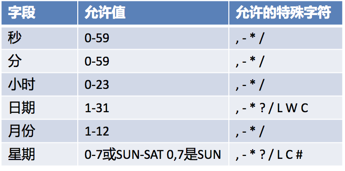
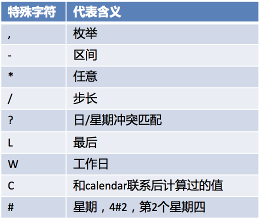

# 异步任务

Spring支持将方法设置成异步执行，无需自己编写多线程逻辑。

在启动类中加上 @EnableAsync 注解，使异步注解生效。

在需要异步执行的方法上添加 @Async 注解即可。

# 定时任务

Spring支持将方法设置成定时运行。

在启动类中加上 @EnableScheduling 注解，开启基于注解的定时任务。

在需要定时执行的方法上添加 @Scheduled 注解，并通过注解的属性指定定时执行的规则。如cron表达式。




# 邮件任务

Spring中，对邮件发送的逻辑做了封装。spring-boot-starter-mail依赖中，自动配置类MailSenderAutoConfiguration中定义了MailProperties，自动装配JavaMailSender

相关配置：
```properties
spring.mail.username=534096094@qq.com
spring.mail.password=gtstkoszjelabijb
spring.mail.host=smtp.qq.com

#特殊配置配在properties属性中，通过键值对配置。
#有些邮件服务器需要ssl
spring.mail.properties.mail.smtp.ssl.enable=true
```

发送简单邮件：
```java
@Autowired
JavaMailSenderImpl mailSender;

@Test
public void test() {
  SimpleMailMessage message = new SimpleMailMessage();
  message.setSubject("标题");
  message.setText("邮件内容");

  message.setTo("aaa@abc.com");
  message.setFrom("bbb@bbb.com");

  mailSender.send(message);
}
```

发送复制内容邮件：

```java
@Autowired
JavaMailSenderImpl mailSender;

@Test
public void test() {
  MimeMessage mimeMessage = mailSender.createMimeMessage();
  MimeMessageHelper helper = new MimeMessageHelper(mimeMessage, true);

  helper.setSubject("标题");
  //html内容
  helper.setText("<b style='color:red'>邮件内容</b>", true);

  helper.setTo("aaa@abc.com");
  helper.setFrom("bbb@bbb.com");

  //文件
  helper.addAttachment("1.jpg", new File("D:/1.jpg"));
  helper.addAttachment("2.jpg", new File("D:/2.jpg"));

  mailSender.send(mimeMessage);
}
```
