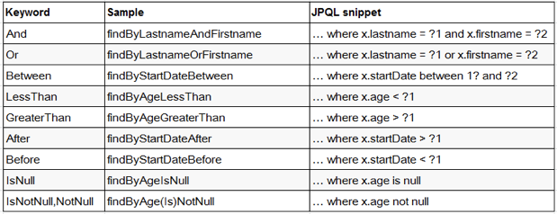
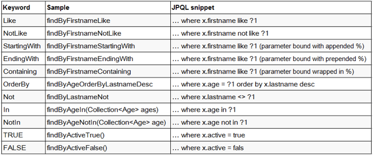

# JDBC

```xml
<dependency>
	<groupId>org.springframework.boot</groupId>
	<artifactId>spring-boot-starter-jdbc</artifactId>
</dependency>
<!--任意数据库驱动包-->
<dependency>
	<groupId>mysql</groupId>
	<artifactId>mysql-connector-java</artifactId>
	<scope>runtime</scope>
</dependency>
```

```yml
spring:
  datasource:
    username: root
    password: 123456
    url: jdbc:mysql://192.168.15.22:3306/jdbc
    driver-class-name: com.mysql.jdbc.Driver
```

效果：

- 默认是用org.apache.tomcat.jdbc.pool.DataSource作为数据源
- 数据源的相关配置都在DataSourceProperties里面

## 自动配置原理

自动配置都在org.springframework.boot.autoconfigure.jdbc包中

1. 参考DataSourceConfiguration，根据配置创建数据源，默认使用Tomcat连接池，可以使用spring.datasource.type指定自定义的数据源类型
2. SpringBoot默认可以支持的数据源：
  ```
  org.apache.tomcat.jdbc.pool.DataSource、HikariDataSource、BasicDataSource
  ```

3. 自定义数据源类型逻辑

  ```java
  @ConditionalOnMissingBean(DataSource.class)
  @ConditionalOnProperty(name = "spring.datasource.type")
  static class Generic {
     @Bean
     public DataSource dataSource(DataSourceProperties properties) {
         //使用DataSourceBuilder创建数据源，利用反射创建响应type的数据源，并且绑定相关属性
        return properties.initializeDataSourceBuilder().build();
     }
  }
  ```

4. **DataSourceInitializer：ApplicationListener**

  作用：
  - runSchemaScripts();运行建表语句
  - runDataScripts();运行插入数据的sql语句
  - 默认只需要将文件命名为：schema-*.sql、data-*.sql  默认规则：schema.sql，schema-all.sql
  - 也可以自定义位置
    ```yml
      spring:
        datasource:
          schemaschema:
            - classpath:department.sql
    ```

5. 操作数据库：自动配置了JdbcTemplate操作数据库

  ```java
  @Autowired
  JdbcTemplate jdbcTemplate;

  @ResponseBody
  @GetMapping("/query")
  public Map<String,Object> map(){
      List<Map<String, Object>> list = jdbcTemplate.queryForList("select * FROM department");
      return list.get(0);
  }
  ```

## 整合Druid数据源

1. 导入数据源

  ```xml
  <dependency>
  	<groupId>com.alibaba</groupId>
  	<artifactId>druid</artifactId>
  	<version>1.1.8</version>
  </dependency>
  ```

2. 配置数据源

  ```yml
  spring:
    datasource:
      username: root
      password: 123456
      url: jdbc:mysql://localhost:3306/jdbc
      driver-class-name: com.mysql.jdbc.Driver
      # 标记为使用druid
      type: com.alibaba.druid.pool.DruidDataSource

      # 以下配置非springboot的默认配置，需要手工指定druid读取
      initialSize: 5
      minIdle: 5
      # 最大活跃数
      maxActive: 20
      # 最大连接等待超时时间
      maxWait: 60000
      timeBetweenEvictionRunsMillis: 60000
      minEvictableIdleTimeMillis: 300000
      validationQuery: SELECT 1 FROM DUAL
      testWhileIdle: true
      testOnBorrow: false
      testOnReturn: false
      # 打开PSCache，并且指定每个连接PSCache的大小
      poolPreparedStatements: true
      # 配置监控统计拦截的filters，去掉后监控界面sql无法统计，'wall'用于防火墙
      filters: stat,wall,log4j
      maxPoolPreparedStatementPerConnectionSize: 20
      useGlobalDataSourceStat: true
      # 通过connectionProperties属性来打开mergeSql功能，慢SQL记录
      connectionProperties: druid.stat.mergeSql=true;druid.stat.slowSqlMillis=500
  ```

3. java配置

  ```java
  @Configuration
  public class DruidConfig {
      // 读取spring.datasource开头的属性，添加到DruidDataSource中
      @ConfigurationProperties(prefix = "spring.datasource")
      @Bean
      public DataSource druid(){
         return  new DruidDataSource();
      }
      //配置Druid的监控
      //1、配置一个管理后台的Servlet
      @Bean
      public ServletRegistrationBean statViewServlet(){
          // 定义servlet及其所拦截的url
          ServletRegistrationBean bean = new ServletRegistrationBean(new StatViewServlet(), "/druid/*");
          Map<String,String> initParams = new HashMap<>();
          initParams.put("loginUsername","admin");
          initParams.put("loginPassword","123456");
          //设置ip白名单
          //只允许localhost访问，默认就是允许所有访问
          initParams.put("allow","localhost");
          initParams.put("deny","192.168.15.21");//不允许这个IP访问
          bean.setInitParameters(initParams);
          return bean;
      }
      //2、配置一个web监控的filter
      @Bean
      public FilterRegistrationBean webStatFilter(){
          FilterRegistrationBean bean = new FilterRegistrationBean();
          bean.setFilter(new WebStatFilter());
          Map<String,String> initParams = new HashMap<>();
          // 排除不需要监控的url
          initParams.put("exclusions","*.js,*.gif,*.jpg,*.png,*.css,*.ico,/druid/*");
          bean.setInitParameters(initParams);
          //设置过滤器过滤路径
          bean.setUrlPatterns(Arrays.asList("/*"));

          return  bean;
      }
  }
  ```

配好后，启动服务可以通过/druid/login.html登录页面进行登录，打开druid管理后台

## 整合MyBatis

```xml
<dependency>
	<groupId>org.mybatis.spring.boot</groupId>
	<artifactId>mybatis-spring-boot-starter</artifactId>
	<version>1.3.1</version>
</dependency>
```

### 注解版

```java
//指定这是一个操作数据库的mapper
@Mapper
public interface DepartmentMapper {
  @Select("select * from department where id=#{id}")
  public Department getDeptById(Integer id);

  @Delete("delete from department where id=#{id}")
  public int deleteDeptById(Integer id);

  // 标记主键为自增长，程序自动给department对象的ID赋值
  @Options(useGeneratedKeys = true,keyProperty = "id")
  @Insert("insert into department(departmentName) values(#{departmentName})")
  public int insertDept(Department department);

  @Update("update department set departmentName=#{departmentName} where id=#{id}")
  public int updateDept(Department department);
}
```

自定义MyBatis的配置规则：给容器中添加一个ConfigurationCustomizer

```java
@org.springframework.context.annotation.Configuration
public class MyBatisConfig {
  @Bean
  public ConfigurationCustomizer configurationCustomizer(){
    return new ConfigurationCustomizer(){
      @Override
      public void customize(Configuration configuration) {
        //让实体属性的驼峰命名与数据库表的_命名对应上
        configuration.setMapUnderscoreToCamelCase(true);
      }
    };
  }
}
```

如果每个mapper接口都标记mapper注解会比较麻烦，可以通过mapperscan注解指定mapper的包路径进行自动扫描

```java
@MapperScan(value = "cn.ldp.springboot.mapper")
@SpringBootApplication
public class SpringBoot06DataMybatisApplication {
	public static void main(String[] args) {
		SpringApplication.run(SpringBoot06DataMybatisApplication.class, args);
	}
}
```

### 配置文件版

```yml
mybatis:
  # 指定全局配置文件的位置
  config-location: classpath:mybatis/mybatis-config.xml
  # 指定sql映射文件的位置
  mapper-locations: classpath:mybatis/mapper/*.xml
```

[更多使用参照](http://www.mybatis.org/spring-boot-starter/mybatis-spring-boot-autoconfigure/)

## 整合SpringData JPA

### SpringData简介


### 整合SpringData JPA

1. 编写一个实体类（bean）和数据表进行映射，并且配置好映射关系；

  ```java
  //告诉JPA这是一个实体类（和数据表映射的类）
  @Entity
  //来指定和哪个数据表对应，如果省略默认表名就是user
  @Table(name = "tbl_user")
  public class User {

    //这是一个主键
    @Id
    //自增主键
    @GeneratedValue(strategy = GenerationType.IDENTITY)
    private Integer id;

    //这是和数据表对应的一个列
    @Column(name = "last_name",length = 50)
    private String lastName;

    //省略默认列名就是属性名
    @Column
    private String email;
  }
  ```

2. 编写一个Dao接口来操作实体类对应的数据表（Repository）

  ```java
  //继承JpaRepository来完成对数据库的操作
	//也可以通过RepositoryDefinition声明为Repository
	//@RepositoryDefinition(domainClass=User.class,idClass=Integer.class)
  public interface UserRepository extends JpaRepository<User,Integer> {
  }
  ```

3. 基本的配置JpaProperties

```yml
spring:
 jpa:
   # 控制台显示SQL
   show-sql: true
   hibernate:
    # 更新或者创建数据表结构
    ddl-auto: update
    naming:
      # 控制hibernate按非驼峰方式进行命名解析
      physical-strategy: org.hibernate.boot.model.naming.PhysicalNamingStrategyStandardImpl
```

#### 查询例子

关键字查询





```java
/**
 * 在 Repository 子接口中声明方法
 * 1. 不是随便声明的. 而需要符合一定的规范
 * 2. 查询方法以 find | read | get 开头
 * 3. 涉及条件查询时，条件的属性用条件关键字连接
 * 4. 要注意的是：条件属性以首字母大写。
 * 5. 支持属性的级联查询. 若当前类有符合条件的属性, 则优先使用, 而不使用级联属性.
 * 若需要使用级联属性, 则属性之间使用 _ 进行连接.
 */

//根据 lastName 来获取对应的 Person
Person getByLastName(String lastName);

//WHERE lastName LIKE ?% AND id < ?
List<Person> getByLastNameStartingWithAndIdLessThan(String lastName, Integer id);

//WHERE lastName LIKE %? AND id < ?
List<Person> getByLastNameEndingWithAndIdLessThan(String lastName, Integer id);

//WHERE email IN (?, ?, ?) OR birth < ?
List<Person> getByEmailInAndBirthLessThan(List<String> emails, Date birth);

//WHERE a.id > ?
List<Person> getByAddress_IdGreaterThan(Integer id);

//查询 id 值最大的那个 Person
//使用 @Query 注解可以自定义 JPQL 语句以实现更灵活的查询
@Query("SELECT p FROM Person p WHERE p.id = (SELECT max(p2.id) FROM Person p2)")
Person getMaxIdPerson();

//为 @Query 注解传递参数的方式1: 使用占位符.
@Query("SELECT p FROM Person p WHERE p.lastName = ?1 AND p.email = ?2")
List<Person> testQueryAnnotationParams1(String lastName, String email);

//为 @Query 注解传递参数的方式1: 命名参数的方式.
@Query("SELECT p FROM Person p WHERE p.lastName = :lastName AND p.email = :email")
List<Person> testQueryAnnotationParams2(@Param("email") String email, @Param("lastName") String lastName);

//SpringData 允许在占位符上添加 %%.
@Query("SELECT p FROM Person p WHERE p.lastName LIKE %?1% OR p.email LIKE %?2%")
List<Person> testQueryAnnotationLikeParam(String lastName, String email);

//SpringData 允许在占位符上添加 %%.
@Query("SELECT p FROM Person p WHERE p.lastName LIKE %:lastName% OR p.email LIKE %:email%")
List<Person> testQueryAnnotationLikeParam2(@Param("email") String email, @Param("lastName") String lastName);

//设置 nativeQuery=true 即可以使用原生的 SQL 查询
@Query(value="SELECT count(id) FROM jpa_persons", nativeQuery=true)
long getTotalCount();
```

#### 数据操作

- 可以通过自定义的 JPQL 完成 UPDATE 和 DELETE 操作. 注意: JPQL 不支持使用 INSERT
- 在 @Query 注解中编写 JPQL 语句, 但必须使用 @Modifying 进行修饰. 以通知 SpringData, 这是一个 UPDATE 或 DELETE 操作
- UPDATE 或 DELETE 操作需要使用事务，一般在service层的方法上添加事务
- 默认情况下, SpringData 的每个方法上都有事务, 但都是一个只读事务，不能完成修改操作

```java
@Modifying
@Query("UPDATE Person p SET p.email = :email WHERE id = :id")
void updatePersonEmail(@Param("id") Integer id, @Param("email") String email);
```

#### 分页

```java
//pageNo 从 0 开始.
int pageNo = 6 - 1;
int pageSize = 5;

//Pageable 接口通常使用的其 PageRequest 实现类. 其中封装了需要分页的信息
Order order1 = new Order(Direction.DESC, "id");
Order order2 = new Order(Direction.ASC, "email");
Sort sort = new Sort(order1, order2);

PageRequest pageable = new PageRequest(pageNo, pageSize, sort);
Page<Person> page = personRepsotory.findAll(pageable);

System.out.println("总记录数: " + page.getTotalElements());
System.out.println("当前第几页: " + (page.getNumber() + 1));
System.out.println("总页数: " + page.getTotalPages());
System.out.println("当前页面的 List: " + page.getContent());
System.out.println("当前页面的记录数: " + page.getNumberOfElements());
```
