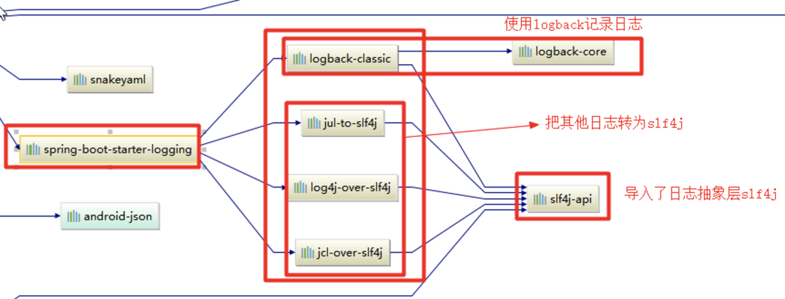

# 日志

## 日志框架

市面上的日志框架：JUL、JCL、Jboss-logging、logback、log4j、log4j2、slf4j....

| 日志门面  （日志的抽象层）                           | 日志实现                                     |
| ---------------------------------------- | ---------------------------------------- |
| ~~JCL（Jakarta  Commons Logging）~~    SLF4j（Simple  Logging Facade for Java）    ~~jboss-logging~~ | Log4j  JUL（java.util.logging）  Log4j2  **Logback** |

日志门面：JCL从2014年开始没更新过、jboss-logging几乎没人用。

日志实现：log4j有性能问题，作者重新编写了logback，同时编写了slf4j。log4j2是appache出的，设计得也很好，不过其他框架尚未有很好的支持

最终选择：
日志门面：SLF4J；
日志实现：Logback；

SpringBoot：底层是Spring框架，Spring框架默认是用JCL。而**SpringBoot选用SLF4j和logback**

## SLF4j使用

### 如何在系统中使用SLF4j https://www.slf4j.org

给系统里面导入slf4j的jar和logback的实现jar

```java
import org.slf4j.Logger;
import org.slf4j.LoggerFactory;

public class HelloWorld {
  public static void main(String[] args) {
    Logger logger = LoggerFactory.getLogger(HelloWorld.class);
    logger.info("Hello World");
  }
}
```


注意：每一个日志的实现框架都有自己的配置文件。使用slf4j以后，**配置文件还是做成日志实现框架自己本身的配置文件**

### 遗留问题

不同的框架内部都引用了不同的日志框架，如: Spring（commons-logging）、Hibernate（jboss-logging）、MyBatis、xxxx

需要统一日志记录，使别的框架和我一起统一使用slf4j进行输出


1. 将系统中其他日志框架先排除出去
2. 用中间包来替换原有的日志框架
3. 我们导入slf4j其他的实现

## SpringBoot中的日志关系

spring-boot-starter包中依赖了spring-boot-starter-logging包，spring-boot-starter-logging包中依赖了slf4j的相关包



总结：

1. SpringBoot底层也是使用slf4j+logback的方式进行日志记录
2. SpringBoot也把其他的日志都替换成了slf4j
3. 如果要引入其他框架，一定要把这个框架的默认日志依赖移除掉

  Spring框架用的是commons-logging；
  ```xml
  		<dependency>
  			<groupId>org.springframework</groupId>
  			<artifactId>spring-core</artifactId>
  			<exclusions>
  				<exclusion>
  					<groupId>commons-logging</groupId>
  					<artifactId>commons-logging</artifactId>
  				</exclusion>
  			</exclusions>
  		</dependency>
  ```

## 日志使用

### 默认配置

SpringBoot默认配置好了日志，直接使用api即可

```java
//记录器
Logger logger = LoggerFactory.getLogger(getClass());
@Test
public void contextLoads() {
	//日志的级别
	//由低到高：trace<debug<info<warn<error
	//可以调整输出的日志级别。
	logger.trace("这是trace日志...");
	logger.debug("这是debug日志...");
	//SpringBoot默认给我们使用的是info级别的，没有指定级别的就用默认的。root级别
	logger.info("这是info日志...");
	logger.warn("这是warn日志...");
	logger.error("这是error日志...");
}
```

日志输出格式：

- %d表示日期时间
- %thread表示线程名
- %-5level：级别从左显示5个字符宽度
- %logger{50} 表示logger名字最长50个字符，否则按照句点分割
- %msg：日志消息
- %n是换行符

```
%d{yyyy-MM-dd HH:mm:ss.SSS} [%thread] %-5level %logger{50} - %msg%n
```

### SpringBoot中修改默认配置

```properties
logging.level=trace

# 不指定路径，就在当前项目下生成日志文件
# 可以指定完整的路径
#logging.file=G:/springboot.log

# 指定文件存放目录。默认使用 spring.log 作为文件名
logging.path=/spring/log

#  在控制台输出的日志的格式
logging.pattern.console=%d{yyyy-MM-dd} [%thread] %-5level %logger{50} - %msg%n

# 指定文件中日志输出的格式
logging.pattern.file=%d{yyyy-MM-dd} === [%thread] === %-5level === %logger{50} ==== %msg%n
```

| logging.file | logging.path | Example  | Description             |
| ------------ | ------------ | -------- | ----------------------- |
| (none)       | (none)       |          | 只在控制台输出                 |
| 指定文件名        | (none)       | my.log   | 输出日志到my.log文件           |
| (none)       | 指定目录         | /var/log | 输出到指定目录的 spring.log 文件中 |

如果logging.file和logging.path都指定了，按照logging.file的配置来输出

### 自定义配置

在类路径下存放所需要使用的日志框架的配置文件即可。

| Logging System          | Customization                            |
| ----------------------- | ---------------------------------------- |
| Logback                 | `logback-spring.xml`, `logback-spring.groovy`, `logback.xml` or `logback.groovy` |
| Log4j2                  | `log4j2-spring.xml` or `log4j2.xml`      |
| JDK (Java Util Logging) | `logging.properties`                     |

推荐使用以spring结尾的文件名

- 使用logback.xml：直接就被日志框架识别了
- 使用**logback-spring.xml**：日志框架就不直接加载日志的配置项，而是由SpringBoot解析日志配置。这样可以使用SpringBoot的高级Profile功能

```xml
<springProfile name="staging">
    <!-- configuration to be enabled when the "staging" profile is active -->
  	可以指定某段配置只在某个环境下生效
</springProfile>
```

如：

```xml
<appender name="stdout" class="ch.qos.logback.core.ConsoleAppender">
    <layout class="ch.qos.logback.classic.PatternLayout">
        <springProfile name="dev">
            <pattern>%d{yyyy-MM-dd HH:mm:ss.SSS} ----> [%thread] ---> %-5level %logger{50} - %msg%n</pattern>
        </springProfile>
        <springProfile name="!dev">
            <pattern>%d{yyyy-MM-dd HH:mm:ss.SSS} ==== [%thread] ==== %-5level %logger{50} - %msg%n</pattern>
        </springProfile>
    </layout>
</appender>
```

## 切换日志框架

### slf4j+log4j的方式

```xml
<dependency>
  <groupId>org.springframework.boot</groupId>
  <artifactId>spring-boot-starter-web</artifactId>
  <!--排除logback的依赖-->
  <exclusions>
    <exclusion>
      <artifactId>logback-classic</artifactId>
      <groupId>ch.qos.logback</groupId>
    </exclusion>
    <exclusion>
      <artifactId>log4j-over-slf4j</artifactId>
      <groupId>org.slf4j</groupId>
    </exclusion>
  </exclusions>
</dependency>

<!--引入log4j的适配器依赖-->
<dependency>
  <groupId>org.slf4j</groupId>
  <artifactId>slf4j-log4j12</artifactId>
</dependency>
```

### 使用log4j2

```xml
<dependency>
  <groupId>org.springframework.boot</groupId>
  <artifactId>spring-boot-starter-web</artifactId>
  <exclusions>
    <!--排除spring-boot-starter-logging-->
    <exclusion>
      <artifactId>spring-boot-starter-logging</artifactId>
      <groupId>org.springframework.boot</groupId>
    </exclusion>
  </exclusions>
</dependency>
<!--排除spring-boot-starter-log4j2依赖-->
<dependency>
  <groupId>org.springframework.boot</groupId>
  <artifactId>spring-boot-starter-log4j2</artifactId>
</dependency>
```
