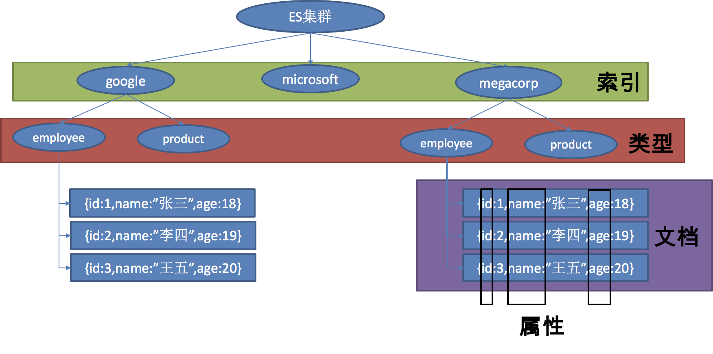

# Elasticsearch

Elasticsearch是一个分布式搜索服务，提供Restful API，底层基于Lucene，采用多shard（分片）的方式保证数据安全，并且提供自动resharding的功能，github等大型的站点也是采用了ElasticSearch作为其搜索服务

# 通过docker安装

下载镜像

```shell
docker pull elasticsearch
```

创建容器

```shell
docker run -e ES_JAVA_OPTS="-Xms256m -Xmx256m" -d -p 9200:9200 -p 9300:9300 --name ES01 elasticsearch
```

其中通过ES_JAVA_OPTS指定了内存大小，由于默认启动的时候会占用2G内存，在本地测试时不需要这么大。9200端口是与外部通信的端口，9300是集群中与其他节点通信的端口。

访问http://localhost:9200可查看节点信息

```json
{
  "name" : "v8hobq7",
  "cluster_name" : "elasticsearch",
  "cluster_uuid" : "tG6Rea1xRpyRV0-RnZ-xgA",
  "version" : {
    "number" : "5.6.9",
    "build_hash" : "877a590",
    "build_date" : "2018-04-12T16:25:14.838Z",
    "build_snapshot" : false,
    "lucene_version" : "6.6.1"
  },
  "tagline" : "You Know, for Search"
}
```

# 概念

以 **员工文档** 的形式存储为例：一个文档代表一个员工数据。存储数据到 ElasticSearch 的行为叫做 **索引** ，但在索引一个文档之前，需要确定将文档存储在哪里。

一个 ElasticSearch 集群可以 包含多个 **索引** ，相应的每个索引可以包含多个 **类型** 。 这些不同的类型存储着多个 **文档** ，每个文档又有 多个 **属性** 。

类似关系：
- 索引-数据库
- 类型-表
- 文档-表中的记录
- 属性-列



# springboot支持

springboot支持两种与ES的交互方式

- Jest：默认不生效。需要导入jest的工具包（io.searchbox.client.JestClient）
- StringData ElasticSearch
  + 客户端：client。 节点信息：clusterNodes、clusterName
  + ElasticsearchTemplate操作es
  + 编写一个ElasticsearchRepository的子接口，类似jpa

## 使用Jest

保存一个文档：

```java
Article article = new Article();
article.setId(1);
article.setTitle("好消息");
article.setAuthor("zero");
article.setContent("Hello World");

//构建一个索引
Index index = new Index.Builder(article).index("myindex").type("news").build();

//执行
jestClient.execute(index);
```

查询：

```java
//查询表达式
String json = "{query:{match{\"content\": \"hello\"}}}";

//构建搜索
Search search = new Search.Builder(json).addIndex("myindex").addType("news").build();

//执行
SearchResult result = jestClient.execute(search);
System.out.println(result.getJsonString());
```

## 使用SpringData

springboot默认配置，可能会与ES的版本有冲突。解决冲突的方式有两种：
- 使用springboot默认支持的ES版本
- 手工修改ES的依赖版本或升级Springboot

SpringData配置文件：
```properties
spring.data.elasticsearch.cluster-name=elasticsearch
spring.data.elasticsearch.cluster-nodes=localhost:9300
```

### 使用ElasticsearchRepository接口

```java
@Document(indexName="myindex", type="person")
public class Person {
  ...
}

public interface PersonRepository extends ElasticsearchRepository<Person, Integer> {

  //自定义查询
  public List<Person> findByPersonName(String personName);

  //查询表达式
  @Query("{"bool": {"must":{"field": {"personName": "?0"}}}}")
  public Page<Person> findByName(String personName, Pageable pageable);
}
```
