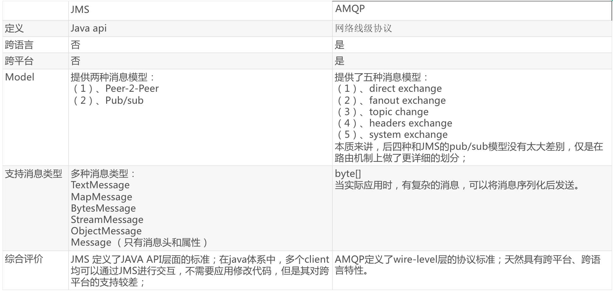

# 消息队列作用

- 实现异步逻辑
- 应用间解耦
- 流量削峰。如秒杀系统，固定接收的数量，其余的自动忽略

# 规范

- JMS（Java Message Service）JAVA消息服务：基于JVM消息代理的规范。ActiveMQ、HornetMQ是JMS实现。
- AMQP（Advanced Message Queuing Protocol）高级消息队列协议，也是一个消息代理的规范，兼容JMS。RabbitMQ是AMQP的实现。



# Spring支持

- spring-jms提供了对JMS的支持
- spring-rabbit提供了对AMQP的支持
- 需要ConnectionFactory的实现来连接消息代理
- 提供JmsTemplate、RabbitTemplate来发送消息
- @JmsListener（JMS）、@RabbitListener（AMQP）注解在方法上监听消息代理发布的消息
- @EnableJms、@EnableRabbit开启支持
- Spring Boot自动配置：JmsAutoConfiguration、RabbitAutoConfiguration

# 安装rabbitmq的docker容器

下载镜像，需要下载3-management的tag，这个拥有web管理界面
```shell
docker pull rabbitmq:3-management
```

运行容器
```shell
docker run -d -p 5672:5672 -p 15672:15672 --name myrabbitmq rabbitmq:3-management
```

访问管理页面：http://localhost:15672

默认用户名密码为：guest/guest

# RabbitTemplate使用

- rabbitTemplate.send(exchage, routeKey, message)：这个方法需要自己构造message对象，包括消息头和消息体
- rabbitTemplate.converAndSend(exchage, routeKey, object)：这个方法将object当成消息体，自动序列化（默认使用jdk的序列化）并发送出去
- rabbitTemplate.receive(queueName)：返回message对象，需要自己解析消息头和消息体
- rabbitTemplate.receiveAndConvert(queueName)：接收并自动反序列化为对象

替换序列化规则为json:
```Java
@Bean
public MessageConverter messageConverter() {
  return new Jackson2JsonMessageConverter();
}
```
自动配置RabbitTemplate时，会检查是否有自定义的MessageConverter，如果有，就使用自定义的。

# 使用Spring的注解监听队列

首先开启注解模式：在启动类中加上@EnableRabbit注解

通过@RabbitListener进行监听

```Java
@RabbitListener(queues="queuesName")
public void receive(Book book) {
}

@RabbitListener(queues="queuesName")
public void receive(Message message) {
  System.out.println(message.getBody());
  System.out.println(message.getMessageProperties());
}
```

# 使用AmqpAdmin创建组件

有时候我们需要通过代码来创建交换机、队列等组件。这时可以使用AmqpAdmin。

AmqpAdmin中有很多declare开头的方法，都是用与创建对应组件的。

```Java
amqpAdmin.declareExchange(new DirectExchange("amqpadmin.exchange"));
```
