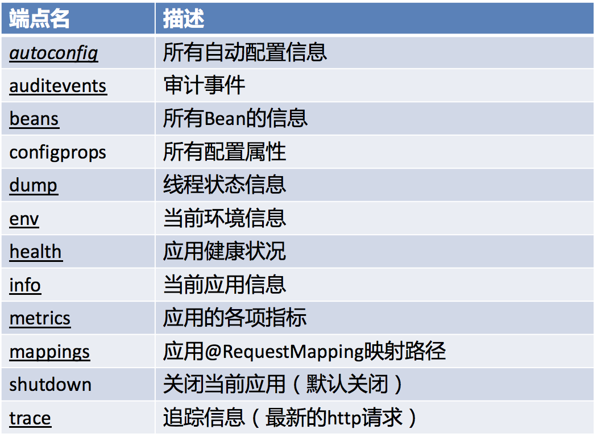

# 监控管理

通过引入spring-boot-starter-actuator，可以使用Spring Boot为我们提供的准生产环境下的应用监控和管理功能。

可以通过HTTP，JMX，SSH协议来进行操作，自动得到审计、健康及指标信息等

步骤：
- 引入spring-boot-starter-actuator
- 通过http方式访问监控端点
- 可进行shutdown（POST 提交，此端点默认关闭）

监控管理端点，默认的访问路径与端点名一致：


# 定制端点

- 定制端点一般通过endpoints+端点名+属性名来设置。
- 修改端点id（endpoints.beans.id=mybeans）
- 开启远程应用关闭功能（endpoints.shutdown.enabled=true）
- 关闭端点（endpoints.beans.enabled=false）
- 开启所需端点
  + 关闭所有端点endpoints.enabled=false
  + 开启需要的端点endpoints.beans.enabled=true
- 定制端点访问根路径management.context-path=/manage
- 关闭http端点management.port=-1，由于-1是一个不存在的端口，相当于阻止了访问

# 健康监测

health端点可以对应用进行健康监测，包括redis、MongoDB等，只要引入了相关依赖就会自动进行健康监测。相关包在spring-boot-starter-actuator依赖的health包中。

## 自定义监测状态指示器

1. 编写一个指示器。需要实现 HealthIndicator 接口
2. 指示器的名字，XXXHealthIndicator
3. 加入到容器中

```java
@Component
public class MyAppHealthIndicator implements HealthIndicator {
  @Override
  public Health health() {
    // 自定义的检查规则
    // Health.up().build()代表健康
    return Health.down().withDetail("msg", "服务异常").build();
  }
}
```
