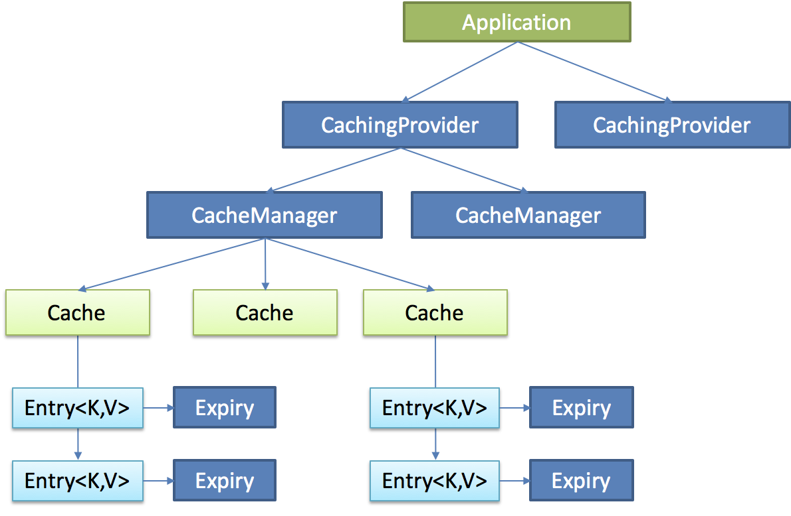
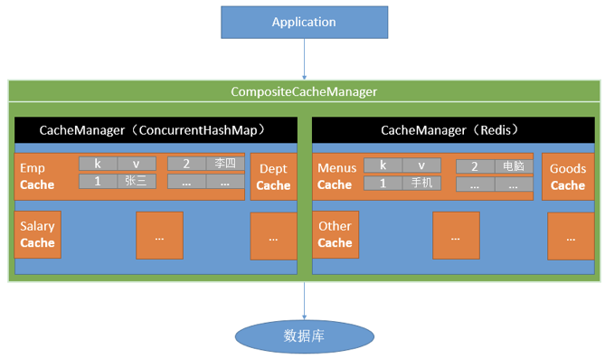

# JSR107缓存规范

Java Caching定义了5个核心接口：

- CachingProvider：定义了创建、配置、获取、管理和控制多个CacheManager。一个应用可以在运行期访问多个CachingProvider。
- CacheManager：定义了创建、配置、获取、管理和控制多个唯一命名的Cache，这些Cache存在于CacheManager的上下文中。一个CacheManager仅被一个CachingProvider所拥有。
- Cache：是一个类似Map的数据结构并临时存储以Key为索引的值。一个Cache仅被一个CacheManager所拥有。
- Entry：是一个存储在Cache中的key-value对。
- Expiry：每一个存储在Cache中的条目有一个定义的有效期。



# Spring缓存抽象

Spring从3.1开始定义了org.springframework.cache.Cache和org.springframework.cache.CacheManager接口来统一不同的缓存技术；并支持使用JCache（JSR-107）注解简化开发；

- Cache：缓存接口，定义缓存操作。实现有：RedisCache、EhCacheCache、ConcurrentMapCache等
- CacheManager：缓存管理器，管理各种缓存（Cache）组件
- @Cacheable：主要针对方法配置，能够根据方法的请求参数对其结果进行缓存
- @CacheEvict：清空缓存
- @CachePut：保证方法被调用，又希望结果被缓存。通常用于更新缓存。
- @EnableCaching：开启基于注解的缓存。在启动类中标注。
- keyGenerator：缓存数据时key生成策略
- serialize：缓存数据时value序列化策略



## @Cacheable/@CachePut/@CacheEvict 主要的参数

- value：缓存（cache组件）的名称，在 spring 配置文件中定义
- key：缓存的 key。默认是所有参数进行组合，可以通过 SpEL 表达式指定。如：
@Cacheable(value=”testcache”,key=”#userName”)
- condition：缓存的条件，使用 SpEL 定义，表达式结果为 true 时进行缓存。如：
@Cacheable(value=”testcache”,condition=”#userName.length()>2”)
- allEntries：@CacheEvict的属性。是否清空所有缓存内容，缺省为 false，如果指定为 true，则方法调用后将立即清空所有缓存
- beforeInvocation：@CacheEvict的属性。是否在方法执行前就清空，缺省为 false，如果指定为 true，则在方法还没有执行的时候就清空缓存，缺省情况下，如果方法执行抛出异常，则不会清空缓存。
- unless：@CachePut和@Cacheable的属性。该表达式只在方法执行之后判断，此时可以拿到返回值result进行判断。条件为true不会缓存，fasle才缓存。如：
@Cacheable(value=”testcache”,unless=”#result == null”)

## 缓存中的spel表达式

- methodName（当前被调用的方法名）：#root.methodName
- method（当前被调用的方法）：#root.method.name
- target（当前被调用的目标对象）：#root.target
- targetClass（当前被调用的目标对象类）：#root.targetClass
- args（当前被调用的方法的参数列表）：#root.args[0]
- caches（当前方法调用使用的缓存列表（如@Cacheable(value={"cache1", "cache2"})），则有两个cache）：#root.caches[0].name
- argument name（方法参数的名字。可以直接用：#参数名 ，也可以使用：#p0或#a0 的形式，0代表参数的索引）：#iban 、 #a0 、  #p0 
- result（方法执行后的返回值（仅当方法执行之后的判断有效，如‘unless’，’cache put’的表达式 ’cache evict’的表达式beforeInvocation=false））：#result。注意：
@Cacheable不能使用#result变量来指定key，因为他在方法执行前就要去查询缓存

## @Caching注解定义复杂缓存规则

@Caching是@Cacheable、@CachePut和@CacheEvict的组合。

```Java
@Caching(
  cacheable = {
    @Cacheable("emp", key="#lastName")
  },
  put = {
    @CachePut("emp", key="#result.id"),
    @CachePut("emp", key="#result.email")
  }
)
public Employee getEmpByLastName(String lastName){
}
```

## @CacheConfig

在类中使用@CacheConfig注解可以指定本类使用缓存的公共配置，如缓存名称、ID策略、缓存管理器等。

@CacheConfig(cacheNames = "emp")，表示本类中使用的缓存名是“emp”

# reids使用

引入spring-boot-starter-data-redis包，redis的自动配置会生效。在资源文件中配置redis链接属性，即可使用redis。

Spring中提供了两个template来操作redis：
- RedisTemplate：便于操作对象
- StringRedisTemplate：便于操作字符串

这两个类的API都是类似的：
1. redisTemplate.opsForValue();//操作字符串
2. redisTemplate.opsForHash();//操作hash
3. redisTemplate.opsForList();//操作list
4. redisTemplate.opsForSet();//操作set
5. redisTemplate.opsForZSet();//操作有序set

自动配置的RedisTemplate所有都是默认的，可以通过java配置来指定个性化配置的template。如果默认的RedisTemplate的序列化规则是使用jdk的序列化，我们可以指定成序列化为json。同理，CacheManager也可以重新指定，并且可以在项目中配置多个，在使用缓存注解时，指定使用哪个。**注意：如果有多个CacheManager的情况需要将其中一个标记成默认的（@Primary）**。
