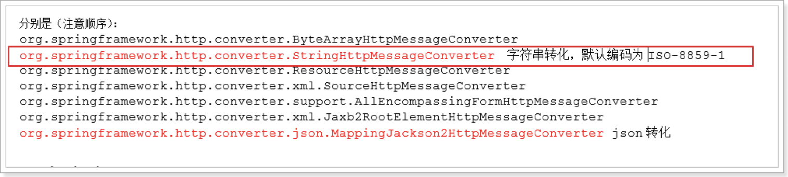

# springmvc中MessageConverter及jsonp支持

SpringMVC之所以能够根据方法返回值自动封装成前台需要的数据格式（json等）进行响应，是因为默认配置了7个MessageConverter



**由于StringHttpMessageConverter默认是以ISO-8859-1编码的，所以以字符串格式返回时会有乱码**

自定义String转换器（springmvc配置文件中配置）：

```xml
<!-- 注解驱动 -->
<mvc:annotation-driven>
  <mvc:message-converters>
    <!-- 自定义String转化器 -->
    <bean class="org.springframework.http.converter.StringHttpMessageConverter">
      <constructor-arg index="0" value="UTF-8"/>
    </bean>
  </mvc:message-converters>
</mvc:annotation-driven>
```

## 自定义扩展json的转化器，支持jsonp的输出

```java
public class CallbackMappingJackson2HttpMessageConverter extends MappingJackson2HttpMessageConverter {

    // 做jsonp的支持的标识，在请求参数中加该参数
    private String callbackName;

    @Override
    protected void writeInternal(Object object, HttpOutputMessage outputMessage) throws IOException, HttpMessageNotWritableException {
        // 从threadLocal中获取当前的Request对象
        HttpServletRequest request = ((ServletRequestAttributes) RequestContextHolder
                .currentRequestAttributes()).getRequest();
        String callbackParam = request.getParameter(callbackName);
        if (StringUtils.isEmpty(callbackParam)) {
            // 没有找到callback参数，直接返回json数据
            super.writeInternal(object, outputMessage);
        } else {
            //需要jsonp支持
            JsonEncoding encoding = getJsonEncoding(outputMessage.getHeaders().getContentType());
            try {
                String result = callbackParam + "(" + super.getObjectMapper().writeValueAsString(object)
                        + ");";
                IOUtils.write(result, outputMessage.getBody(), encoding.getJavaName());
            } catch (JsonProcessingException ex) {
                throw new HttpMessageNotWritableException("Could not write JSON: " + ex.getMessage(), ex);
            }
        }
    }

    public String getCallbackName() {
        return callbackName;
    }

    public void setCallbackName(String callbackName) {
        this.callbackName = callbackName;
    }
}
```

```xml
<!-- 注解驱动 -->
<mvc:annotation-driven>
  <mvc:message-converters>
    <!-- 自定义String转化器 -->
    <bean class="org.springframework.http.converter.StringHttpMessageConverter">
      <constructor-arg index="0" value="UTF-8"/>
    </bean>
    <!-- 自定义json的转化器，支持了jsonp的输出 -->
    <bean class="com.taotao.common.spring.exetend.converter.json.CallbackMappingJackson2HttpMessageConverter">
      <property name="callbackName" value="callback"/>
    </bean>
  </mvc:message-converters>
</mvc:annotation-driven>
```

# 利用springmvc进行伪静态

请求添加.html后缀

```xml
<!-- SpringMVC的入口 -->
<servlet>
  <servlet-name>taotao-web</servlet-name>
  <servlet-class>org.springframework.web.servlet.DispatcherServlet</servlet-class>
  <init-param>
    <param-name>contextConfigLocation</param-name>
    <param-value>classpath:spring/taotao-web-servlet.xml</param-value>
  </init-param>
  <load-on-startup>1</load-on-startup>
</servlet>

<servlet-mapping>
  <servlet-name>taotao-web</servlet-name>
  <!-- 伪静态，好处：SEO（搜索引擎优化） -->
  <url-pattern>*.html</url-pattern>
</servlet-mapping>
<servlet-mapping>
  <servlet-name>taotao-web</servlet-name>
  <url-pattern>/service/*</url-pattern>
</servlet-mapping>
```
