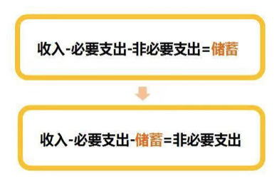
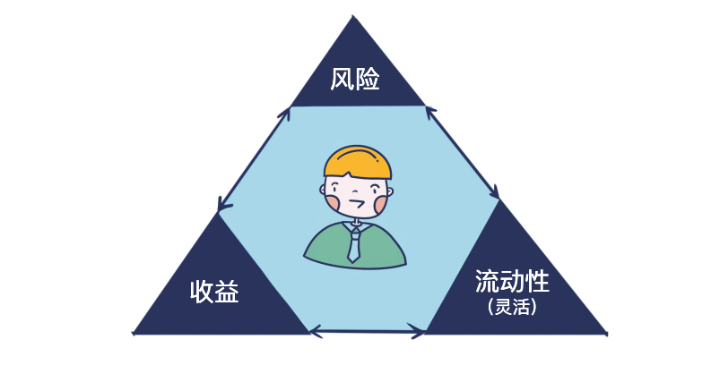

# 笔记

## 习惯1：改变你的存钱顺序。先储蓄，后消费

- 先了解自己的必要支出

- 省下非必要的支出

  

## 习惯2：开启一个具体的存钱计划

- 一个合格的存钱计划应该是3W计划
  - Where：在哪里存
  - When：什么时候存
  - How much: 每次你准备存多少钱

## 如何做其它理财产品的选择

参考维度：风险、收益、灵活性：

- 首先：收益，我们在衡量一个产品或者投资的收益的时候，建议多想2个方面：
  - 收益是否可以复制
  - 收益是否可以预期
  - 只有可预期、并且可复制的收益，我们才能用它来规划自己的投资
- 其次：风险
- 最后：流动性。简单来说，就是你买了理财产品之后，万一要是想要用钱，可以用多快的速度把它变成现金
  - 纸面上赚到的钱，那都是账面收益，你真要用钱的时候，能多快到账也是关键

#  作业

1. 哪种存钱动作，更适合月入1万元的小飞，开启存钱之路？
   
- B、改变用钱顺序，发现自己每月存2000元比较合理，开始每月发工资后，把2000元转入一个货币基金中。
   
2. 作为一个理财新人，存钱最适合先考虑哪种投资品？
   
   - 货币基金。（最开始存钱，建议先选择低风险、操作简单、投资灵活的投资品，货币基金最符合这个要求
   
     指数基金存在一定风险（但收益相对可观）；国债逆回购需要在特定交易时间操作；5年期定存不够灵活）

