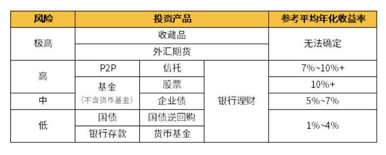

# 笔记

## 简介

- 基金：是一种组织大家的钱集合在一起，再请一位专业人士帮我们大理，进行间接投资的投资形式。
- 基金的好处：
  - 更专业：有专业的管理人
  - 资金独立托管，不担心被挪用
  - 门槛低：100甚至1元就可以买
  - 投资类别多

## 基金分类

- 货币基金
  - 一种专门投向风险小的货币市场
  - 安全度较高，几乎不会亏损
  - 收益不高，很难跑赢通胀
- 债券基金
  - 指80%以上投资债券
  - 一般来说，长期收益比货币基金高，相对股票基金收益较低
- 股票资金
  - 指80%以上投资股票
  - 风险最高，但收益也相对较高
  - 短期来看，股票基金波动比货币基金、债券基金都要大
- 混合基金
  - 混合多种投资品，包括货币、债券、股票等等，比例不受限制
  - 收益和风险一般基于债券和股票基金之间

### 风险及收益对比

### 判断基金类型

通过基金名称判断，一般来说，一个完整的基金名称包含3部分：

1. 基金公司
2. 基金特点或投资方向
3. 基金类别

如：余额宝的全名为：天弘余额宝货币基金，其中，天弘代表天弘基金管理有限公司；余额宝为基金的小名；货币意味着货币基金。

### 投资选型

- 一般来说，像余额宝之类的货币基金更适合放日常零用闲钱，或者临时投资周转使用。如果有大笔钱，长期闲置在其中，收益跑不赢通胀会有点浪费
- 债券基金收益相对货币资金高些，但有价格波动，适合搭配1~3年中短期的理财目标
- 长期不用的闲钱，才适合投资更高风险的股票基金或混合基金。而且因为股市波动大，推荐持有3~5年甚至更长时间的投资准备

#  作业

1. 关于基金投资，以下哪个说法是错误的？
   - C 基金投资是保本的，谁买都不会亏钱

2. 以下哪类基金风险最高？
   - B 股票基金
