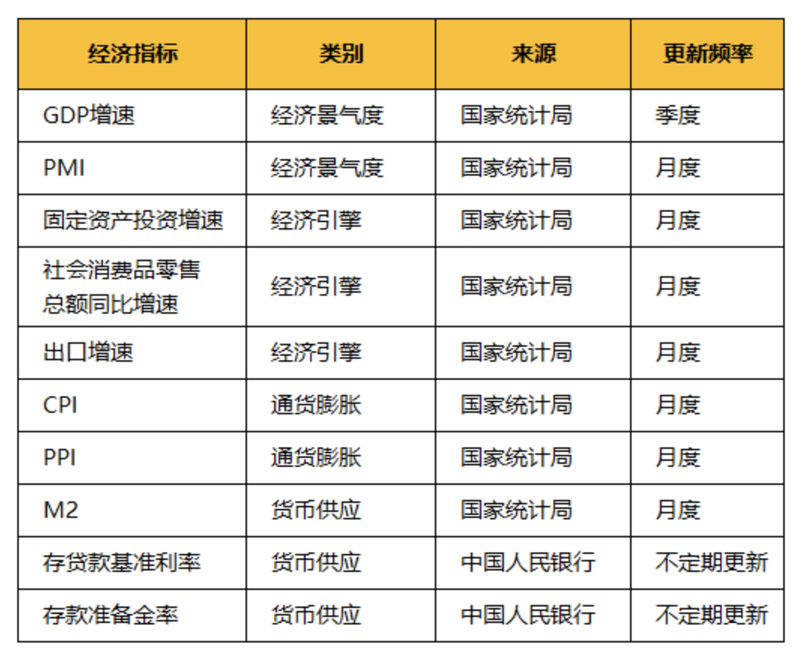
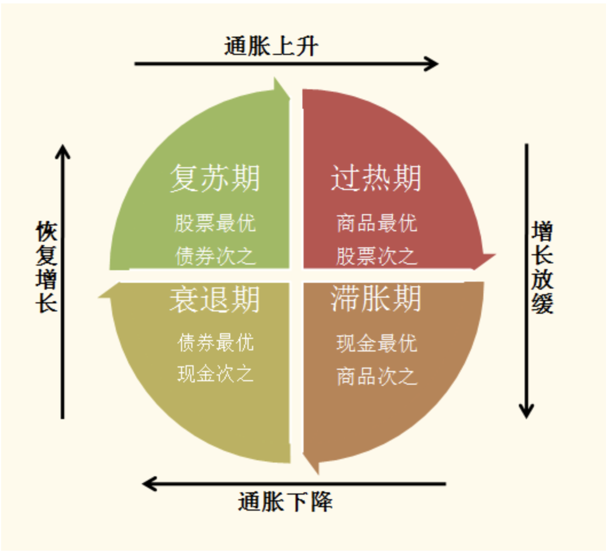

# 宏观数据怎么看

和“预期”进行比较。每次实际数据出炉前，会有众多金融机构的专家们共同给出一个预测值。如果实际值比预测值好，那就说明是真的不错；反之则说明数据表现较差，超出了众多专家的预期。而市场，往往也会有对应的短期涨跌。

# 判断经济引擎：三驾马车

- 投资：固定资产投资增速
  - 用途：固定资产总投资量的变化
  - 说明：数字越大，说明固定资产投资增长越多
- 消费：社会消费品零售总额同比增速
  - 用途：消费品（含商品和服务）销售总额增长
  - 说明：数字越大，说明固定资产投资增长越多
- 出口：出口增速
  - 用途：出口量的月度变化
  - 说明：数字越大，说明出口量增长越多

# 主要关注哪些经济数据

## GDP

- 国内生产总值（GDP），反应的是某一段时间内，国内整体的生产活动，创造了多少价值。
- 这个数据每季度发布一次，在次月的15日进行公布
- 一般通过同比增长%（比去年同时期）来判断经济总体增长情况

## PMI

- 采购经理指数（PMI），每个月都会发布1次，发布时间是每月的最后1天。能够反映经济的变化趋势。
- PMI会发布三个数据，综合PMI，以及进一步细分的制造业、非制造业PMI。综合PMI指数反映制造业和服务业的整体增长或衰退情况。
- 用途：经济景气度的领先指标
- 当PMI大于50%时，说明经济在发展，当PMI小于50%时，说明经济在衰退。

## CPI（居民消费价格指数）、PPI（工业生产者出厂价格指数）

- CPI：
  - 用途：衡量日常消费的一篮子商品和服务的价格变化
  - 说明：数字越大，越可能发生通货膨胀
  - 一般来说，不超过3%的情况下，经济通货膨胀的压力不大。
    - 如果增长过快，则说明物价飞涨、市场上流通的钱太多了。存在经济过热、通货膨胀的风险。
    - 如果增长过低、甚至是负数，说明大家都不愿意消费。存在经济下滑、通货紧缩的风险。
- PPI：
  - 用途：衡量工业产品出厂价格总水平的变动程度
  - 说明：数字越大，越可能发生通货膨胀
- 这两个数据，每月都会进行更新。月度的数据，一般在9号、10号左右公布，季度、年度则在下月的20号左右。

## 货币供应量、新增人民币贷款、社会融资量

- 货币供应量M2，反应的是市场中现在流通的“活钱”有多少。
- 增加货币供应量，是一个有效刺激经济的手段。
- 但是，M2增速持续处于高位，说明市场上不停地有很多活钱在投入。背后往往是由于，众多金融机构、居民个人大幅“上杠杆”，举债消费、投资的原因。这是不合理的，一旦出现意外，整个体系都会崩塌，进而出现金融危机。
- 新增人民币贷款和社会融资量，它们反应的都是某一时间段内，新增的贷款数量。人民币贷款，主要包括消费贷、房贷、经营性贷款以及非金融企业的贷款。简单来说，它反应的是实业领域的贷款情况。而社会融资量，是一个更广义的概念，除了人民币贷款外，它还包括外汇贷款、委托贷款、企业债券融资、股票融资等等。

# 实际作用

- 更高的维度：站在更高的维度，客观看待市场。在熟练之后，能够对中长期的未来发展，做到心里有数。
- 避开这些日子：这些数据在发布后，会是市场造成短期的刺激。对于普通人来说，这些经济数据是很难预测的。所以在投资，尤其是设置定投日期时，应当避开这些“特殊”的日子。防止由于市场的短期情绪，而影响自己定投的成本。
  - GDP：每季度发布一次，在次月的15日进行公布
  - PMI：每月的最后1天
  - CPI、PPI：月度9号、10号左右，季度、年度20号左右
  - 货币供应量等：每月的10-15号
  - 因此，如果是从这个角度来看，每月的1号-8号、21-29号，是比较合适的投资时间，可以避免这些经济数据所带来的影响。

# 不同经济环境下投资逻辑——美林时钟

