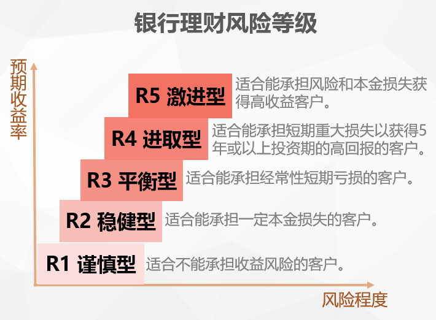

# 笔记

- 影响复利的因素有：本金、时间、利率
  - 复利计算器：https://www.jane7.com/tvm/
- 合理分配自己的资产，积累本金。
  - 10/50法则：把10%的日常收入和50%的奖金收入放入一个储蓄账户用于投资
- 关注投资回报率，起码跑赢通货膨胀
  - CPI指数：消费者物价指数（不包含房间） http://data.stats.gov.cn/tablequery.htm?code=AA0108
  - 4%-6%的年化收益利率
- 尽早开始理财（时间是公式中的指数位参数，对结果起着重大的影响）
- 

#  作业

1. 在通货膨胀的前提下，今天的1元钱，和1年后的1元钱，到底哪个更值钱，有更强的购买力？
   - A 今天的1元钱。（因为通货膨胀，未来的钱会不断贬值，因此同样1元钱，越早的越值钱）

2. 如果你现在开始每个月末，拿出1000元做投资，每年的投资收益率为7%，30年后你会收获多少钱？
   - A 122W。（根据题目，把年投资收益率换成月，30年换成360个月，带入复利计算器可得出结果）

# 疑问

1. 如果某月信用卡账单过万，手中有足够的金额还款。该不该选择分期还款，腾出部分金额进行投资？同样的，买房或买车时应选择贷款还是一次性付款？