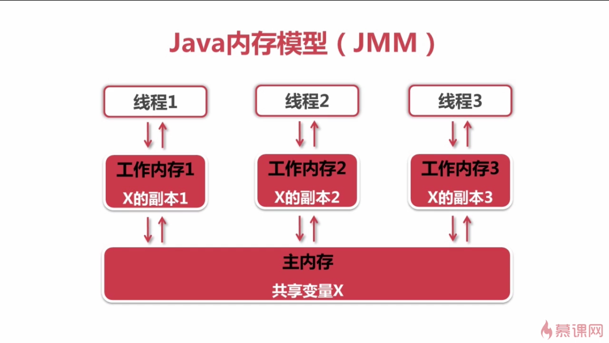

# 概念

共享变量：如果一个变量在多个线程的工作内存中都存在副本，那么这个变量就是这些线程的共享变量

可见性：一个线程对共享变量的修改，能够及时的被其他线程看到

# 两条规则

- 线程对共享变量的所有操作都必须在自己的工作内存中进行，不能直接从主内存中读取
- 不同线程之间无法直接访问其他线程工作内存中的变量，线程间变量值的传递需要通过主内存来完成

# 可见性实现

## synchronized

JMM关于synchronized的两条规定：

- 线程解锁前，必须把共享变量的新值刷新的主内存中
- 线程加锁时，将清空工作内存中的共享变量的值，当使用到共享变量时，需要重新到主内存中读取最新值

## volatile

volatile是通过加入内存屏障和禁止重排序优化来实现内存可见性的

- 对volatile变量执行写操作时，会在写操作后加入一条stroe屏障指令，强制写入到主内存
- 对volatile变量执行读操作时，会在读操作前加入一条load屏障指令，重新从主内存中获取

volatile变量的特性

- 能够保证volatile变量的可见性
- 不能保证volatile变量复合操作的原子性

### volatile变量适合场合

- 对变量的写操作不依赖当前值
    + 不满足：number++（先读取、再加一、再写入）、count = count * 5等
    + 满足：boolean变量、记录温度变化的变量等
- 改变量没有包含在具有其他变量的不变时中
    + 不满足：不变式low < up

## synchronized和volatile比较

- volatile不需要加锁，比synchronized更轻量级，不会阻塞线程
- synchronized既保证了可见性，也保证了原子性，而volatile只能保证可见性，无法保证原子性

# 补充

在有些JVM中，对于64位（long、double）变量的读写操作不是原子性的。
>Java内存模型允许JVM将没有被volatile修饰的64位数据类型的读写操作划分为两次32位的读写操作来进行。这样可能会出现读取到“半个变量”的情况
