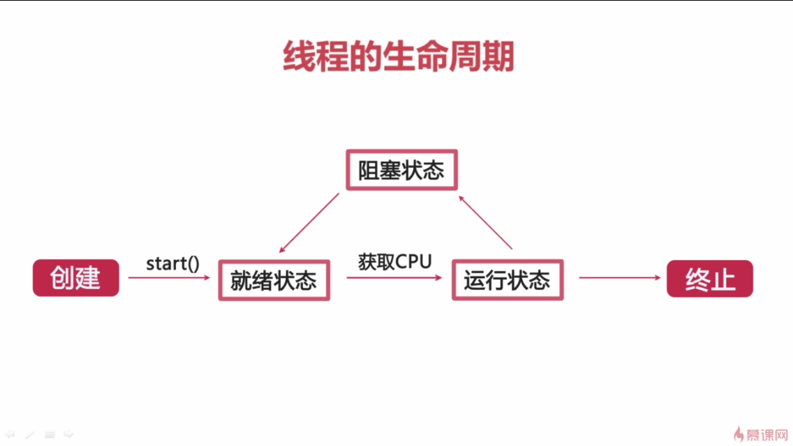

# 线程状态转换

# 状态说明

## 就绪

线程对象创建后，调用了start方法。此时线程具备了运行的条件，但不一定马上能运行。只是进入了线程队列，等待CPU。

## 运行

处于就绪状态的线程，一旦获得了CPU资源，就进入运行状态，开始执行run方法里面的逻辑

## 阻塞

一个正在执行的线程，在某些情况下，由于某些原因而暂时让出CPU资源，暂停了自己的执行，就进入了阻塞状态，如调用了sleep方法。
