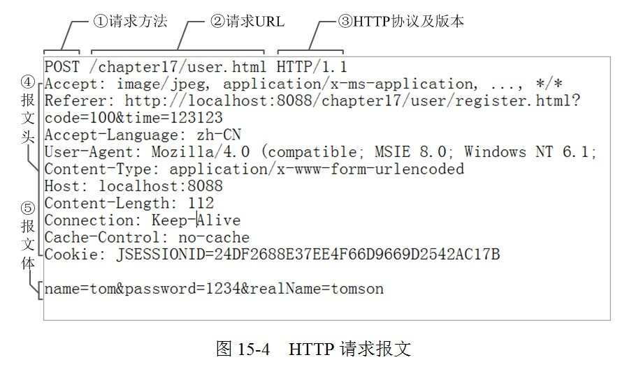

# 三次握手

- 第一次：客户端向服务器发送消息。发完之后，客户端不知道服务器有没有收到这个消息。
- 第二次：服务器接收到了客户端发来的消息之后，给客户端回复一个消息。
- 第三次：客户端接收到服务器给的消息之后，再次给服务器端发送一段消息。
- 经历这三次之后，就意味着：客户端可以确定服务器可以收到自己的消息，服务器也可以确定客户端可以收到自己的消息。

# 组成部分

- 从客户端(能够发送HTTP)发出的:请求Request
- 从服务器返回的:响应Response

# 请求
请求从客户端发出,主要有三个组成部分:请求行,请求头,请求主体

- 请求行
    + 请求方法:GET
    + 请求URL
    + HTTP协议版本
- 请求头（这里设置的主要是一些信息,包含客户端,服务器）

- User-Agent
    + 浏览器的具体类型
    + User-Agent：Mozilla/5.0 (Windows NT 6.1; rv:17.0) Gecko/20100101 Firefox/17.0
- Accept
    +  浏览器支持哪些数据类型
    +  Accept:text/html,application/xhtml+xml,application/xml;q=0.9;
- Accept-Charset
    + 浏览器采用的是哪种编码
    + Accept-Charset: ISO-8859-1
- Accept-Encoding
    + 浏览器支持解码的数据压缩格式
    + Accept-Encoding: gzip, deflate
- Accept-Language
    + 浏览器的语言环境
    + Accept-Language zh-cn,zh;q=0.8,en-us;q=0.5,en;q=0.3
- Host
    + 请求的主机名，允许多个域名同处一个IP地址，即虚拟主机
    + Host:www.baidu.com
- Connection
    + 表示是否需要持久连接。Keep-Alive/close，HTTP1.1默认是持久连接，它可以利用持久连接的优点，当页面包含多个元素时（例如Applet，图片），显著地减少下载所需要的时间。要实现这一点，Servlet需要在应答中发送一个Content-Length头，最简单的实现方法是：先把内容写入ByteArrayOutputStream，然后在正式写出内容之前计算它的大小。
    + Connection: Keep-Alive
- Content-Length
    + 表示请求消息正文的长度。对于POST请求来说Content-Length必须出现。
- Content-Type
    + WEB服务器告诉浏览器自己响应的对象的类型和字符集。
    + Content-Type: text/html; charset='gb2312'
- Content-Encoding
    + WEB服务器表明自己使用了什么压缩方法（gzip，deflate）压缩响应中的对象。
    + Content-Encoding：gzip
- Content-Language
    + WEB服务器告诉浏览器自己响应的对象的语言。
- Cookie
    + 最常用的请求头，浏览器每次都会将cookie发送到服务器上，允许服务器在客户端存储少量数据。
- Referer
    + 包含一个URL，用户从该URL代表的页面出发访问当前请求的页面。服务器能知道你是从哪个页面过来的。
    + Referer: http://www.baidu.com/

- 请求体
    + 这里是提交给服务器的数据
    + 需要注意的是,如果是往服务器提交数据,需要在请求头中设置Content-Type: application/x-www-form-urlencoded(在ajax中需要手动设置)

# 响应/响应报文

响应报文组成部分有状态行,响应头,响应主体

## 常见相应属性

- Cache-Control
    + 响应输出到客户端后，服务端通过该报文头属告诉客户端如何控制响应内容的缓存。
    + Cache-Control: max-age=3600 表示响应内容缓存3600秒，在这个时间内访问可以直接访问缓存。
- ETag
    + 一个代表响应服务端资源（如页面）版本的报文头属性，如果某个服务端资源发生变化了，这个ETag就会相应发生变化。它是Cache-Control的有益补充，可以让客户端“更智能”地处理什么时候要从服务端取资源，什么时候可以直接从缓存中返回响应。
    + ETag: "737060cd8c284d8af7ad3082f209582d"
- Location
    + Location: http://www.google.com.hk 表示将客户端redirect到对于的URL
- Set-Cookie
    + 服务端可以设置客户端的Cookie，其原理就是通过这个响应报文头属性实现的。
    + Set-Cookie: UserID=JohnDoe; Max-Age=3600; Version=1

# 响应状态码

- 响应首行中包含一个状态码。状态码由三位数字组成，表示请求是否被理解或者被满足。
- HTTP响应状态码的第一个数字定义了响应的类别，后面两位没有具体分类
- 第一个数字有五种可能的取值，具体介绍如下所示：
    + 1xx ：表示请求已接收，需要继续处理。
    + 2xx ：表示请求已经成功被服务器接收、理解、并接受
    + 3xx ：为完成请求，客户端需要进一步细化请求
    + 4xx ：客户端的请求有错误
    + 5xx ：服务器端出现错误

## 常见状态码

状态码	| 说明
---|---
200 | 请求成功，浏览器会把响应回来的信息显示在浏览器端。
404 | 表示客户端出错，比如说在浏览器端请求一个不存在的资源，这时浏览器端会出现404状态码。
405 | 客户端错误的一种，表示当前的请求方式不支持。比如说服务器端只对GET请求做了处理，而客户端的请求是post方式的，这个时候会出现405状态码。
500 | 服务器端错误，比如说服务器端代码出现空指针等异常，浏览器就会收到服务器发送的500状态码。
302 | 表示重定向。比如说浏览器访问一个资源，服务器响应给浏览器一个302的状态码，并且通过响应头Location发送了一个新的url，告诉浏览器去请求这个url。这就是重定向。
304 | 第一次访问一个资源后，浏览器会将该资源缓存到本地，第二次再访问该资源时，如果该资源没有发生改变，那么服务器响应给浏览器304状态码，告诉浏览器使用本地缓存的资源。
