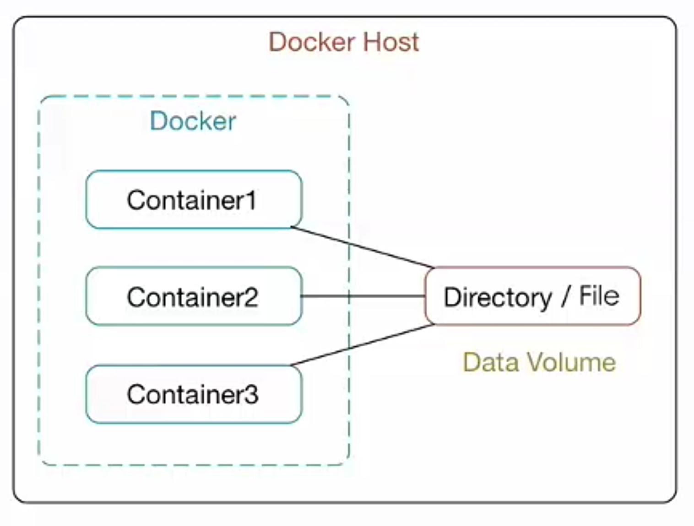
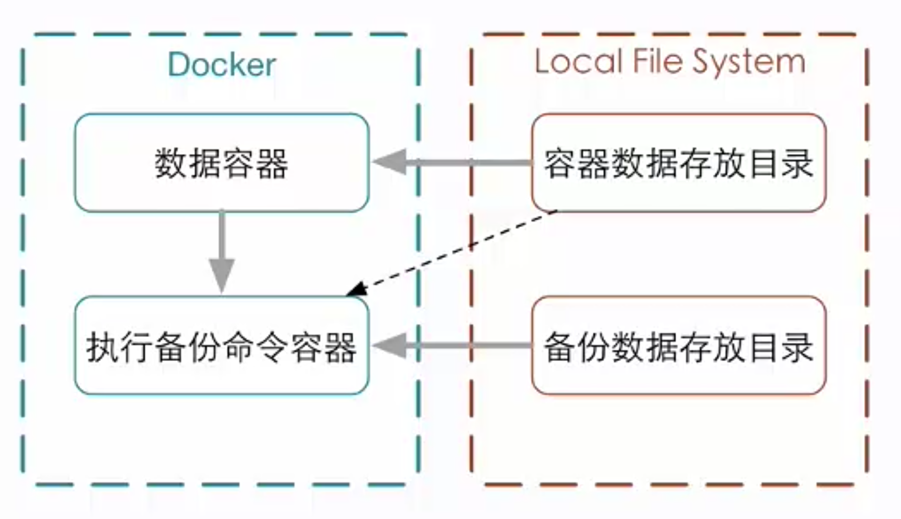

# 数据卷

数据卷是经过特殊设计的目录，可以绕过联合文件系统（UFS），为一个或多个容器提供访问。

数据卷设计的目的，在于数据的永久化，它完全独立于容器的声明周期。docker不会在删除容器的时候删除其挂载的数据卷，也不会存在类似垃圾回收的机制，对容器引用的数据卷进行处理。



数据卷的特点：

- 数据卷在容器启动时初始化，如果容器使用的镜像在挂载点包含了数据，这些数据会拷贝到新初始化的数据卷中
- 数据卷可以在容器间共享和重用
- 可以数据卷里的内容直接进行修改
- 数据卷的变化不会影响镜像的更新
- 卷会一直存在，几时挂载数据的卷的容器被删除

# 使用run命令控制数据卷

## 添加数据卷

启动容器时，可以通过 `-v` 参数指定宿主机目录与容器中的目录映射

```shell
docker run -v ~/container_data:/data -it ubuntu /bin/bash
```

## 给数据卷添加访问权限

```shell
docker run -v ~/datavolume:/data:ro -it ubuntu /bin/bash
```

# 使用dockerfile构建包含数据的镜像

指令：VOLUME["/data"]

在镜像指定的数据卷不能指定宿主机目录，容器启动时，docker会自动创建对应的目录，并且每个容器创建的目录都不一样，这样没法进行数据共享。

# 数据卷容器

命名的容器挂载数据卷，其他容器通过挂载这个容器实现数据共享，挂载数据卷的容器就叫数据卷容器

挂载数据卷容器的方法

```shell
docker run --volumes-from [CONTAINER NAME]
```

注意：**即使删除了数据卷容器，所挂载该容器的容器仍然可以正常使用数据卷**。数据卷容器仅仅起到传递配置的作用。

# 数据卷备份和还原

数据备份，通过运行一个容器，同时挂载数据卷容器和备份目录，并对数据卷容器目录进行打包命令，存放到备份目录中：

```shell
docker run --volumes-from [container name] -v $(pwd):/backup ubuntu tar cvf /backup/backup.tar [container data volume]
```



数据还原

```shell
docker run --volumes-from [container name] -v $(pwd):/backup ubuntu tar xvf /backup/backup.tar [container data volume]
```
