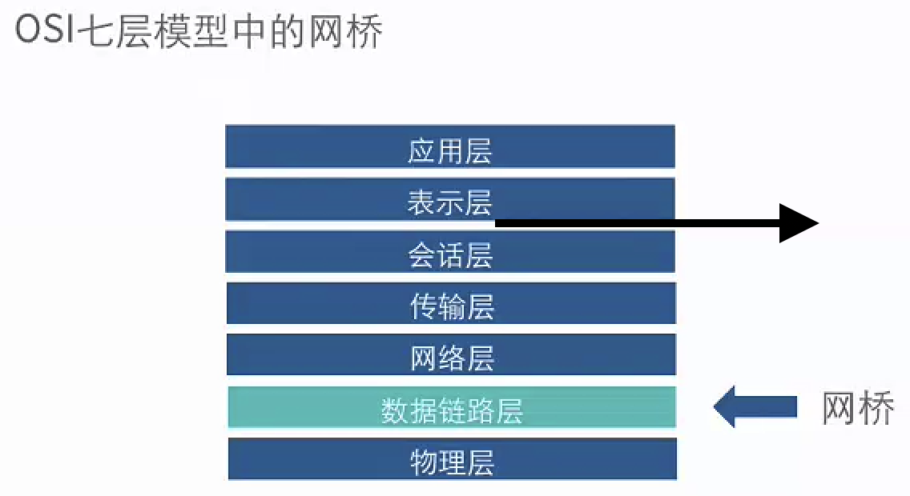
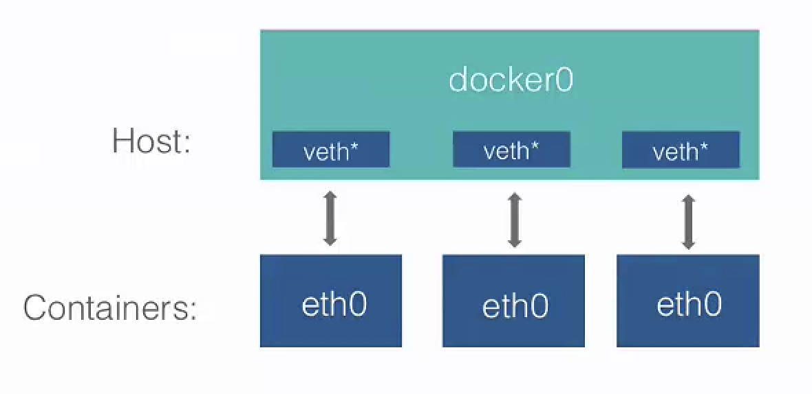
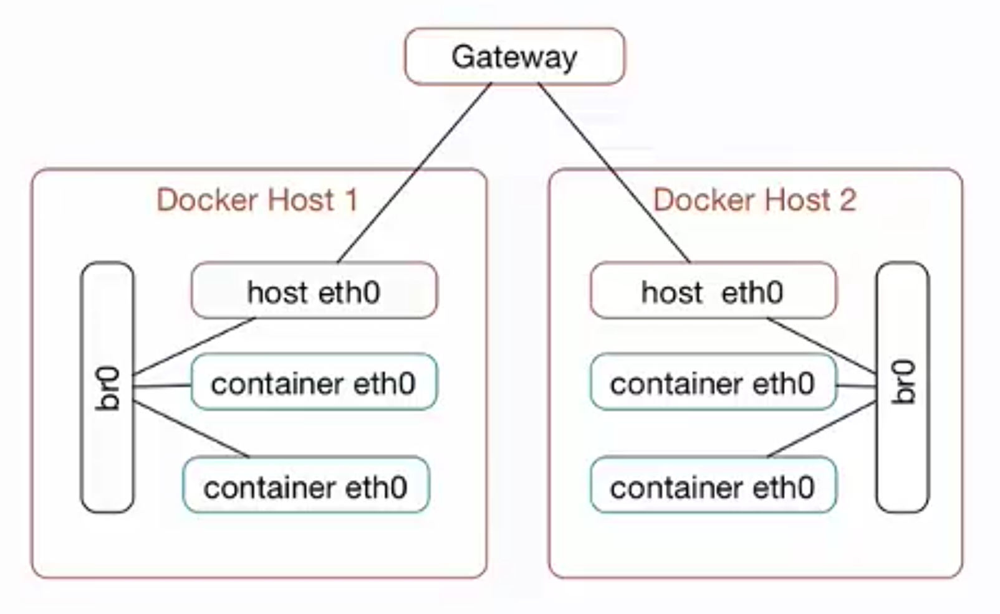
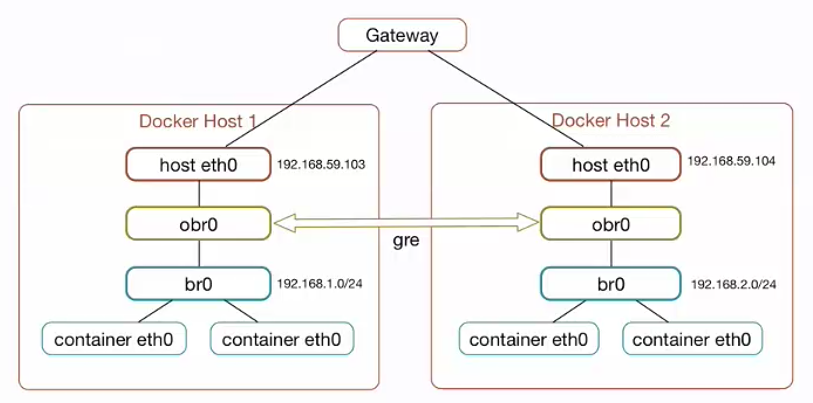

# docker0

docker安装后，运行docker容器的主机会多了个名为docker0的虚拟网桥

网桥属于数据链路层：


Linux中，虚拟网桥的特点：

- 可以设置IP地址
- 相当于拥有一个隐藏的虚拟网卡

docker0的地址划分：

- IP：172.17.42.1
- 子网掩码：255.255.0.0
- MAC：02:42:ac:11:00:00 到 02:42:ac:11:ff:ff
- 总共提供了65534个地址

当启动容器的时候，docker会在主机的docker0中创建一个名为 `veth*` 的虚拟网卡，同时容器中也会创建一个名为 `eth0` 的虚拟网卡：


## 修改docker0地址

通过Linux命令修改docker0的地址：
```shell
ifconfig docker0 192.168.200.1 netmask 255.255.255.0
```

修改后需要重启docker守护进程

# 自定义虚拟网桥

添加虚拟网桥：

一下是Ubuntu的做法

```shell
brctl addbr br0
ifconfig br0 192.168.100.1 netmask 255.255.255.0
```

更改docker守护进程的启动配置：
- /etc/default/docker中添加DOCKER_OPS=“-b=br0”

# docker容器互联

## 允许所有容器间互联

默认情况下，在同一个主机中运行的docker容器是可以相互互联的

由于容器启动的时候，IP地址会发生变化，所以通过IP地址进行互通是不可靠的。

容器启动命令中，可以通过 `--link` 参数指定要访问容器的别名：
```shell
docker run --link=[CONTAINER_NAME]:[ALIAS] [IMAGE] [COMMOND]
```

## 拒绝所有容器间的访问

修改docker配置文件（/etc/default/docker）添加DOCKER_OPS=“--icc=false”(默认是true)

## 允许特定容器间互通

- docker守护进程启动选项（即修改docker配置文件）：--icc=false --iptbales=true
- 启动容器时指定`--link`参数

# docker容器与外部网络的连接

## ip-forward

--ip-forward=true。默认为true。

ip-forward本身是Linux的一个变量，它的值决定系统是否会转发流量

当docker守护进程启动时，如果--ip-forward=true，那么会将系统的ip-forward设置成1，即允许流量转发

## iptables

iptables是Linux内核集成的包过滤防火墙系统，几乎所有的Linux发行版都会有iptables的功能

linux是通过iptables来控制对容器的访问

# 跨主机链接

## 使用网桥实现



优点：配置简单，不依赖第三方软件

缺点：
与主机在同一网段，需要小心划分IP地址。
需要有网段控制权，在生产环境中不易实现。
不容器管理。
兼容性不佳。

## 使用 open vswitch 实现

open vswitch（ovs）是一个高质量的、多层虚拟交换机，使用开源Apache2.0许可协议，使用跨平台的c语言开发。它目的是让大规模网络自动化可以通过编程扩展，同时仍然支持标准的管理接口和协议



## 使用wearve实现

建立一个虚拟网络，用于将运行在不同主机的docker容器连接起来
