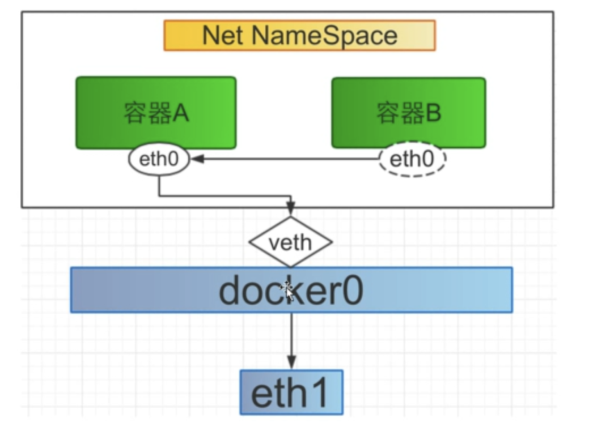
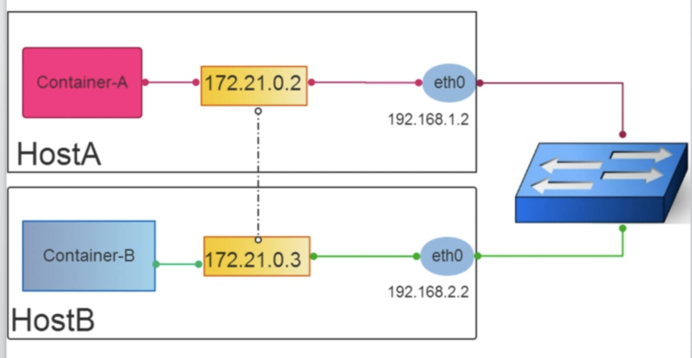

docker容器的网络类型是在容器创建时指定的，即使用`docker run --net=`命令时指定

# nat网络（默认类型，不用指定）

容器间通过docker0进行通信

优点：
- 网络资源隔离
- 无需手动配置
- 可访问外网

缺点：
- 外界无法直接访问容器IP
- 性能低（iptables遍历低效）
- 端口管理麻烦

# Host网络

容器与主机共享同一个网络

优点：
- 共享宿主机网络
- 网络性能无衰减
- 排查网络故障简单

缺点：
- 网络环境无隔离
- 网络资源无法统计
- 端口不易管理

# other container

优点：
- 与主机网络空间隔离
- 容器间共享网络空间
- 适合容器间网络通信频繁

# none类型

容器无网络配置，可自行配置

# overlay网络

优点：
- 跨主机通信
- 无需做端口管理
- 无需担心IP冲突
