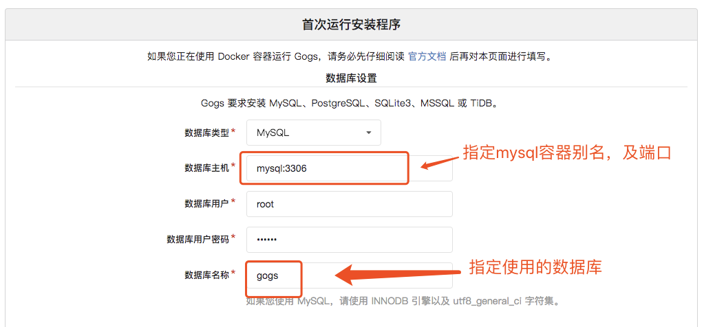
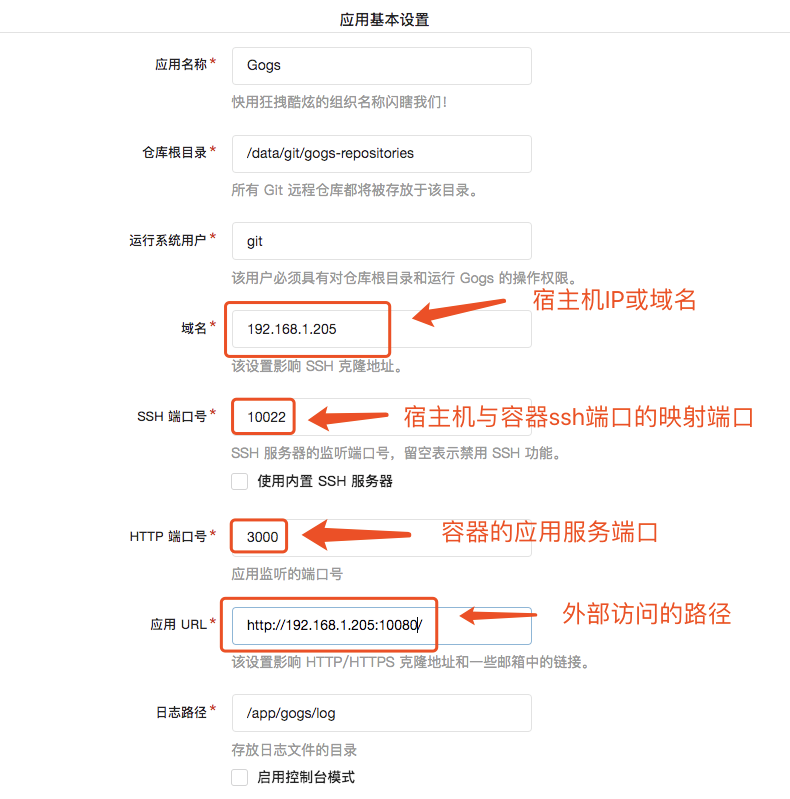

# 使用docker进行安装

## 准备docker环境

以下是Centos7的环境搭建：

1. 检查内核版本 `uname -r`，必须是3.10及以上
    - 如果版本过低则需要升级 `yum update`
2. 卸载旧版本(如果安装过旧版本的话) `yum remove docker  docker-common docker-selinux docker-engine`
3. 安装需要的软件包, yum-util提供yum-config-manager功能,另外两个是devicemapper驱动依赖的 `yum install -y yum-utils device-mapper-persistent-data lvm2`
4. 设置yum源 `yum-config-manager --add-repo https://download.docker.com/linux/centos/docker-ce.repo`
5. 可以查看所有仓库中所有docker版本，并选择特定版本安装 `yum list docker-ce --showduplicates | sort -r`
6. 安装docker `yum install docker-ce`，并输入y确认安装
7. 启动docker `systemctl start docker`
    - 可以设置为开机启动docker `systemctl enable docker`
8. 停止docker `systemctl stop docker`

## 安装mysql容器

1. 下载mysql镜像，使用daocloud加速，并下载5.7版本
  ```shell
  docker pull daocloud.io/library/mysql:5.7
  ```
2. 创建mysql容器
  ```shell
  docker run --name mysql5.7 -d -p 3306:3306 -v /var/mysql5.7_data:/var/lib/mysql -e MYSQL_ROOT_PASSWORD=123456 daocloud.io/library/mysql:5.7 --character-set-server=utf8mb4 --collation-server=utf8mb4_unicode_ci
  ```
  - --name 指定容器名称
  - -d 表示以守护进程运行容器
  - -p 指定宿主机与容器的端口映射，这里把宿主机的3306端口映射到容器的3306。即外部通过宿主机的3306端口可以访问到容器的3306端口
  - -v 指定宿主机目录与容器中的目录映射，这里指容器中/var/lib/mysql目录的数据会保存到宿主机的/var/mysql5.7_data目录中
  - -e 用于设置环境变量，这里指定了root用户的密码为123456
  - 最后的`--character-set-server=utf8mb4 --collation-server=utf8mb4_unicode_ci`为启动参数，这里表示将数据设置成utf8编码
  - 注意：具体的端口映射、文件目录、环境变量和启动参数是由创建docker镜像是决定的，使用镜像时需要按照镜像中的定义进行容器创建，这属于docker的知识，这里不做详细说明。
3. 进入mysql数据库，并创建gogs数据库

## 安装gogs服务

1. 下载gogs镜像
  ```shell
  docker pull gogs/gogs
  ```
  这里没有用国内加速，如果下载较慢，可以使用国内的镜像加速
2. 创建gogs容器
  ```shell
   docker run --name=gogs -d --link mysql5.7:mysql -p 10022:22 -p 10080:3000 -v /var/gogs:/data gogs/gogs
  ```
  - --link mysql5.7:mysql表示此容器通过mysql这个别名可以访问到mysql5.7容器
3. 此时，gogs服务已经运行起来，通过web页面访问会跳到首次安装页面，进行安装配置。这里宿主机的内容IP为192.168.1.205。即内网访问路径为http://192.168.1.205:10080
4. 数据库配置
  
5. 应用配置
  
